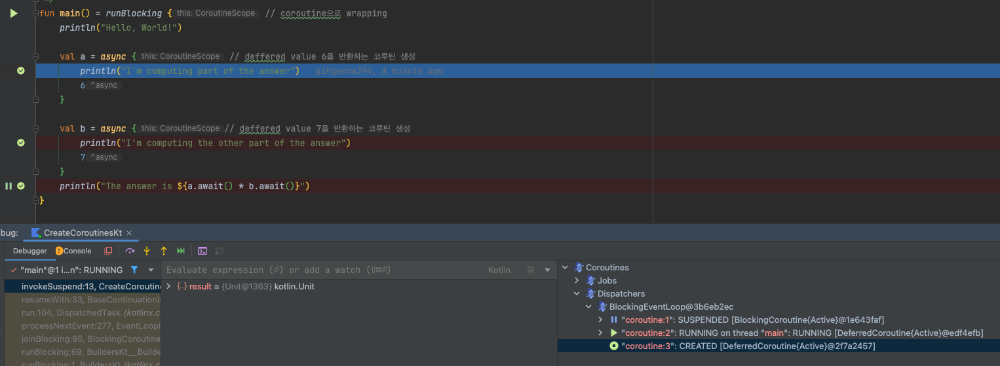
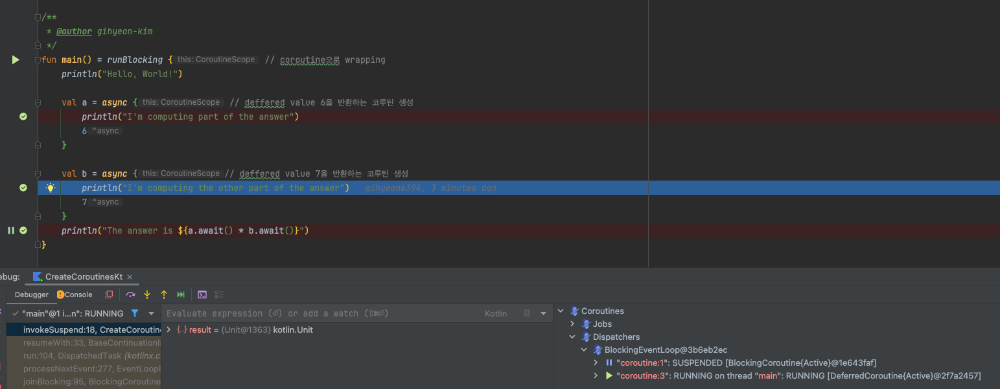

# Coroutines (kotlinx.coroutines)

- Coroutines basics
- Coroutines and channels-tutorial
- Cancellation and timeouts
- Composing suspending functions
- Coroutine context and dispatchers
- Asynchronous Flow
- Channels
- Coroutine exception handling
- Shared mutuable state and concurrency
- Select expression (experimental)
- Debug coroutines using IntelliJ IDEA - tutorial
- Debug Kotlin Flow using IntelliJ IDEA - tutorial

reference : https://kotlinlang.org/docs/coroutines-guide.html

---

### Coroutines

비동기, non-blocking은 개발에서 매우 중요한 부분이다.  
코틀린은 couroutine을 통해 비동기 프로그래밍을 쉽게 할 수 있도록 지원한다.

## Coroutines guide

- `async`, `await` 는 kotlin에서 keyword나 라이브러리가 아니다.
- **suspending function**은 더 안전하고 더 낮은 error-prone을 가진다. (futures, promises 보다)
- `kotlinx.coroutines` : 코루틴을 사용하기 위한 라이브러리 (by JetBrains)
    - `launch`, `async` 와 같은 고수준으로 코루틴을 사용할 수 있는 함수를 제공한다.
- `kotlinx-coroutines-core` : 코루틴을 사용하기 위한 라이브러리 (by JetBrains)

## Coroutines basics

### Your first coroutine

- **coroutine** : 중지가능한 연산을 하는 인스턴스
- 스레드와 비슷한 면 : 실행중인 코드 block 가능
- 코루틴은 스레드와 다름 : 중지된 코루틴은 다른 스레드에서 계속 될 수 있음

```kotlin
import kotlinx.coroutines.delay
import kotlinx.coroutines.launch
import kotlinx.coroutines.runBlocking

fun main() = runBlocking {
    launch {
        delay(1000L)
        println("World!")
    }

    println("Hello,")
}
```

```shell
Hello,
World!
```

- `launch` : 코루틴 빌더
    - 새로운 코루틴을 시작 (런치)하고 실행한다.
- `delay` : 일시 중지 함수 (suspend function)
    - 코루틴을 특정 시간동안 중지
- `runBlocking` : 실행 중인 스레드 (`fun main()`)가 blocked
    - non coroutines world (`fun main()`)과 연결
    - 없이 `launch`를 사용하면 에러 발생 `Unresolved reference: launch`
    - `{}` 안에서 런치된 모든 코루틴이 종료될 떄까지 해당 스레드는 block
    - 주로 top-level 코드에서 사용 (application 시작 코드)
- suspending coroutine (코루틴 중지) 는 스레드를 블로킹 하지 않으며, 다른 코루틴을 실행할 수 있게 양보

#### Structured concurrency

- Structured concurrency : 반드시 CoroutineScope 안에서 코루틴을 런치해야한다
- CoroutineScope : 코루틴의 lifecycle, scope을 관리하는 인터페이스
- 위에서는 `runBlocking` 으로 새로운 CoroutineScope를 만들었다.
- CoroutineScope은 자식 코루틴들이 완료되기 전까지 실행을 끝내지 않는다.
- 장점
    - 코루틴 누수 방지 : 자식 코루틴이 모두 종료될떄까지 부모 코루틴이 종료되지 않음
    - 에러 리포트 : 자식 코루틴이 예외를 던지면 부모 코루틴이 예외를 받아서 처리

### Extract function refactoring

- `launch` 를 별도의 함수로 추출
- `suspend` modifier : suspending function을 선언
- **suspending function** : 코루틴을 중지 가능한 함수 (코루틴 안에서 사용)

```kotlin
import kotlinx.coroutines.delay
import kotlinx.coroutines.launch
import kotlinx.coroutines.runBlocking

fun main() = runBlocking {
    launch { doWorld() }

    println("Hello,")
}

suspend fun doWorld() {
    delay(1000L)
    println("World!")
}
```

### Scope builder

- `coroutineScope` builder : 코루틴 스코프를 생성하고, 스코프 안에서 생성된 자식 코루틴이 완료될때까지 완료되지 않음

|     | `runBlocking`                      | `coroutineScope`                   |
|-----|------------------------------------|------------------------------------|
| 공통점 | 코루틴을 실행하는 블록, children이 완료될떄까지 기다림 | 코루틴을 실행하는 블록, children이 완료될때까지 기다림 |
| 차이점 | 실행 중인 스레드를 block                   | suspending function                |

```kotlin
fun main() = runBlocking {
    doWorld()
}

suspend fun doWorld() = coroutineScope {  // this: CoroutineScope
    launch {
        delay(1000L)
        println("World!")
    }
    println("Hello")
}
```

### Scope builder and concurrency

- `coroutineScope` builder는 suspending function 내부 어디에서든 사용 가능

```kotlin
// Sequentially executes doWorld followed by "Done"
fun main() = runBlocking {
        doWorld()
        println("Done")
    }

// Concurrently executes both sections
suspend fun doWorld() = coroutineScope { // this: CoroutineScope
    launch {
        delay(2000L)
        println("World 2")
    }
    launch {
        delay(1000L)
        println("World 1")
    }
    println("Hello")
}
```

### An explicit job

- `launch` builder는 Job 오브젝트를 반환
- 명시적으로 Job을 관리할 수 있음

```kotlin
import kotlinx.coroutines.*

suspend fun explicitJob() = coroutineScope {
    val job = launch {
        delay(1000L)
        println("World!")
    }

    println("Hello,")
    job.join() // wait until child coroutine completes
    println("Done")
}
```

### Coroutines are light-weight

- 코루틴은 JVM 스레드보다 resource를 적게 사용

```kotlin
import kotlinx.coroutines.*

fun main() = runBlocking {
    repeat(50_000) { // 50000 개의 개별적인 코루틴 생성, launch는 suspend function (=스레드에게 제어권을 양보)
        launch {
            delay(5000L)
            print(".")
        }
    }
}

// using java thread
fun main() {
    repeat(50_000) {
        thread {
            Thread.sleep(5000L)
            print(".")
        }
    }
}
```

## Coroutines and channels-tutorial

- network request를 suspend function으로 만들기
- 코루틴을 사용해서 request를 concurrently하게 실행
- 채널을 사용해 코루틴 간에 정보 전달

### Before you start

### Blocking requests


```kotlin
interface GitHubService {
    /**
     * Get a list of the repositories for the organization.
     */
    @GET("orgs/{org}/repos?per_page=100")
    fun getOrgReposCall(
        @Path("org") org: String
    ): Call<List<Repo>>

    /**
     * Get a list of the contributors to a repository.
     */
    @GET("repos/{owner}/{repo}/contributors?per_page=100")
    fun getRepoContributorsCall(
        @Path("owner") owner: String,
        @Path("repo") repo: String
    ): Call<List<User>>
}

fun loadContributorsBlocking(service: GitHubService, req: RequestData): List<User> {

    // repository 정보를 가져옴
    val repos = service
        .getOrgReposCall(req.org)
        .execute() // Executes request and blocks the current thread
        .also { logRepos(req, it) }
        .body() ?: emptyList()

    // 각 repository의 contributor 정보를 가져옴
    return repos.flatMap { repo ->
        service
            .getRepoContributorsCall(req.org, repo.name)
            .execute() // Executes request and blocks the current thread
            .also { logUsers(repo, it) }
            .bodyList()
    }.aggregate()
}

fun <T> Response<List<T>>.bodyList(): List<T> {
    return body() ?: emptyList()
}
```

### Task 1

- `aggregate()` : `List<User>`를 받아서
    - 같은 이름 (`login`)을 가진 `User`를 합침
    - 합친 후, `contributions`를 기준으로 내림차순 정렬

```kotlin
class AggregationKtTest {
    @Test
    fun testAggregation() {
        val actual = listOf(
            User("Alice", 1), User("Bob", 3),
            User("Alice", 2), User("Bob", 7),
            User("Charlie", 3), User("Alice", 5)
        ).aggregate()
        val expected = listOf(
            User("Bob", 10),
            User("Alice", 8),
            User("Charlie", 3)
        )
        Assert.assertEquals("Wrong result for 'aggregation'", expected, actual)
    }
}

fun List<User>.aggregate(): List<User> =
    groupBy { it.login }
        .map { (login, group) -> User(login, group.sumOf { it.contributions }) }
        .sortedByDescending { it.contributions }
```

### Callbacks

- callback : 비동기 작업이 완료되면 호출되는 함수
- callback 을 사용해서 스레드를 블룅하고, UI 멈춤 현상을 해결
- operation이 완료되고 코드를 즉시 호출하는 대신에, 콜백 (일반적으로 람다)으로 분리하여 호출자에게 전달

### Use a background thread

```kotlin
thread {
    loadContributorsBlocking(service, req)
}
```


````
fun loadContributorsBackground(
    service: GitHubService, req: RequestData,
    updateResults: (List<User>) -> Unit
)

...

fun loadContributorsBackground(service: GitHubService, req: RequestData, updateResults: (List<User>) -> Unit) {
    thread {
        updateResults(loadContributorsBlocking(service, req))
    }
}

...

loadContributorsBackground(service, req) { users ->
    SwingUtilities.invokeLater {
        updateResults(users, startTime)
    }
}
````

- `updateResults()` : 콜백 함수, 모두 완료되면 호출
- `SwingUtilities.invokeLater` : UI 업데이트를 위해 사용

### Use the Retrofit callback API

- 순차적으로 loading request가 이루어지는 문제점 해결하기
- loading 결과가 나올때까지 분리된 thread가 blocking 되는 문제 해결하기
- loading + processing 중 processing을 callback으로 분리하기


- Retrofit callback API 의 `Call.enqueue()` 로 HTPP reuqest에 대한 callback을 등록할 수 있다.

```kotlin
import retrofit2.Call
import retrofit2.Callback
import retrofit2.Response
import java.util.*
import java.util.concurrent.atomic.AtomicInteger

fun loadContributorsCallbacks(service: GitHubService, req: RequestData, updateResults: (List<User>) -> Unit) {
    service.getOrgReposCall(req.org).onResponse { responseRepos ->
        logRepos(req, responseRepos)
        val repos = responseRepos.bodyList()
        val allUsers = Collections.synchronizedList(mutableListOf<User>())
        val numberOfProcessed = AtomicInteger()
        for (repo in repos) {
            service.getRepoContributorsCall(req.org, repo.name)
                .onResponse { responseUsers ->
                    logUsers(repo, responseUsers)
                    val users = responseUsers.bodyList()
                    allUsers += users
                    if (numberOfProcessed.incrementAndGet() == repos.size) {
                        updateResults(allUsers.aggregate())
                    }
                }
        }
    }
}
```

- `onResponse` : `Call`에 대한 callback을 등록하는 extension function

### Suspending functions

- `Call<List<Repo>>` 을 리턴하는 대신 `suspend` function을 사용

```kotlin
interface GitHubService {
    @GET("orgs/{org}/repos?per_page=100")
    suspend fun getOrgRepos(
        @Path("org") org: String,
    ): List<Repo>
}
````

- `getOrgRepos()` 은 suspend funciton
    - reqeust 스레드는 block 되지 않음
- `getOrgRepos()` 은 `List<Repo>`를 리턴 (Call<List<Repo>> 대신)

```kotlin

import retrofit2.Response

interface GitHubService {
    // getOrgReposCall & getRepoContributorsCall declarations

    @GET("orgs/{org}/repos?per_page=100")
    suspend fun getOrgRepos(
        @Path("org") org: String,
    ): Response<List<Repo>>

    @GET("repos/{owner}/{repo}/contributors?per_page=100")
    suspend fun getRepoContributors(
        @Path("owner") owner: String,
        @Path("repo") repo: String,
    ): Response<List<User>>
}
```

- retrofit을 사용하여 `Response`를 리턴하는 suspend function을 작성, 대체 가능

```kotlin
suspend fun loadContributorsSuspend(service: GitHubService, req: RequestData): List<User> {
    val repos = service
        .getOrgRepos(req.org) // suspend function
        .also { logRepos(req, it) }
        .body() ?: emptyList()

    return repos.flatMap { repo ->
        service
            .getRepoContributors(req.org, repo.name) // suspend function
            .also { logUsers(repo, it) }
            .bodyList()
    }.aggregate()
}

```

### Coroutines

- threa가 blocking 되는 것은 coroutine이 suspend되는 것과 비슷한 개념
- 코루틴은 경량 스레드라고도 불림 (lightweight thread)

| thread | coroutine |
|--------|-----------|
| block  | supdend   |

#### Starting a new coroutine

```kotlin
// 아래는 하나의 코루틴 @coroutine#1에서 실행됨
// 모든 contributor를 load하고,
// 결과를 updateResults()로 전달
launch {
    val users = loadContributorsSuspend(req)
    updateResults(users, startTime)
}
```

- `launch` : 새로운 computation 시작 (새로운 코루틴 시작)
    - compuation은 suspendable
    - network rquest 시 suspend되어 thread를 release
    - network result가 오면 다시 resume
- **coroutine** : suspendable computation
- 코루틴은 스레드 위에서 실행되고, suspend됨
    - suspended : computation이 일시중지, thread에서 제어권을 양보, 메모리에 저장 => thread는 다른 태스크를 수행
- computation이 다시 실행가능해지면
    - 스레드에 다시할당 (다른 스레드일수도 있음)
    - 코루틴은 오직 응답이 왔을떄만 재개 가능


### Concurrency

- 코틀린 코루틴은 스레드보다 덜 리소를 소모함
- 코루틴 생성 = 새로운 비동기 연산 실행
- **coroutine builder** : 새로운 코루틴을 시작 e.g. `launch`, `async`, `runBlocking`
- `async` : 새로운 코루틴을 싲가하고, `Deferred`를 반환
    - `Deferred` : `Future`, `Promise`와 비슷한 개념
        - 연산을 저장하고, **future** 에 결과를 반환할거라는 **promise**를 가짐
- `async`와 `launch`의 차이점
    - `launch` : 결과를 반환하지 않음
        - `Job`을 반환 (`Job` : 코루틴을 나타냄)
        - `Job.join()` : 코루틴이 완료될때까지 기다림
- `Deferred` : `Job`을 확장한 제네릭 타입
    - `async` 는 `Deferred<Int>`를 반환 (or `Deferred<CustomeType>`)
    - `Deferred.await()` : 코루틴 결과 반환, `await()`을 호출한 코루틴은 suspended

```kotlin
import kotlinx.coroutines.*

fun main() = runBlocking {
    val deferred: Deferred<Int> = async {
        loadData()
    }
    println("waiting...")
    println(deferred.await())
}

suspend fun loadData(): Int {
    println("loading...")
    delay(1000L)
    println("loaded!")
    return 42
}
```

```
waiting...
loading...
loaded!
42

Process finished with exit code 0
```

- `runBlocking` : regular funciton과 suspending function의 브릿지
- https://youtu.be/zEZc5AmHQhk

```kotlin
import kotlinx.coroutines.*

fun main() = runBlocking {
    val deferreds: List<Deferred<Int>> = (1..3).map {
        async {
            delay(1000L * it)
            println("Loading $it")
            it
        }
    }
    val sum = deferreds.awaitAll().sum()
    println("$sum")
}
```


````kotlin
suspend fun loadContributorsConcurrent(service: GitHubService, req: RequestData): List<User> = coroutineScope {
    val repos = service
        .getOrgRepos(req.org)
        .also { logRepos(req, it) }
        .bodyList()

    val deferreds: List<Deferred<List<User>>> = repos.map { repo ->
        // 메인스레드에서 코루틴 생성
        async {
            service.getRepoContributors(req.org, repo.name)
                .also { logUsers(repo, it) }
                .bodyList()
        }
    }
    deferreds.awaitAll().flatten().aggregate()
}

````

````
...
    async(Dispatchers.Default) {
        log("starting loading for ${repo.name}")
        service.getRepoContributors(req.org, repo.name)
            .also { logUsers(repo, it) }
            .bodyList()
    }
...
````

- `async(Dispatchers.Default) { }` : `async` 를 사용하여 새로운 코루틴을 시작하고, `Dispatchers.Default`를 사용하여 코루틴을 실행할 스레드를 지정
    - `CoroutineDispatcher` : 코루틴을 실행할 스레드를 지정
    - `Dispatchers.Default` : JVM의 스레드 shared pool

````
// 메인 스레드에서 코루틴 실행
launch(Dispatchers.Main) {
    updateResults()
}
````

- 메인 스레드가 바쁘면, 코루틴은 suspended

````
launch(Dispatchers.Default) {
    val users = loadContributorsConcurrent(service, req)
    withContext(Dispatchers.Main) {
        updateResults(users, startTime)
    }
}
````

- `updateResults`는 메인 스레드에서 실행되어야 하므로, `withContext(Dispatchers.Main)`을 사용하여 메인 스레드에서 실행
- `withContext()` : 람다를 특정한 coroutine context에서 실행
    - 완료될 떄까지 suspended
    - `launch(context) { ... }.join()` 과 같은 의미

### Structured concurrency

- **coroutine scope** :  코루틴간의 parent-child 관계, 구조에 대한 관리를 함
    - 새로운 코루틴은 코루틴 스코프에서 시작되어야함
- **coroutine context** : 코루틴이 실행되는 환경에 대한 추가적인 정보들 e.g. 코루틴 커스텀 이름, 스레드 특정 가능한 디스패쳐 등
- scope은 일반적으로 childe coroutine에 대한 책임이 있다.
- scope은 child coroutine을 취소시킬 수 있다
- scope은 child corouitine의 완료를 기다린다.
    - 따라서 scope에 있는 모든 코루틴이 완료되지 않으면 parent 코루틴은 완료될 수 없다

```kotlin
launch { /* this: CoroutineScope */ }
```

- `launch` 람다의 암묵적 receiver는 `CoroutineScope` 인터페이스
- runBlocking, launch, or async 안의 새로운 코루틴은 자동을 해당 scope에서 실행됨
- `runBlocking` 은 top-level function으로서 현제 스레드를 block

```kotlin
import kotlinx.coroutines.*

fun main() = runBlocking { /* this: CoroutineScope */
    launch { /* ... */ }
    // the same as:
    this.launch { /* ... */ }
}
```

- nested coroutine은 outer coroutne의 child로 취급
    - scope을 통해 parent-child 관계를 유지
- `coroutineScope()` : 새로운 scope를 만들기만 함 (코루틴 생성, 실행 없음)
- `Global.async()`, `GlobalScope.launch()` : global scope에서 코루틴 생성
    - top-level "independent" coroutines
    - 코루틴의 라이프타임 한계는 application 라이프 타임

#### Canceling the loading of contributors

```kotlin
suspend fun loadContributorsConcurrent(
    service: GitHubService,
    req: RequestData,
): List<User> = coroutineScope {
    // ...
    async {
        log("starting loading for ${repo.name}")
        delay(3000)
        // load repo contributors
    }
    // ...
}
```

```kotlin
interface Contributors {

    fun loadContributors() {
        // ...
        when (getSelectedVariant()) {
            CONCURRENT -> {
                launch {
                    val users = loadContributorsConcurrent(service, req)
                    updateResults(users, startTime)
                }.setUpCancellation()      // #1
            }
        }
    }

    private fun Job.setUpCancellation() {
        val loadingJob = this              // #2

        // cancel the loading job if the 'cancel' button was clicked:
        val listener = ActionListener {
            loadingJob.cancel()            // #3
            updateLoadingStatus(CANCELED)
        }
        // add a listener to the 'cancel' button:
        addCancelListener(listener)

        // update the status and remove the listener
        // after the loading job is completed
    }
}
```

- `#1` : `launch` 의 리턴값인 `Job`에 `setUpCancellation()`을 호출
    - `Job` 에는 loading 코루틴에 대한 참조를 가짐

````kotlin
suspend fun loadContributorsNotCancellable(
    service: GitHubService,
    req: RequestData,
): List<User> {   // #1
    // ...
    GlobalScope.async {   // #2
        log("starting loading for ${repo.name}")
        // load repo contributors
    }
    // ...
    return deferreds.awaitAll().flatten().aggregate()  // #3
}
````

- `loadContributorsNotCancellable` : 코루틴이 취소되지 않는다.
    - `GlobalScope.async` : global scope에서 코루틴 생성
    - `GlobalScope` : application life time
    - `GlobalScope`에서 생성된 코루틴은 application이 종료될때까지 실행

#### Using the outer scope's context

- 모든 nested 코루틴은 자동으로 inherited context (부모 코루틴의 context)에서 시작

```kotlin
launch(Dispatchers.Default) {  // outer scope
    val users = loadContributorsConcurrent(service, req)
    // ...
}
````

```kotlin
suspend fun loadContributorsConcurrent(
    service: GitHubService, req: RequestData,
): List<User> = coroutineScope {
    // this scope inherits the context from the outer scope
    // ...
    async {   // nested coroutine started with the inherited context
        // ...
    }
    // ...
}
```

### Showing progress

- repo마다 데이터가 로딩되자마자 UI에 표시

```kotlin
suspend fun loadContributorsProgress(
    service: GitHubService,
    req: RequestData,
    updateResults: suspend (List<User>, completed: Boolean) -> Unit
) {
    val repos = service
        .getOrgRepos(req.org)
        .also { logRepos(req, it) }
        .bodyList()

    var allUsers = emptyList<User>()
    for ((index, repo) in repos.withIndex()) {
        val users = service.getRepoContributors(req.org, repo.name)
            .also { logUsers(repo, it) }
            .bodyList()

        allUsers = (allUsers + users).aggregate()
        updateResults(allUsers, index == repos.lastIndex)
    }
}

launch(Dispatchers.Default) {
    loadContributorsProgress(service, req) { users, completed ->
        withContext(Dispatchers.Main) {
            updateResults(users, startTime, completed)
        }
    }
}
```

- `updateResults()` : aggregate 중간마다 UI에 표시
    - `suspend` function으로 선언된 파라미터
    - `withContext` : lamda 블록을 다른 context (`loadContributorsProgress`) 에서 실행

#### Consecutive vs concurrent


- Consecutive (sequential) : repo를 순차적으로 접근해서 aggregate
- 동기화 필요 없음


- Concurrent : repo를 순차적으로 접근하지만, aggregate를 concurrent하게 실행
- 동기화 필요 (synchronization)
    - 동기화 작업 : `updateResults()` 내부에서 수행

### Channels


- 코루틴 간에 데이터를 통신(전달) 하는 방법
- 코루틴 하나가 채널로 정보를 보내면, 다른 하나가 받을 수 있음


- producer-consumer 패턴 가능
- N개의 코루틴이 같은 채널을 통해 데이터를 받을 때, 채널로부터 데이터가 처리된 (consume) 즉시 el은 채널에서 제거됨
- **suspend** `send()`, `receive()` 함수를 사용하여 채널을 통해 데이터를 보내고 받음
- 채널의 크기는 유한할때, 채널의 크기가 가득 차면 `send()` 함수는 suspended 됨

```kotlin
interface SendChannel<in E> {
    suspend fun send(element: E)
    fun close(): Boolean
}

interface ReceiveChannel<out E> {
    suspend fun receive(): E
}

interface Channel<E> : SendChannel<E>, ReceiveChannel<E>
```

- `Channel`의 세가지 인터페이스
    - `SendChannel` : 데이터를 보내는 채널
    - `ReceiveChannel` : 데이터를 받는 채널
    - `Channel` : 데이터를 보내고 받는 채널


- Unlimited channel : 큐와 가장 비슷
- 프로듀서가 무한정으로 채널에 데이터를 보낼 수 있음
- `send()` 는 suspended 되지 않음
- 빈 채널에 `receive()` 를 호출하면 suspended 됨


- Buffer channel : 크기가 유한한 채널
- 채널이 가득 차면 `send()` 는 suspended 됨


- Rendezvous channel : 크기가 0인 채널
- `send()`, `receive()` 는 항상 suspended 됨 (둘 다 준비될 때까지)

- Conflated channel : 가장 최근에 보낸 데이터만 유지
- `send()` 시 채널이 가득 차면, 가장 최근에 보낸 데이터로 채널을 덮어씀 (suspend 되지 않음)
- `receive()` 는 항상 가장 최근에 보낸 데이터를 받음

```kotlin
val rendezvousChannel = Channel<String>() // Rendezvous channel (default)
val bufferedChannel = Channel<String>(10) // Buffered channel with buffer size 10
val conflatedChannel = Channel<String>(CONFLATED) // Conflated channel
val unlimitedChannel = Channel<String>(UNLIMITED) // Unlimited channel
```

```kotlin
import kotlinx.coroutines.channels.Channel
import kotlinx.coroutines.launch
import kotlinx.coroutines.runBlocking

fun main() = runBlocking<Unit> {
    val channel = Channel<String>()
    launch {
        channel.send("A1")
        channel.send("A2")
        log("A done")
    }

    launch {
        channel.send("B1")
        log("B done")
    }

    launch {
        repeat(3) {
            log(channel.receive())
        }
    }
}


fun log(msg: String) = println("[${Thread.currentThread().name}] $msg")
```

````
[main] A1
[main] B1
[main] A done
[main] B done
[main] A2

Process finished with exit code 0
````

````kotlin
suspend fun loadContributorsChannels(
    service: GitHubService,
    req: RequestData,
    updateResults: suspend (List<User>, completed: Boolean) -> Unit,
) {
    coroutineScope {
        val repos = service
            .getOrgRepos(req.org)
            .also { logRepos(req, it) }
            .bodyList()

        val channel = Channel<List<User>>()
        for (repo in repos) {
            launch {
                val users = service.getRepoContributors(req.org, repo.name)
                    .also { logUsers(repo, it) }
                    .bodyList()
                channel.send(users) // send data to the channel
            }
        }
        var allUsers = emptyList<User>()
        repeat(repos.size) {
            val users = channel.receive()
            allUsers = (allUsers + users).aggregate()
            updateResults(allUsers, it == repos.lastIndex)
        }
    }
}
````

### Testing coroutines

- 실행시간을 직접 측정하면 machine 준비시간 등이 합쳐져 부정확함
- test dispatcher 사용해서 virtual time을 측정
- `runTest` : test dispatcher를 사용하여 코루틴을 실행 (`runBlocking`과 비슷)
- test dispatcher에서 `delay` 하면 즉시 리턴하고 virtual time을 증가시킴


````kotlin
import kotlinx.coroutines.delay
import kotlinx.coroutines.test.currentTime
import kotlinx.coroutines.test.runTest
import kotlin.test.Test

class TestingCoroutines {
    @Test
    fun testDelayInSuspend() = runTest {
        val realStartTime = System.currentTimeMillis()
        val virtualStartTime = currentTime

        foo()
        println("${System.currentTimeMillis() - realStartTime} ms") // ~ 6 ms
        println("${currentTime - virtualStartTime} ms")             // 1000 ms
    }

    suspend fun foo() {
        delay(1000)    // auto-advances without delay
        println("foo") // executes eagerly when foo() is called
    }

}

````

````
foo
0 ms
1000 ms

Process finished with exit code 0
````

```kotlin
@Test
fun testDelayInLaunch() = runTest {
        val realStartTime = System.currentTimeMillis()
        val virtualStartTime = currentTime

        bar()

        println("${System.currentTimeMillis() - realStartTime} ms") // ~ 11 ms
        println("${currentTime - virtualStartTime} ms")             // 1000 ms
    }

suspend fun bar() = coroutineScope {
    launch {
        delay(1000)    // auto-advances without delay
        println("bar") // executes eagerly when bar() is called
    }
}
```

````
bar
1 ms
1000 ms

Process finished with exit code 0
````

- `delay` 가 있음에도 불구하고, 실제 실행시간이 delay 되지 않음

```kotlin

@Test
fun test() = runTest {
    val startTime = currentTime
    // action
    val totalTime = currentTime - startTime
    // testing result
}


fun testConcurrent() = runTest {
    val startTime = currentTime
    val result = loadContributorsConcurrent(MockGithubService, testRequestData)
    Assert.assertEquals("Wrong result for 'loadContributorsConcurrent'", expectedConcurrentResults.users, result)
    val totalTime = currentTime - startTime

    Assert.assertEquals(
        "The calls run concurrently, so the total virtual time should be 2200 ms: " +
                "1000 for repos request plus max(1000, 1200, 800) = 1200 for concurrent contributors requests)",
        expectedConcurrentResults.timeFromStart, totalTime
    )
}

fun testChannels() = runTest {
    val startTime = currentTime
    var index = 0
    loadContributorsChannels(MockGithubService, testRequestData) { users, _ ->
        val expected = concurrentProgressResults[index++]
        val time = currentTime - startTime
        Assert.assertEquals(
            "Expected intermediate results after ${expected.timeFromStart} ms:",
            expected.timeFromStart, time
        )
        Assert.assertEquals("Wrong intermediate results after $time:", expected.users, users)
    }
}
```

## Cancellation and timeouts

### Cancelling coroutine execution

- 코루틴을 취소할 니즈가 있음 (유저가 UI를 닫았는데, 코루틴이 계속 실행되는 경우)

````kotlin
val job = launch {
    repeat(1000) { i ->
        println("job: I'm sleeping $i ...")
        delay(500L)
    }
}
delay(1300L) // delay a bit
println("main: I'm tired of waiting!")
job.cancel() // cancels the job
job.join() // waits for job's completion 
println("main: Now I can quit.")
````

````
job: I'm sleeping 0 ...
job: I'm sleeping 1 ...
job: I'm sleeping 2 ...
main: I'm tired of waiting!
main: Now I can quit.
````

- `launch` 가 반환하는 `Job`을 사용하여 코루틴을 취소

### Cancellation is cooperative

- 코루틴은 cooperative하게 취소됨
- `kotlinx.coroutines` 의 모든 suspeding function은 취소 가능
- 코루틴 취소를 체크하다 취소되면, throw `CancellationException`
- 코루틴이 연산을 계속하면서 취소 체크를 안하고 있다면 취소 불가능

````kotlin
val startTime = System.currentTimeMillis()
val job = launch(Dispatchers.Default) {
    var nextPrintTime = startTime
    var i = 0
    while (i < 5) { // computation loop, just wastes CPU
        // print a message twice a second
        if (System.currentTimeMillis() >= nextPrintTime) {
            println("job: I'm sleeping ${i++} ...")
            nextPrintTime += 500L
        }
    }
}
delay(1300L) // delay a bit
println("main: I'm tired of waiting!")
job.cancelAndJoin() // cancels the job and waits for its completion
println("main: Now I can quit.")
````

````
job: I'm sleeping 0 ...
job: I'm sleeping 1 ...
job: I'm sleeping 2 ...
main: I'm tired of waiting!
job: I'm sleeping 3 ...
job: I'm sleeping 4 ...
main: Now I can quit.
````

- `job.cancelAndJoin()` : `cancel()`과 `join()`을 합친 함수

```kotlin
val job = launch(Dispatchers.Default) {
    repeat(5) { i ->
        try {
            // print a message twice a second
            println("job: I'm sleeping $i ...")
            delay(500)
        } catch (e: Exception) {
            // log the exception
            println(e)
        }
    }
}
delay(1300L) // delay a bit
println("main: I'm tired of waiting!")
job.cancelAndJoin() // cancels the job and waits for its completion
println("main: Now I can quit.")
```

- `try-catch` 블록을 사용하여 `CancellationException`을 catch해버리면 취소되지 않음

### Making computation code cancellable

- 취소 가능한 코루틴 코드를 작성하는 방법
- 방법 1. 주기적으로 cancellation check
    - `yield()` 를 활용
- 방법 2. 명시적으로 취소 상태를 확인

```kotlin
val startTime = System.currentTimeMillis()
val job = launch(Dispatchers.Default) {
    var nextPrintTime = startTime
    var i = 0
    while (isActive) { // cancellable computation loop
        // print a message twice a second
        if (System.currentTimeMillis() >= nextPrintTime) {
            println("job: I'm sleeping ${i++} ...")
            nextPrintTime += 500L
        }
    }
}
delay(1300L) // delay a bit
println("main: I'm tired of waiting!")
job.cancelAndJoin() // cancels the job and waits for its completion
println("main: Now I can quit.")
```

````
job: I'm sleeping 0 ...
job: I'm sleeping 1 ...
job: I'm sleeping 2 ...
main: I'm tired of waiting!
main: Now I can quit.
````

- `isActive` : `CoroutineScope`의 확장 프로퍼티

### Closing resources with finally

- suspending funciton은 취소되었을때 `CancellationException`을 던짐
- `finally` 블록을 사용하여 취소되었을때 리소스를 해제

```kotlin
val job = launch {
    try {
        repeat(1000) { i ->
            println("job: I'm sleeping $i ...")
            delay(500L)
        }
    } finally {
        println("job: I'm running finally")
    }
}
delay(1300L) // delay a bit
println("main: I'm tired of waiting!")
job.cancelAndJoin() // cancels the job and waits for its completion
println("main: Now I can quit.")
````

````
job: I'm sleeping 0 ...
job: I'm sleeping 1 ...
job: I'm sleeping 2 ...
main: I'm tired of waiting!
job: I'm running finally
main: Now I can quit.
````

### Run non-cancellable block

- `finally{}` 에서 suspending function을 호출하려하면 다시 `CancellationException`을 던짐
    - 현재 코루틴이 이미 cancel되었기 때문
- `withContext(NonCancellable)` : 취소 불가능한 블록을 실행
- 아주 드문 케이스로 취소 불가능한 블록을 실행해야할때 사용

```kotlin
val job = launch {
    try {
        repeat(1000) { i ->
            println("job: I'm sleeping $i ...")
            delay(500L)
        }
    } finally {
        withContext(NonCancellable) {
            println("job: I'm running finally")
            delay(1000L)
            println("job: And I've just delayed for 1 sec because I'm non-cancellable")
        }
    }
}
delay(1300L) // delay a bit
println("main: I'm tired of waiting!")
job.cancelAndJoin() // cancels the job and waits for its completion
println("main: Now I can quit.")
```

```
job: I'm sleeping 0 ...
job: I'm sleeping 1 ...
job: I'm sleeping 2 ...
main: I'm tired of waiting!
job: I'm running finally
job: And I've just delayed for 1 sec because I'm non-cancellable
main: Now I can quit.
```

### Timeout

- 실무에서 코루틴을 취소해야하는 이유 중 가장 큰 부분
- 코루틴의 실행이 특정 시간을 초과하면 취소
- `withTimeout` : 특정 시간을 초과하면 `TimeoutCancellationException`을 던짐
    - `TimeoutCancellationException` 은 `CancellationException`의 하위 클래스
    - `CancellationException`은 보통 완료로 처리하지만, `withTimeout` 안에서는 예외로 처리
- `withTimeoutOrNull` : `TimeoutCancellationException`을 던지지 않고 `null`을 반환

```kotlin
withTimeout(1300L) {
    repeat(1000) { i ->
        println("I'm sleeping $i ...")
        delay(500L)
    }
}
```

````
'm sleeping 0 ...
I'm sleeping 1 ...
I'm sleeping 2 ...
Exception in thread "main" kotlinx.coroutines.TimeoutCancellationException: Timed out waiting for 1300 ms
 at _COROUTINE._BOUNDARY._ (CoroutineDebugging.kt:46) 
 at FileKt$main$1$1.invokeSuspend (File.kt:-1) 
 at FileKt$main$1.invokeSuspend (File.kt:-1) 
Caused by: kotlinx.coroutines.TimeoutCancellationException: Timed out waiting for 1300 ms
at kotlinx.coroutines.TimeoutKt .TimeoutCancellationException(Timeout.kt:191)
````

````kotlin
val result = withTimeoutOrNull(1300L) {
    repeat(1000) { i ->
        println("I'm sleeping $i ...")
        delay(500L)
    }
    "Done" // will get cancelled before it produces this result
}
println("Result is $result")
````

````
I'm sleeping 0 ...
I'm sleeping 1 ...
I'm sleeping 2 ...
Result is null
````

### Asynchronous timeout and resources

- timeout 이벤트는 비동기로 발생함
    - 즉, `withTimeout{}` 반환 직전에도 발생이 가능함
    - 리소스 생성 후 타임아웃 이벤트가 발생했으면, 리소스 헤제를 반드시할 수 있게 `finally` 블록을 사용해야함
- `withTimeout` 을 사용했고, 블록 내에서 리소스를 사용하는 경우 블록 밖에서 리소스를 해제
- 아래 코드에서 리소스 누수는 없음

```kotlin
var acquired = 0

class Resource {
    init {
        acquired++
    } // Acquire the resource

    fun close() {
        acquired--
    } // Release the resource
}

fun main() {
    runBlocking {
        repeat(10_000) { // Launch 10K coroutines
            launch {
                val resource = withTimeout(60) { // Timeout of 60 ms
                    delay(50) // Delay for 50 ms
                    Resource() // Acquire a resource and return it from withTimeout block     
                }
                resource.close() // Release the resource
            }
        }
    }
    // Outside of runBlocking all coroutines have completed
    println(acquired) // Print the number of resources still acquired
}
```

```
0
```

````kotlin
runBlocking {
    repeat(10_000) { // Launch 10K coroutines
        launch {
            var resource: Resource? = null // Not acquired yet
            try {
                withTimeout(60) { // Timeout of 60 ms
                    delay(50) // Delay for 50 ms
                    resource = Resource() // Store a resource to the variable if acquired      
                }
                // We can do something else with the resource here
            } finally {
                resource?.close() // Release the resource if it was acquired
            }
        }
    }
}
// Outside of runBlocking all coroutines have completed
println(acquired) // Print the number of resources still acquired
````

```
0
```

## Composing suspending functions

suspending function을 조합하는 여러 방법

### Sequential by default

```kotlin
suspend fun doSomethingUsefulOne(): Int {
    delay(1000L) // pretend we are doing something useful here
    return 13
}

suspend fun doSomethingUsefulTwo(): Int {
    delay(1000L) // pretend we are doing something useful here, too
    return 29
}

fun main() {
    val time = measureTimeMillis {
        val one = doSomethingUsefulOne()
        val two = doSomethingUsefulTwo()
        println("The answer is ${one + two}")
    }
    println("Completed in $time ms")
}
```

````
The answer is 42
Completed in 2017 ms
````

- 코루틴의 코드는 기본적으로 sequential하게 실행됨

### Concurrent using async

- 각 suspending function을 `async`로 감싸면 concurrent하게 실행됨
- `async` : `launch`와 비슷, 새로운 코루틴에서 시작
    - `launch` : `Job`을 반환하고, 그 안에는 결과가 없음
    - `async` : 결과 `Deferred`를 반환
- `Deferred` : light-weight non-blocking future
    - `Deferred.await()` : 결과를 반환
    - `Job` 처럼 필요시 cancel 가능

```kotlin
val time = measureTimeMillis {
    val one = async { doSomethingUsefulOne() }
    val two = async { doSomethingUsefulTwo() }
    println("The answer is ${one.await() + two.await()}")
}
println("Completed in $time ms")
```

````
The answer is 42
Completed in 1017 ms
````

### Lazily started async

- `async`는 `start` 파라미터를 가짐
- `start` : `CoroutineStart` 타입
    - `DEFAULT` : 즉시 시작
    - `LAZY` : `Deferred`를 반환하고, `Deferred.await()` 호출 혹은 `Job.start()` 호출시 시작

```kotlin
val time = measureTimeMillis {
    val one = async(start = CoroutineStart.LAZY) { doSomethingUsefulOne() }
    val two = async(start = CoroutineStart.LAZY) { doSomethingUsefulTwo() }
    // some computation
    one.start() // start the first one
    two.start() // start the second one
    println("The answer is ${one.await() + two.await()}")
}
println("Completed in $time ms")
```

````
The answer is 42
Completed in 1017 ms
````

### Async-style functions

> 프로그래밍 언어에서 비동기 스타일 함수는 인기가 많으나, 코루틴에서는 비추

- `GlobalScope`을 사용하는 `async` 코투린 빌더로 비동기 스타일 함수를 만들 수 있음
- structured concurrency를 위반하고, 취소가 어려움

````kotlin
// The result type of somethingUsefulOneAsync is Deferred<Int>
@OptIn(DelicateCoroutinesApi::class)
fun somethingUsefulOneAsync() = GlobalScope.async {
        doSomethingUsefulOne()
    }

// The result type of somethingUsefulTwoAsync is Deferred<Int>
@OptIn(DelicateCoroutinesApi::class)
fun somethingUsefulTwoAsync() = GlobalScope.async {
    doSomethingUsefulTwo()
}
````

- `xxxAsync` 은 suspending function이 아님
- 어디서나 비동기로 호출 가능

````kotlin
// note that we don't have `runBlocking` to the right of `main` in this example
fun main() {
    val time = measureTimeMillis {
        // we can initiate async actions outside of a coroutine
        val one = somethingUsefulOneAsync()
        val two = somethingUsefulTwoAsync()
        // but waiting for a result must involve either suspending or blocking.
        // here we use `runBlocking { ... }` to block the main thread while waiting for the result
        runBlocking {
            println("The answer is ${one.await() + two.await()}")
        }
    }
    println("Completed in $time ms")
}
````

- `somethingUsefulOneAsync` 를 실행한 메인 스레드가 백그라운드로 `doSomethingUsefulOne`을 실행
- `runBlocking`을 사용하여 결과를 기다림
- 즉 메인스레드가 `runBlocking`을 사용하여 blocking 되어 백그라운드 작업이 완료될때까지 기다림 (Structured Concurrency에서는 발생하지 않음)

### Structured concurrency with async

- 비동기를 활용한 동시성 예시
- `doSomethingUsefulOne`, `doSomethingUsefulTwo` 를 동시에 실행하고, 결과를 합침

```kotlin
suspend fun concurrentSum(): Int = coroutineScope {
    val one = async { doSomethingUsefulOne() }
    val two = async { doSomethingUsefulTwo() }
    one.await() + two.await()
}

fun main() {
    val time = measureTimeMillis {
        println("The answer is ${concurrentSum()}")
    }
    println("Completed in $time ms")
}
```

````
The answer is 42
Completed in 1017 ms
````

#### cancelling 전파

- 자식이 취소되면 형제와 부모가 모두 취소됨 (전파)

```kotlin
import kotlinx.coroutines.*

fun main() = runBlocking<Unit> {
    try {
        failedConcurrentSum()
    } catch (e: ArithmeticException) {
        println("Computation failed with ArithmeticException")
    }
}

suspend fun failedConcurrentSum(): Int = coroutineScope {
    val one = async<Int> {
        try {
            delay(Long.MAX_VALUE) // Emulates very long computation
            42
        } finally {
            println("First child was cancelled")
        }
    }
    val two = async<Int> {
        println("Second child throws an exception")
        throw ArithmeticException()
    }
    one.await() + two.await()
}
```

````
Second child throws an exception
First child was cancelled
Computation failed with ArithmeticException
````

## Coroutine context and dispatchers

- 코루틴은 항상 실행되는 context (`CoroutineContext`)를 가짐
- `CoroutineContext` : 여러 요소를 가짐
    - `Job` : 코루틴의 lifecycle을 관리
    - `CoroutineDispatcher` : 코루틴을 실행할 스레드를 지정
    - `CoroutineName` : 코루틴의 이름
    - `CoroutineExceptionHandler` : 코루틴에서 발생한 예외를 처리

### Dispatchers and threads

- **coroutine dispatcher** (`CoroutineDispatcher`) : 코루틴을 실행할 스레드를 지정
    - 스레드 풀에 디스패치
- 모든 코루틴 빌더 (`launch`, `asynce`, ..)는 `CoroutineContext`를 받음 (optional)

```kotlin
launch { // context of the parent, main runBlocking coroutine
    println("main runBlocking      : I'm working in thread ${Thread.currentThread().name}")
}
launch(Dispatchers.Unconfined) { // not confined -- will work with main thread
    println("Unconfined            : I'm working in thread ${Thread.currentThread().name}")
}
launch(Dispatchers.Default) { // will get dispatched to DefaultDispatcher 
    println("Default               : I'm working in thread ${Thread.currentThread().name}")
}
launch(newSingleThreadContext("MyOwnThread")) { // will get its own new thread
    println("newSingleThreadContext: I'm working in thread ${Thread.currentThread().name}")
}
```

````
main runBlocking      : I'm working in thread main
Unconfined            : I'm working in thread main
Default               : I'm working in thread DefaultDispatcher-worker-1
newSingleThreadContext: I'm working in thread MyOwnThread
````

- 파라미터 없는 `launch` : 부모 코루틴의 context를 상속
    - main runBlocking coroutine의 context를 상속
- `Dispatchers.Unconfined` : 부모 코루틴의 context를 상속하지 않음
    - main thread에서 실행
- `Dispatchers.Default` : 공유 백그라운드 스레드 풀에서 실행
- `newSingleThreadContext` : 새로운 스레드를 생성
    - 해당 블럭의 코루틴만을 위한 헌신적인 스레드는 매우 비싼 자원임 (반드시 다 썼으면 release)

### Unconfined vs confined dispatcher

- `Dispathcers.Unconfined` : 코루틴 시작을 호출한 스레드에서 실행
    - 첫번쨰 suspension point 까지만 시작 스레드가 실행
    - 재개할때는 suspending function을 호출한 스레드에서 실행
    - 적합 : CPU 시간을 많이 소모하지 않고, 공유 데이터를 변경하지 않는 경우
    - 자주 사용되지 않음
- 그 외 디스패쳐들은 기본적으로 바깥 `CoroutineScope` 을 상속
    - `runBlocking`의 기본 디스패쳐는 호출 스레드로 디스패처를 한정지음

````kotlin
launch(Dispatchers.Unconfined) { // not confined -- will work with main thread
    println("Unconfined      : I'm working in thread ${Thread.currentThread().name}")
    delay(500)
    println("Unconfined      : After delay in thread ${Thread.currentThread().name}")
}
launch { // context of the parent, main runBlocking coroutine
    println("main runBlocking: I'm working in thread ${Thread.currentThread().name}")
    delay(1000)
    println("main runBlocking: After delay in thread ${Thread.currentThread().name}")
}
````

````
Unconfined      : I'm working in thread main
main runBlocking: I'm working in thread main
Unconfined      : After delay in thread kotlinx.coroutines.DefaultExecutor
main runBlocking: After delay in thread main
````

### Debugging coroutines and threads

- 코루틴은 스레드 에서 중지되어 다른 스레드에서 재개 가능
- 싱글스레드 디스패처여도, 어떤 코루틴이 뭘하고 있는지 파악하기 힘듦

#### Debugging with IDEA


- Debug 툴의 Coroutines 탭 사용
- 코루틴 state 확인
- 각 코루틴의 로컬 변수, 변수 값 확인
- 코루틴 stack trace 확인
- Coroutines Dump : 코루틴의 상태를 파일로 저장

#### Debugging using logging

- logging framework을 사용하여 코루틴의 상태를 로깅

````kotlin
// run with JVM option -Dkotlinx.coroutines.debug
val a = async {
    log("I'm computing a piece of the answer")
    6
}
val b = async {
    log("I'm computing another piece of the answer")
    7
}
log("The answer is ${a.await() * b.await()}")

fun log(msg: String) = println("[${Thread.currentThread().name}] $msg")
````

````
[main @coroutine#2] I'm computing a piece of the answer
[main @coroutine#3] I'm computing another piece of the answer
[main @coroutine#1] The answer is 42
````

### Jumping between threads

````kotlin
import kotlinx.coroutines.newSingleThreadContext
import kotlinx.coroutines.runBlocking
import kotlinx.coroutines.withContext


fun main() {
    newSingleThreadContext("Ctx1").use { ctx1 ->
        newSingleThreadContext("Ctx2").use { ctx2 ->
            runBlocking(ctx1) { // context 명시 + 코루틴 launch
                log("Started in ctx1")
                withContext(ctx2) { // context 변경
                    log("Working in ctx2")
                }
                log("Back to ctx1")
            }
        }
    }
}
````

````
[Ctx1 @coroutine#1] Started in ctx1
[Ctx2 @coroutine#1] Working in ctx2
[Ctx1 @coroutine#1] Back to ctx1
````

- `newSingleThreadContext` : 새로운 스레드를 생성하고 `use` 블록이 끝나면 스레드를 release

### Job in the context

- `Job`은 context의 일부
- `coroutineCOntext[Job]` 표현식으로 `Job`을 얻을 수 있음

````kotlin
import kotlinx.coroutines.Job
import kotlinx.coroutines.newSingleThreadContext
import kotlinx.coroutines.runBlocking
import kotlinx.coroutines.withContext


fun main() {
    newSingleThreadContext("Ctx1").use { ctx1 ->
        newSingleThreadContext("Ctx2").use { ctx2 ->
            runBlocking(ctx1) {
                log("Started in ctx1")
                println("My job is ${coroutineContext[Job]}") // My job is "coroutine#1":BlockingCoroutine{Active}@7103734e
                withContext(ctx2) {
                    log("Working in ctx2")
                }
                log("Back to ctx1")
            }
        }
    }
}
````

### Children of a coroutine

- 코루틴이 시작되면, `CoroutineScope.coroutineContext`를 통해 컨텍스트를 상속 받고, 새로운 코루틴의 `Job`과 부모-자식 관계가 성립됨
- 코루틴이 취소되면 자식 코루틴도 취소됨
- 명시적으로 부모-자식 관계를 무시(취소)하는 방법
    - 방법 1. 코루틴 런치 시 명시적으로 다른 스코프 사용 (e.g. `GlobalScope.launch`)
    - 방법 2. 코루틴 런치시 context 파라미터로 다른 `Job` 오브젝트 사용
        - 해당 `Job` 의 부모를 상속받음

```kotlin
// launch a coroutine to process some kind of incoming request
val request = launch {
    // it spawns two other jobs
    launch(Job()) {
        println("job1: I run in my own Job and execute independently!")
        delay(1000)
        println("job1: I am not affected by cancellation of the request")
    }
    // and the other inherits the parent context
    launch {
        delay(100)
        println("job2: I am a child of the request coroutine")
        delay(1000)
        println("job2: I will not execute this line if my parent request is cancelled")
    }
}
delay(500)
request.cancel() // cancel processing of the request
println("main: Who has survived request cancellation?")
delay(1000) // delay the main thread for a second to see what happens
```

````
job1: I run in my own Job and execute independently!
job2: I am a child of the request coroutine
main: Who has survived request cancellation?
job1: I am not affected by cancellation of the request
````

### Parental responsibilities

- 부모 코루틴은 자식 코루틴이 완료되기를 언제나 기다림
- 명시적으로 `Job.join` 해서 기다리지 않아도 됨

````kotlin
// launch a coroutine to process some kind of incoming request
val request = launch {
    repeat(3) { i -> // launch a few children jobs
        launch {
            delay((i + 1) * 200L) // variable delay 200ms, 400ms, 600ms
            println("Coroutine $i is done")
        }
    }
    println("request: I'm done and I don't explicitly join my children that are still active")
}
request.join() // wait for completion of the request, including all its children
println("Now processing of the request is complete")
````

````
request: I'm done and I don't explicitly join my children that are still active
Coroutine 0 is done
Coroutine 1 is done
Coroutine 2 is done
Now processing of the request is complete
````

### Naming coroutines for debugging

- `CoroutineName` : 코루틴의 이름을 지정
- debugging mode에서 코루틴의 이름을 확인 가능

````kotlin
log("Started main coroutine")
// run two background value computations
val v1 = async(CoroutineName("v1coroutine")) {
    delay(500)
    log("Computing v1")
    6
}
val v2 = async(CoroutineName("v2coroutine")) {
    delay(1000)
    log("Computing v2")
    7
}
log("The answer for v1 * v2 = ${v1.await() * v2.await()}")
````

````
[main @coroutine#7] Started main coroutine
[main @v1coroutine#8] Computing v1
[main @v2coroutine#9] Computing v2
[main @coroutine#7] The answer for v1 * v2 = 42
````

### Combining context elements

- `+` 연산자로 `CoroutineContext`의 요소를 결합

````kotlin
launch(Dispatchers.Default + CoroutineName("test")) { // Default dispatcher + named coroutine
    println("I'm working in thread ${Thread.currentThread().name}")
}
````

````
I'm working in thread DefaultDispatcher-worker-1 @test#11
````

### Coroutine scope

- `CoroutineScope` : 코루틴을 시작하고, 취소할 수 있는 scope
- `CoroutineScope` 인스턴스는 `CoroutineScope()`, `MainScope()` 등으로 생성

```kotlin
class Activity {
    private val mainScope = CoroutineScope(Dispatchers.Default)
    fun destroy() {
        mainScope.cancel()
    }

    fun doSomething() {
        // launch ten coroutines for a demo, each working for a different time
        repeat(10) { i ->
            mainScope.launch {
                delay((i + 1) * 200L) // variable delay 200ms, 400ms, ... etc
                println("Coroutine $i is done")
            }
        }
    }
}


fun main() = runBlocking {
    val activity = Activity()
    activity.doSomething() // run test function
    println("Launched coroutines")
    delay(500L) // delay for half a second
    println("Destroying activity!")
    activity.destroy() // cancels all coroutines
    delay(1000) // visually confirm that they don't work
}
```

#### Thread-local data

- 코루틴 간에 스레드-로컬 데이터를 전달하는 방법
- `ThreadLocal` : `asContextElement` 확장 함수를 사용하여 `CoroutineContext`에 추가
    - 주어진 `ThreadLocal` 에 값을 저장하고, context가 변경될때마다 값을 복사
- `ensuerPresent` : `ThreadLocal` 값이 존재하는지 확인
- `ThreadLocal` 값이 변해도 새로운 값이 코루틴 호출자에게 전파되지 않음
    - context element가 모든 ThreadLocal Object를 추적할 수 없기 때문
    - 수정된 값은 다음 suspension point에서 유실됨
    - `withContext`를 사용해 코루틴 변수 내에서 스레드 로컬 변수 값을 업데이트 할것

```kotlin

val threadLocal = ThreadLocal<String?>() // declare thread-local variable

fun main() = runBlocking {
    threadLocal.set("main")
    println("Pre-main, current thread: ${Thread.currentThread()}, thread local value: '${threadLocal.get()}'")
    val job = launch(Dispatchers.Default + threadLocal.asContextElement(value = "launch")) {
        println("Launch start, current thread: ${Thread.currentThread()}, thread local value: '${threadLocal.get()}'")
        yield()
        println("After yield, current thread: ${Thread.currentThread()}, thread local value: '${threadLocal.get()}'")
    }
    job.join()
    println("Post-main, current thread: ${Thread.currentThread()}, thread local value: '${threadLocal.get()}'")
}
```

````
Pre-main, current thread: Thread[main,5,main], thread local value: 'main'
Launch start, current thread: Thread[DefaultDispatcher-worker-1,5,main], thread local value: 'launch'
After yield, current thread: Thread[DefaultDispatcher-worker-1,5,main], thread local value: 'launch'
Post-main, current thread: Thread[main,5,main], thread local value: 'main'
````

- 별도의 `Dispatchers.Default` 풀에서 코루틴 런치
    - `threadLocal.asContextElement(value = "launch")` 로 `ThreadLocal` 값을 설정
    - 해당 코루틴을 어느 스레드에서 실행하건 `ThreadLocal` 값이 유지됨

## Asynchronous Flow

### Representing multiple values

- Kotlin에서는 `Collection`을 사용하여 여러 값을 표현

```kotlin
fun simple(): List<Int> = listOf(1, 2, 3)

fun main() {
    simple().forEach { value -> println(value) }
}
```

#### Sequences

- CPU 집중 작업 (blocking 유발)을 연속으로 한다면, `Sequence`를 사용
- 아래는 sequence 항목 마다 blocking됨

```kotlin
fun simple(): Sequence<Int> = sequence { // sequence builder
    for (i in 1..3) {
        Thread.sleep(100) // pretend we are computing it
        yield(i) // yield next value
    }
}

fun main() {
    simple().forEach { value -> println(value) }
}
```

#### Suspending functions

```kotlin
suspend fun simple(): List<Int> {
    delay(1000) // pretend we are doing something asynchronous here
    return listOf(1, 2, 3)
}

fun main() = runBlocking<Unit> {
    simple().forEach { value -> println(value) }
}
```

#### Flows

- stream의 value들이 비동기적으로 연산될 수 있다면 `Flow<Int>`를 사용
- `flow { ...}` 빌더를 사용하여 flow를 생성
- 람다 안의 코드는 suspending function
- `emit()` : flow의 값을 emit
- `collect()` : flow의 값을 소비

```kotlin
fun simple() = flow { // flow builder
    for (i in 1..3) {
        delay(100) // pretend we are doing something useful here
        emit(i) // emit next value
    }
}

fun main() = runBlocking {
    // Launch a concurrent coroutine to check if the main thread is blocked
    launch {
        for (k in 1..3) {
            println("I'm not blocked $k")
            delay(100)
        }
    }
    // Collect the flow
    simple().collect { value -> println(value) }
}
```

````
I'm not blocked 1
1
I'm not blocked 2
2
I'm not blocked 3
3
````

### Flows are cold

- `Flow`는 cold stream (sequence 처럼)
- cold stream : `collect` 함수가 호출되기 전까지 아무것도 하지 않음
- `flow` 빌더 안의 코드들이 `collect` 함수가 호출될때 실행됨

```kotlin
// simple()은 suspend 제어자가 필요 없다. 실행해도 즉시 결과를 반환하고, flow의 람다는 lazy하게 실행되기 떄문ㅇ
fun simple(): Flow<Int> = flow {
        println("Flow started")
        for (i in 1..3) {
            delay(100)
            emit(i)
        }
    }

fun main() = runBlocking<Unit> {
    println("Calling simple function...")
    val flow = simple()
    println("Calling collect...")
    flow.collect { value -> println(value) }
    println("Calling collect again...")
    flow.collect { value -> println(value) }
}
```

````
Calling simple function...
Calling collect...
Flow started
1
2
3
Calling collect again...
Flow started
1
2
3
````

### Flow cancellation basics

- Flow는 기본 cooperative cancellation을 지원
- suspending function 안에서 코루틴이 취소되면 flow 취소됨

```kotlin
import kotlinx.coroutines.withTimeoutOrNull

fun simple(): Flow<Int> = flow {
    for (i in 1..3) {
        delay(100)
        println("Emitting $i")
        emit(i)
    }
}

fun main() = runBlocking<Unit> {
    withTimeoutOrNull(250) { // Timeout after 250ms 
        simple().collect { value -> println(value) }
    }
    println("Done")
}
````

````
Emitting 1
1
Emitting 2
2
Done
````

### Flow builders

- `flow{...}` 빌더는 가장 간단한 flow builder
- `flowOf` : 고정된 수의 값을 flow로 변환
- `.asFlow()` : 다양한 컬렉션이나 시퀀스를 flow로 변환

```kotlin
(1..3).asFlow().collect { value -> println(value) }
```

### Intermediate flow operators

- intermediate operator : flow를 변환하거나, 다른 flow로 변환
- `map`, `filter`, ...
- 시퀀스와 다른점 : operator 람다 안에서 suspending function 호출 가능

```kotlin
import kotlinx.coroutines.delay
import kotlinx.coroutines.flow.asFlow
import kotlinx.coroutines.flow.map
import kotlinx.coroutines.runBlocking

suspend fun performRequest(request: Int): String {
    delay(1000) // imitate long-running asynchronous work
    return "response $request"
}

fun main() = runBlocking {
    (1..3).asFlow() // a flow of requests
        .map { request -> performRequest(request) }
        .collect { response -> println(response) }
}
```

````
response 1
response 2
response 3
````

#### Transform operator

- `transform` : flow의 요소를 임의 값, 횟수만큼 emit 가능
- 가장 일반적인 transform operator

````kotlin
(1..3).asFlow() // a flow of requests
    .transform { request ->
        emit("Making request $request")
        emit(performRequest(request))
    }
    .collect { response -> println(response) }
````

````
Making request 1
response 1
Making request 2
response 2
Making request 3
response 3
````

#### Size-limiting operator

- limit에 도달하면 flow 실행 취소
- flow가 취소되면 flow를 실행하던 코루틴이 취소되므로, 반드시 `finally{}` 에서 자원 반납

```kotlin
fun numbers(): Flow<Int> = flow {
    try {
        emit(1)
        emit(2)
        println("This line will not execute")
        emit(3) // throw exception
    } finally {
        println("Finally in numbers")
    }
}

fun main() = runBlocking {
    numbers()
        .take(2) // take only the first two
        .collect { value -> println(value) }
}
```

````
1
2
Finally in numbers
````

### Terminal flow operators

- flow의 terminal operation은 **suspending function**
- `collect` : flow를 실행하고, 각 요소를 처리
- `toList`, `toSet` : flow를 리스트나 셋으로 변환
- `first` : 첫번째 요소 반환
- `reduce`, `fold` : flow의 요소를 하나의 값으로 축소

```kotlin
val sum = (1..5).asFlow()
    .map { it * it } // squares of numbers from 1 to 5                           
    .reduce { a, b -> a + b } // sum them (terminal operator)
println(sum)
```

### Flows are sequential

- flow는 sequential하게 실행됨
- terminal operator를 실행한 코루틴에서 flow의 모든 연산이 실행됨
    - 새로운 코루틴이 생성되지 않음

```kotlin
import kotlinx.coroutines.flow.asFlow
import kotlinx.coroutines.flow.filter
import kotlinx.coroutines.flow.map
import kotlinx.coroutines.runBlocking

fun main() = runBlocking {
    (1..5).asFlow()
        .filter {
            println("Filter $it")
            it % 2 == 0
        }
        .map {
            println("Map $it")
            "string $it"
        }.collect {
            println("Collect $it")
        }
}
```

````
Filter 1
Filter 2
Map 2
Collect string 2
Filter 3
Filter 4
Map 4
Collect string 4
Filter 5

Process finished with exit code 0
````

### Flow context

- flow 컬렉션의 컨텍스트는 항상 호출한 코루틴의 컨텍스트에서 실행됨
- **context preservation**

```kotlin
withContext(context) {
    simple().collect { value ->
        println(value) // run in the specified context
    }
}
```

```kotlin
fun simple(): Flow<Int> = flow {
    log("Started simple flow")
    for (i in 1..3) {
        emit(i)
    }
}

fun main() = runBlocking<Unit> {
    simple().collect { value -> log("Collected $value") }
}
```

````
[main @coroutine#1] Started simple flow
[main @coroutine#1] Collected 1
[main @coroutine#1] Collected 2
[main @coroutine#1] Collected 3
````

- `simple().collect` 는 `runBlocking`의 context에서 실행됨
- flow 빌더 안의 코드는 `flow` 빌더가 호출되는 context에서 실행됨

#### A common pitfall when using withContext

- 코루틴에서는 `withContext`를 사용하여 컨텍스트 변경 가능
- 하지만 flow 빌더는 context preservation을 지켜야하므로 다른 컨텍스트에서 `emit()` 하지 못함

```kotlin
fun simpleDifferentContext(): Flow<Int> = flow {
    // The WRONG way to change context for CPU-consuming code in flow builder
    kotlinx.coroutines.withContext(Dispatchers.Default) {
        for (i in 1..3) {
            Thread.sleep(100) // pretend we are computing it in CPU-consuming way
            emit(i) // emit next value
        }
    }
}

fun main() = runBlocking {
    simpleDifferentContext().collect { value -> log("Collected $value") }
}
````

````
Exception in thread "main" java.lang.IllegalStateException: Flow invariant is violated:
		Flow was collected in [BlockingCoroutine{Active}@72dd3e6e, BlockingEventLoop@74f3eb40],
		but emission happened in [DispatchedCoroutine{Active}@72412f39, Dispatchers.Default].
		Please refer to 'flow' documentation or use 'flowOn' instead
		...
````

#### flowOn operator

- `flowOn` : flow의 context를 변경

```kotlin
fun simple(): Flow<Int> = flow {
    for (i in 1..3) {
        Thread.sleep(100) // pretend we are computing it in CPU-consuming way
        log("Emitting $i")
        emit(i) // emit next value
    }
}.flowOn(Dispatchers.Default) // RIGHT way to change context for CPU-consuming code in flow builder

fun main() = runBlocking<Unit> {
    simple().collect { value ->
        log("Collected $value")
    }
}  
````

````
[DefaultDispatcher-worker-1] Emitting 1
[main] Collected 1
[DefaultDispatcher-worker-1] Emitting 2
[main] Collected 2
[DefaultDispatcher-worker-1] Emitting 3
[main] Collected 3
````

### Buffering

- flow의 일부를 다른 코루틴에서 실행
- 매우 큰 작업을 비동기로 분리할 떄 유용

```kotlin
fun simple3(): Flow<Int> = flow {
    for (i in 1..3) {
        delay(100) // pretend we are asynchronously waiting 100 ms
        emit(i) // emit next value
    }
}

fun main() = runBlocking {
    val time = measureTimeMillis {
        simple3().collect { value ->
            delay(300) // pretend we are processing it for 300 ms
            println(value)
        }
    }
    println("Collected in $time ms")
}
```

````
1
2
3
Collected in 1232 ms
````

- 프로그램 완료까지 1,200ms가 소요됨

```kotlin
val timeBuffer = measureTimeMillis {
    simple()
        .buffer() // buffer emissions, don't wait
        .collect { value ->
            delay(300) // pretend we are processing it for 300 ms
            println(value)
        }
}
println("Collected in $timeBuffer ms")
```

````
1
2
3
Collected in 1039 ms
````

- `buffer` operator를 사용해 emit 코루틴, collect 코루틴을 분리

### Conflaction

- `conflate` operator : flow의 값을 버퍼링하지 않고, 가장 마지막에 emit된 값만 처리

```kotlin
val timeConflate = measureTimeMillis {
    simple()
        .conflate() // conflate emissions, don't process each one
        .collect { value ->
            delay(300) // pretend we are processing it for 300 ms
            println(value)
        }
}
println("Collected in $timeConflate ms")
```

````
1
3
Collected in 713 ms
````

#### Processing the latest value

- 새로운 값이 emmit 될떄마다 collector의 block을 취소하고 재시작

```kotlin
val timeCollectLatest = measureTimeMillis {
    simple()
        .collectLatest { value -> // cancel & restart on the latest value
            println("Collecting $value")
            delay(300) // pretend we are processing it for 300 ms
            println("Done $value")
        }
}
println("Collected in $timeCollectLatest ms")
```

````
Collecting 1
Collecting 2
Collecting 3
Done 3
Collected in 638 ms
````

### Composing multiple flows

- flow를 합치는 방법

#### Zip

- `Sequence.zip` 처럼 flow에도 `zip` operator가 있음

```kotlin
import kotlinx.coroutines.flow.asFlow
import kotlinx.coroutines.flow.flowOf
import kotlinx.coroutines.flow.zip

suspend fun main() {
    val nums = (1..3).asFlow()
    val strs = flowOf("one", "two", "three")
    nums.zip(strs) { a, b -> "$a -> $b" }.collect { println(it) }
}
```

````
1 -> one
2 -> two
3 -> three

Process finished with exit code 0
````

#### Combine

- `zip`은 결합된 두 flow가 새로운 값을 emit하는 시점마다 결합
- `combine` operator : 두 flow 중 하나가 새로운 값을 emit할 때마다 결합
- e.g. flow의 각 숫자가 300ms마다 수정되고, 문자열이 400ms마다 수정되면,
    - `zip` 은 400ms마다 값을 출력
    - `combine` 은 300ms마다 값을 출력

```kotlin
val nums = (1..3).asFlow().onEach { delay(300) } // numbers 1..3 every 300 ms
val strs = flowOf("one", "two", "three").onEach { delay(400) } // strings every 400 ms
val startTime = System.currentTimeMillis() // remember the start time
nums.zip(strs) { a, b -> "$a -> $b" } // compose a single string with "zip"
    .collect { value -> // collect and print
        println("$value at ${System.currentTimeMillis() - startTime} ms from start")
    }
```

````
1 -> one at 440 ms from start
2 -> two at 852 ms from start
3 -> three at 1257 ms from start

Process finished with exit code 0
````

```kotlin
val nums2 = (1..3).asFlow().onEach { delay(300) } // numbers 1..3 every 300 ms
val strs2 = flowOf("one", "two", "three").onEach { delay(400) } // strings every 400 ms
val startTime2 = System.currentTimeMillis() // remember the start time
nums2.combine(strs2) { a, b -> "$a -> $b" } // compose a single string with "combine"
    .collect { value -> // collect and print
        println("$value at ${System.currentTimeMillis() - startTime2} ms from start")
    }
```

````
1 -> one at 414 ms from start
2 -> one at 622 ms from start
2 -> two at 821 ms from start
3 -> two at 926 ms from start
3 -> three at 1222 ms from start

Process finished with exit code 0
````

### Flattening flows

- flow의 flow를 합치는 방법 **flattened**
- Collection의 `flatten()`, `flatMap()`과 유사

````kotlin
import kotlinx.coroutines.delay
import kotlinx.coroutines.flow.Flow
import kotlinx.coroutines.flow.asFlow
import kotlinx.coroutines.flow.flow
import kotlinx.coroutines.flow.map

fun requestFlow(i: Int): Flow<String> = flow {
    emit("$i: First")
    delay(500) // wait 500 ms
    emit("$i: Second")
}

fun main() {
    requestFlow(1) // return Flow<String>
    (1..3).asFlow().map { requestFlow(it) } // return Flow<Flow<String>>
}

````

#### flatMapConcat

- `flatMapConcat`, `flattenConcat` : flow의 flow를 순차적으로 합침
- inner flow가 완료되었을떄 다음 inner flow collect

````kotlin
val startTime = System.currentTimeMillis() // remember the start time
(1..3).asFlow().onEach { delay(100) } // emit a number every 100 ms
    .flatMapConcat { requestFlow(it) }
    .collect { value -> // collect and print
        println("$value at ${System.currentTimeMillis() - startTime} ms from start")
    }
````

````
1: First at 128 ms from start
1: Second at 634 ms from start
2: First at 734 ms from start
2: Second at 1240 ms from start
3: First at 1345 ms from start
3: Second at 1850 ms from start

Process finished with exit code 0
````

#### flatMapMerge

- `flatMapMerge`, `flattenMerge` : flow의 flow를 병렬로 합침
- emit 되는 시점마다 inner flow와 병렬로 합쳐짐
- optional parameter로 `concurrency`를 지정하여 병렬 수를 지정할 수 있음

````kotlin
val startTime = System.currentTimeMillis() // remember the start time
(1..3).asFlow().onEach { delay(100) } // a number every 100 ms
    .flatMapMerge { requestFlow(it) }
    .collect { value -> // collect and print
        println("$value at ${System.currentTimeMillis() - startTime} ms from start")
    }
````

````
1: First at 137 ms from start
2: First at 240 ms from start
3: First at 341 ms from start
1: Second at 642 ms from start
2: Second at 744 ms from start
3: Second at 843 ms from start

Process finished with exit code 0
````

#### flatMapLatest

- `collectLatest` operator와 유사
- flow에서 emit되면 이전 flow를 취소하고 새로운 flow를 실행

````kotlin
val startTime = System.currentTimeMillis() // remember the start time
(1..3).asFlow().onEach { delay(100) } // a number every 100 ms
    .flatMapLatest { requestFlow(it) }
    .collect { value -> // collect and print
        println("$value at ${System.currentTimeMillis() - startTime} ms from start")
    }
````

````
1: First at 106 ms from start
2: First at 213 ms from start
3: First at 316 ms from start
3: Second at 820 ms from start

Process finished with exit code 0
````

### Flow exceptions

- flow에서 예외가 발생해도 완료 시킬 수 있음

#### Collector try and catch

- kotlin `try/catch` block을 사용함

```kotlin
fun simple(): Flow<Int> = flow {
    for (i in 1..3) {
        println("Emitting $i")
        emit(i) // emit next value
    }
}

fun main() = runBlocking {
    try {
        simple().collect { value ->
            println(value)
            check(value <= 1) { "Collected $value" }
        }
    } catch (e: Throwable) {
        println("Caught $e")
    }
}
```

````
Emitting 1
1
Emitting 2
2
Caught java.lang.IllegalStateException: Collected 2

Process finished with exit code 0
````

#### Everything is caught

- `map` operator같은 terminal operator 안에서 발생한 예외도 `collect`에서 잡힘

````kotlin
fun simple(): Flow<String> =
    flow {
        for (i in 1..3) {
            println("Emitting $i")
            emit(i) // emit next value
        }
    }.map { value ->
        check(value <= 1) { "Crashed on $value" }
        "string $value"
    }

fun main() = runBlocking {
    try {
        simple().collect { value ->
            println(value)
        }
    } catch (e: Throwable) {
        println("Caught $e")
    }
}
````

````
Emitting 1
string 1
Emitting 2
Caught java.lang.IllegalStateException: Crashed on 2

Process finished with exit code 0
````

### Exception transparency

````kotlin
simple()
    .catch { e -> emit("Caught $e") } // emit on exception 문자열
    .collect { value -> println(value) }
````

- flow emitter 는 예외를 투명하게 관리 (transparent)
- `try/catch` 블럭 안에서 `flow` 빌더를 사용하여 emmit 하는것은 투명성 위반
- collector가 던진 예외는 항상 flow의 `catch` 블럭에서 잡히는 것을 보장
- emitter 가 `catch` operator 를 사용해 예외를 캡슐화할 수 있음
    - 다시 `throw`
    - 다른 값을 emit
    - 예외를 무시

#### Transparent catch

- 반드시 upstream 에서 발생한 예외만 잡음 (downstream에서 발생한 예외는 잡히지 않음)

````kotlin
fun simple(): Flow<Int> = flow {
    for (i in 1..3) {
        println("Emitting $i")
        emit(i)
    }
}

fun main() = runBlocking<Unit> {
    simple()
        .catch { e -> println("Caught $e") } // does not catch downstream exceptions
        .collect { value ->
            check(value <= 1) { "Collected $value" }
            println(value)
        }
}        
````

````
Emitting 1
1
Emitting 2
Exception in thread "main" java.lang.IllegalStateException: Collected 2
 at FileKt$main$1$2.emit (File.kt:15) 
 at FileKt$main$1$2.emit (File.kt:14) 
 at kotlinx.coroutines.flow.FlowKt__ErrorsKt$catchImpl$2.emit (Errors.kt:158) 
````

#### Catching declaratively

- `onEach`로 변경하여 `catch` operator 이전에 배치해 upstream에서 발생한 예외를 잡음

````kotlin
simple()
    .onEach { value ->
        check(value <= 1) { "Collected $value" }
        println(value)
    }
    .catch { e -> println("Caught $e") }
    .collect()
````

````
Emitting 1
1
Emitting 2
Caught java.lang.IllegalStateException: Collected 2
````

### Flow completion

- flow는 imperative, declarative 방식으로 완료될 수 있음

#### Imperative finally block

- `finally` block을 사용하여 flow 완료시 실행

````kotlin
fun simple(): Flow<Int> = (1..3).asFlow()

fun main() = runBlocking<Unit> {
    try {
        simple().collect { value -> println(value) }
    } finally {
        println("Done")
    }
}            
````

#### Declarative handling

- `onCompletion` operator를 사용하여 flow 완료시 실행
- 장점 : nullable `Throwable`을 받을 수 있음
    - `catch`와 달리 예외 처리는 할 수 없음
    - 자동으로 downstream으로 전파됨

````kotlin
simple()
    .onCompletion { println("Done") }
    .collect { value -> println(value) }
````

````kotlin
fun simple(): Flow<Int> = flow {
    emit(1)
    throw RuntimeException()
}

fun main() = runBlocking<Unit> {
    simple()
        .onCompletion { cause -> if (cause != null) println("Flow completed exceptionally") } // exception 은 downstream으로 전파됨
        .catch { cause -> println("Caught exception") } // 전파받은 exception을 catch
        .collect { value -> println(value) }
}            
````

````
1
Flow completed exceptionally
Caught exception
````

#### Successful completion

- `onCompletion` operator는 성공적인 완료에 대해서도 실행됨
    - cause가 null이면 upstream이 성공적으로 완료된 것임

````kotlin
fun simple(): Flow<Int> = (1..3).asFlow()

fun main() = runBlocking<Unit> {
    simple()
        .onCompletion { cause -> println("Flow completed with $cause") }
        .collect { value ->
            check(value <= 1) { "Collected $value" }
            println(value)
        }
}
````

````
1
Flow completed with java.lang.IllegalStateException: Collected 2
Exception in thread "main" java.lang.IllegalStateException: Collected 2
````

### Imperative versus declarative

- flow의 Completion, exception은 imperative, declarative 방식으로 처리 가능
- 각자 장단점이 있음
- imperative
    - `try/catch/finally` 블럭을 사용하여 flow의 완료를 처리
    - 예외 처리가 가능
- declarative
    - `onCompletion` operator를 사용하여 flow의 완료를 처리
    - 성공적인 완료와 예외 완료를 구분할 수 있음
    - `onCOmpletion`에서 예외가 발생하면 downstream으로 전파됨

### Launching flow

- 어딘가에서 발생한 이벤트를 flow를 사용해 비동기로 처리
- `addEventListener()` : 이벤트에 대한 리스너를 등록
- `onEach` operator : 이벤트를 flow로 변환
- `onEach` 는 intermediate operator이므로 terminal operator를 추가로 호출해야함 (e.g. `collect`)
- `launchIn` : flow를 시작하고, `Job`을 반환 (별도의 코루틴에서 실행)
    - 필수 파라미터로 `CoroutineScope`를 전달
    - 반환한 `Job`으로 `cancel`을 사용하여 flow를 취소할 수 있음
- `onEach { ... }.launchIn(scope)` : 마치 이벤트 리스너
    - 해당 scope이 취소되면 flow도 취소됨

````kotlin
// Imitate a flow of events
fun events(): Flow<Int> = (1..3).asFlow().onEach { delay(100) }

fun main() = runBlocking<Unit> {
    events()
        .onEach { event -> println("Event: $event") }
        .collect() // <--- Collecting the flow waits
    println("Done")
}   
````

````
Event: 1
Event: 2
Event: 3
Done

Process finished with exit code 0
````

```kotlin
events()
    .onEach { event -> println("Event: $event") }
    .launchIn(this) // <--- Launching the flow in a separate coroutine
println("Done")

```

````
Done
Event: 1
Event: 2
Event: 3
````

#### Flow cancellation checks

- `ensureActive()` : flow가 취소되었는지 확인
- 대부분의 flow operator들은 성능의 이유로 cacecllation check를 하지 않음
    - e.g. `IntRage.asFlow`

```kotlin
fun foo(): Flow<Int> = flow {
    for (i in 1..5) {
        println("Emitting $i")
        emit(i)
    }
}

fun main() = runBlocking<Unit> {
    foo().collect { value ->
        if (value == 3) cancel()
        println(value)
    }
}
```

````
Emitting 1
1
Emitting 2
2
Emitting 3
3
Emitting 4
Exception in thread "main" kotlinx.coroutines.JobCancellationException: BlockingCoroutine was cancelled; job=BlockingCoroutine{Cancelled}@27f674d
````

````kotlin
fun main() = runBlocking<Unit> {
    (1..5).asFlow().collect { value ->
        if (value == 3) cancel() // cancel이 발생하지만 runBlocking thread가 종료되어야 알 수 있음
        println(value)
    }
}
````

````
1
2
3
4
5
Exception in thread "main" kotlinx.coroutines.JobCancellationException: BlockingCoroutine was cancelled; job="coroutine#1":BlockingCoroutine{Cancelled}@3327bd23
````

##### Making busy flow cancellable

- `.onEach { currentCoroutineContext().ensureActive() }` : flow가 취소되었는지 확인을 명시
- `cancellable()` : flow를 취소 가능하게 만듬

````kotlin
fun main() = runBlocking<Unit> {
    (1..5).asFlow().cancellable().collect { value ->
        if (value == 3) cancel()
        println(value)
    }
}
````

````
1
2
3
Exception in thread "main" kotlinx.coroutines.JobCancellationException: BlockingCoroutine was cancelled; job="coroutine#1":BlockingCoroutine{Cancelled}@5ec0a365
````

### Flow and Reactive Streams

- Flow는 reactive stream의 publisher와 유사
- Flow는 `Reactive Streams`나 reactive framework (e.g. RxJava)와 유사
- Reactive Sterams에서 영감을 받아 구현되었음
- Flow의 목표 : 심플 디자인, 코틀린의 structured concurrency와 잘 어울림
- Flow를 reactive stream pulisher로 변환하거나, 그 반대로 변환 가능
    - `kotlinx,coroutines` 에서 제공 중
    - `kotlinx-coroutines-reactive` : Reactive Streams 전용
    - `kotlinx-coroutines-rx2` : RxJava2 전용
    - `kotlinx-coroutines-rx3` : RxJava3 전용
    - `kotlinx-coroutines-reactor` : Project Reactor 전용

## Channels

- 코루틴 간에 값 (Single value)을 전달할 수 있음
- Differed value 를 사용하여 전달

### Channel basics

- `Channel` : `BlockingQueue`와 유사한 특수한 coroutine
- `BlockingQueue` 와 다른점
    - `put` blocking 대신 suspending function `send`
    - `take` blocking 대신 suspending function `receive`

```kotlin
import kotlinx.coroutines.channels.Channel
import kotlinx.coroutines.launch
import kotlinx.coroutines.runBlocking

fun main() = runBlocking {
    val channel = Channel<Int>()
    launch {
        // this might be heavy CPU-consuming computation or async logic,
        // we'll just send five squares
        for (x in 1..5) channel.send(x * x)
    }
    // here we print five received integers:
    repeat(5) { println(channel.receive()) }
    println("Done!")
}
```

### Closing and iteration over channels

- queue와 달리, Channel은 다음 el이 없으면 닫을 수 있음
- `for` loop를 사용하여 channel을 iterate 하다가 close token을 만나면 loop 종료
- `close` : channel에 close token을 전송

```kotlin
import kotlinx.coroutines.channels.Channel
import kotlinx.coroutines.launch
import kotlinx.coroutines.runBlocking

fun main() = runBlocking {
    val channel = Channel<Int>()
    launch {
        for (x in 1..5) channel.send(x * x)
        channel.close() // we're done sending
    }
    // here we print received values using `for` loop (until the channel is closed)
    for (y in channel) println(y)
    println("Done!")
}
```

````
1
4
9
16
25
Done!

Process finished with exit code 0
````

### Building channel producers

- producer-consumer 패턴
- producter를 함수로 추상화하여 `Channel`을 파라미터로 받음
    - 함수에서는 값을 프로듀싱하는 Channel 동작을 정의
- `produce()` : 프로듀서 입장에서 사용하는 코루틴 빌더
- `consumeEach` : 컨슈머 입장에서 사용하는 확장 함수

```kotlin
import kotlinx.coroutines.CoroutineScope
import kotlinx.coroutines.channels.ReceiveChannel
import kotlinx.coroutines.channels.consumeEach
import kotlinx.coroutines.channels.produce
import kotlinx.coroutines.runBlocking

fun CoroutineScope.produceSquares(): ReceiveChannel<Int> = produce {
    for (x in 1..5) send(x * x)
}

fun main() = runBlocking {
    val squares = produceSquares()
    squares.consumeEach { println(it) }
    println("Done!")
}
```

### Pipelines

- pipeline 패턴 : 값을 무한히 생산하는 하나의 코루틴
- 다른 코루틴은 해당 stream으로부터 소비

```kotlin
import kotlinx.coroutines.CoroutineScope
import kotlinx.coroutines.channels.ReceiveChannel
import kotlinx.coroutines.channels.produce
import kotlinx.coroutines.runBlocking

fun CoroutineScope.produceNumbers() = produce<Int> {
    var x = 1
    while (true) send(x++) // infinite stream of integers starting from 1
}

fun CoroutineScope.square(numbers: ReceiveChannel<Int>): ReceiveChannel<Int> = produce {
    for (x in numbers) send(x * x)
}

fun main() = runBlocking {
    val numbers = produceNumbers()
    val squares = square(numbers)
    repeat(5) { println(squares.receive()) }
    println("Done!")
}

```

### Prime numbers with pipeline

```kotlin
import kotlinx.coroutines.CoroutineScope
import kotlinx.coroutines.cancelChildren
import kotlinx.coroutines.channels.ReceiveChannel
import kotlinx.coroutines.channels.produce
import kotlinx.coroutines.runBlocking


// producer : produces a sequence of numbers starting from start
fun CoroutineScope.numbersFrom(start: Int) = produce {
    var x = start
    while (true) send(x++) // infinite stream of integers from start
}

// filter : filters out numbers not divisible by prime
fun CoroutineScope.filter(numbers: ReceiveChannel<Int>, prime: Int) = produce {
    for (x in numbers) if (x % prime != 0) send(x)
}


fun main() = runBlocking {
    var cur = numbersFrom(2)
    repeat(10) {
        val prime = cur.receive()
        println(prime)
        cur = filter(cur, prime)
    }
    coroutineContext.cancelChildren() // cancel all children to let main finish
}

```

- `iterator` 코루틴 빌더로 pipeline을 구현할 수 있음
    - `produce` -> `iterator`
    - `send` -> `yield`
    - `receive` -> `next`
    - `ReceiveChannel` -> `Iterator`
- 다른점 : channel을 사용하면 코루틴이 동시에 실행되지만, iterator는 순차적으로 실행됨
    - parallel processing을 위해서는 `produce`를 사용해야함

```kotlin
fun CoroutineScope.numbersFrom(start: Int) = iterator {
    var x = start
    while (true) yield(x++) // infinite stream of integers from start
}

fun CoroutineScope.filter(numbers: Iterator<Int>, prime: Int) = iterator {
    for (x in numbers) if (x % prime != 0) yield(x)
}

fun main() = runBlocking {
    var cur = numbersFrom(2)
    repeat(10) {
        val prime = cur.next()
        println(prime)
        cur = filter(cur, prime)
    }
}
```

### Fan-out

- 여러 코루틴이 하나의 channel로부터 receive
- `consumeEach` 와 달리 `for` loop로 여러 코루틴이 동시에 값을 받을 수 있음
    - 한 코루틴이 실패해도 다른 코루틴은 계속 실행됨
    - `consumeEach` 는 한 코루틴이 실패하면 채널이 취소됨

```kotlin
import kotlinx.coroutines.CoroutineScope
import kotlinx.coroutines.channels.ReceiveChannel
import kotlinx.coroutines.channels.produce
import kotlinx.coroutines.delay
import kotlinx.coroutines.launch
import kotlinx.coroutines.runBlocking


fun main() = runBlocking {
    val producer = produceNumber()
    repeat(5) { launchProcessor(it, producer) }
    delay(950)
    producer.cancel() // cancel producer coroutine and thus kill them all
}

fun CoroutineScope.produceNumber() = produce {
    var x = 1
    while (true) {
        send(x++)
        delay(100)
    }
}

fun CoroutineScope.launchProcessor(id: Int, channel: ReceiveChannel<Int>) = launch {
    for (msg in channel) {
        println("Processor #$id received $msg")
    }
}
```

### Fan-in

- 여러 코루틴이 하나의 channel로 send

```kotlin
import kotlinx.coroutines.cancelChildren
import kotlinx.coroutines.channels.Channel
import kotlinx.coroutines.channels.SendChannel
import kotlinx.coroutines.delay
import kotlinx.coroutines.launch
import kotlinx.coroutines.runBlocking

fun main() = runBlocking {
    val channel = Channel<String>()
    launch {
        sendString(channel, "foo", 200L)
    }
    launch {
        sendString(channel, "BAR!", 500L)
    }
    repeat(6) { // receive first six
        println(channel.receive())
    }
    coroutineContext.cancelChildren() // cancel all children to let main finish
}

suspend fun sendString(channel: SendChannel<String>, s: String, time: Long) {
    while (true) {
        delay(time)
        channel.send(s)
    }
}
```

### Buffered channels

- Unbefferd channel은 랑데부 : sender와 receiver가 만나면 그 즉시 element를 전달
    - sender가 보내면 receiver가 받을 때까지 기다림
    - receiver가 받으면 sender가 보낼 때까지 기다림
- `Channel()` 과 `produce()` 는 파라미터로 `capacity`를 받음
    - `capacity` : buffer size
    - capacity가 찰떄까지는 suspending 되지 않음
    - `BlockingQueue`와 유사

```kotlin
import kotlinx.coroutines.channels.Channel
import kotlinx.coroutines.delay
import kotlinx.coroutines.launch
import kotlinx.coroutines.runBlocking

fun main() = runBlocking {
    val channel = Channel<Int>(4) // create buffered channel
    val sender = launch { // launch sender coroutine
        repeat(10) {
            println("Sending $it") // print before sending each element
            channel.send(it) // will suspend when buffer is full
        }
    }
    // don't receive anything... just wait....
    delay(1000)
    sender.cancel() // cancel sender coroutine
}
```

````
Sending 0
Sending 1
Sending 2
Sending 3
Sending 4

Process finished with exit code 0
````

### Channels are fair

- channel은 fair : 먼저 요청한 코루틴이 먼저 처리됨 (FIFO)
- 먼저 `recive`를 요청한 코루틴이 먼저 처리됨

```kotlin

import kotlinx.coroutines.cancelChildren
import kotlinx.coroutines.channels.Channel
import kotlinx.coroutines.delay
import kotlinx.coroutines.launch
import kotlinx.coroutines.runBlocking

data class Ball(var hits: Int)

fun main() = runBlocking {
    val table = Channel<Ball>() // a shared table
    launch { player("ping", table) }
    launch { player("pong", table) }
    table.send(Ball(0)) // serve the ball
    delay(1000) // delay 1 second
    coroutineContext.cancelChildren() // game over, cancel them
}

suspend fun player(name: String, table: Channel<Ball>) {
    for (ball in table) { // receive the ball in a loop
        ball.hits++
        println("$name $ball")
        delay(300) // wait a bit
        table.send(ball) // send the ball back
    }
}
```

````
ping Ball(hits=1)
pong Ball(hits=2)
ping Ball(hits=3)
pong Ball(hits=4)

Process finished with exit code 0
````

### Ticker channels

- 일정한 시간을 간격으로 `Unit` 을 보내는 특별한 랑데부 채널
- 복잡한 time-based `produce()` 파이프라인에 유용
- `ticker()` factory method : 채널 생성
- `ReceiveChannel.cancel()` : 채널 취소
- 백프레셔를 고려해 리시버가 멈추면 채널에 더이상 send하지 않음
    - `TickerMode.FIXED_PERIOD` : delay를 가변적으로 조절
    - `TickerMode.FIXED_DELAY` : 컨슈머와 관계없이 delay 유지

```kotlin
package coroutines.channels

import kotlinx.coroutines.channels.ticker
import kotlinx.coroutines.delay
import kotlinx.coroutines.runBlocking
import kotlinx.coroutines.withTimeoutOrNull

fun main() = runBlocking {
    val tickerChannel = ticker(delayMillis = 200, initialDelayMillis = 0) // create a ticker channel
    var nextElement = withTimeoutOrNull(1) { tickerChannel.receive() }
    println("Initial element is available immediately: $nextElement") // no initial delay

    nextElement = withTimeoutOrNull(100) { tickerChannel.receive() } // all subsequent elements have 200ms delay
    println("Next element is not ready in 100 ms: $nextElement")

    nextElement = withTimeoutOrNull(120) { tickerChannel.receive() }
    println("Next element is ready in 200 ms: $nextElement")

    // Emulate large consumption delays
    println("Consumer pauses for 300ms")
    delay(300)
    // Next element is available immediately
    nextElement = withTimeoutOrNull(1) { tickerChannel.receive() }
    println("Next element is available immediately after large consumer delay: $nextElement")
    // Note that the pause between `receive` calls is taken into account and next element arrives faster
    nextElement = withTimeoutOrNull(120) { tickerChannel.receive() }
    println("Next element is ready in 100ms after consumer pause in 300ms: $nextElement")

    tickerChannel.cancel() // indicate that no more elements are needed
}
```

````
Initial element is available immediately: kotlin.Unit
Next element is not ready in 100 ms: null
Next element is ready in 200 ms: kotlin.Unit
Consumer pauses for 300ms
Next element is available immediately after large consumer delay: kotlin.Unit
Next element is ready in 100ms after consumer pause in 300ms: kotlin.Unit

Process finished with exit code 0
````

## Coroutine exception handling

- 취소된 코루틴은 `CancellationException`을 발생시킴

### Exception propagation

- `launch` 빌더 : 예외를 자동으로 전파
    - root 코루틴 생성 시 `launch`로 런치하면, 예외를 **uncaught exception**으로 간주 (Java의 `Thread.uncatchExceptionHandler`와 유사)
- `async`, `produce` 빌더 : 예외를 유저에게 노출
    - 유저의 요청에 따라 예외를 처리
    - `await()`, `receive()`로 최종 예외를 처리
    - `Deffered` 객체가 예외를 가지고 있음

```kotlin
import kotlinx.coroutines.*

@OptIn(DelicateCoroutinesApi::class)
fun main() = runBlocking {
    val job = GlobalScope.launch { // root coroutine with launch
        println("Throwing exception from launch")
        throw IndexOutOfBoundsException() // Will be printed to the console by Thread.defaultUncaughtExceptionHandler
    }
    job.join()
    println("Joined failed job")
    val deferred = GlobalScope.async { // root coroutine with async
        println("Throwing exception from async")
        throw ArithmeticException() // Nothing is printed, relying on user to call await
    }
    try {
        deferred.await()
        println("Unreached")
    } catch (e: ArithmeticException) {
        println("Caught ArithmeticException")
    }
}
```

### CoroutineExceptionHandler

- `CoroutineExceptionHandler` 로 **uncaught exception** 에 대한 기존 동작 정의 가능
- `CoroutineExceptionHandler` 에서는 예외로부터 복구 불가능
- `CoroutineExceptionHandler` 가 호출되었다는 것은 이미 해당 예외로 코루틴이 완료된 상태라는 것
- 예외를 로깅하고, 어플리케이션 종료/재시작 등에 사용 가능
- `CoroutineExceptionHandler` 는 오직 **uncaught exception** 에 대해서만 호출됨
    - **uncaught exception** : 예외를 처리하는 코드가 없는 상태의 예외

```kotlin
import kotlinx.coroutines.*

suspend fun main() {
    val handler = CoroutineExceptionHandler { _, exception ->
        println("CoroutineExceptionHandler got $exception")
    }
    val job = GlobalScope.launch(handler) { // root coroutine, running in GlobalScope
        throw AssertionError()
    }
    val deferred = GlobalScope.async(handler) { // also root, but async instead of launch
        throw ArithmeticException() // Nothing will be printed, relying on user to call deferred.await()
    }
    joinAll(job, deferred)
}
```

````
CoroutineExceptionHandler got java.lang.AssertionError

Process finished with exit code 0
````

### Cancellation and exceptions

- 코루틴은 취소시 내부적으로 `CancellationException`을 발생시킴
- `CancellationException`은 모든 핸들러를 무시
- `Job.cancel` 로 취소하면 부모 코루틴 말고 자기만 취소됨
- `CancellationException` 외의 예외가 발생하면 부모까지 취소시킴
- 모든 childeren이 종료되면 부모가 예외를 핸들링 가능

```kotlin
import kotlinx.coroutines.delay
import kotlinx.coroutines.launch
import kotlinx.coroutines.runBlocking
import kotlinx.coroutines.yield

fun main() = runBlocking {
    val job = launch {
        val child = launch {
            try {
                delay(Long.MAX_VALUE)
            } finally {
                println("Child is cancelled")
            }
        }
        yield()
        println("Cancelling child")
        child.cancel()
        child.join()
        yield()
        println("Parent is not cancelled")
    }
    job.join()
}
```

````
Cancelling child
Child is cancelled
Parent is not cancelled

Process finished with exit code 0
````

```kotlin
val handler = CoroutineExceptionHandler { _, exception ->
    println("CoroutineExceptionHandler got $exception")
}
val job2 = GlobalScope.launch(handler) {
    launch { // the first child
        try {
            delay(Long.MAX_VALUE)
        } finally {
            withContext(NonCancellable) {
                println("Children are cancelled, but exception is not handled until all children terminate")
                delay(100)
                println("The first child finished its non cancellable block")
            }
        }
    }
    launch { // the second child
        delay(10)
        println("Second child throws an exception")
        throw ArithmeticException()
    }
}
job2.join()
```

````
Second child throws an exception
Children are cancelled, but exception is not handled until all children terminate
The first child finished its non cancellable block
CoroutineExceptionHandler got java.lang.ArithmeticException

Process finished with exit code 0
````

### Exceptions aggregation

- 여러 자식 코루틴이 예외를 발생하며 실패하면 먼저 발생한 예외가 전파되어서 핸들링
- 예외는 기본적으로 투명하고 래핑되지 않은 채로 전파됨

```kotlin
import kotlinx.coroutines.*
import java.io.IOException

@OptIn(DelicateCoroutinesApi::class)
fun main() = runBlocking {
    val handler = CoroutineExceptionHandler { _, exception ->
        println("CoroutineExceptionHandler got $exception with suppressed ${exception.suppressed.contentToString()}")
    }
    val job = GlobalScope.launch(handler) {
        launch {
            try {
                delay(Long.MAX_VALUE) // it gets cancelled when another sibling fails with IOException
            } finally {
                throw ArithmeticException() // the second exception
            }
        }
        launch {
            delay(100)
            throw IOException() // the first exception
        }
        delay(Long.MAX_VALUE)
    }
    job.join()
}
```

````
CoroutineExceptionHandler got java.io.IOException with suppressed [java.lang.ArithmeticException]

Process finished with exit code 0
````

```kotlin
val handler = CoroutineExceptionHandler { _, exception ->
    println("CoroutineExceptionHandler got $exception")
}
val job = GlobalScope.launch(handler) {
    val innerJob = launch { // all this stack of coroutines will get cancelled
        launch {
            launch {
                throw IOException() // the original exception
            }
        }
    }
    try {
        innerJob.join()
    } catch (e: CancellationException) {
        println("Rethrowing CancellationException with original cause")
        throw e // cancellation exception is rethrown, yet the original IOException gets to the handler  
    }
}
job.join()
```

````
Rethrowing CancellationException with original cause
CoroutineExceptionHandler got java.io.IOException
````

### Supervision

- unidirectional cancellation
- e.g. UI 컴포넌트
    - UI의 자식 태스크 중 하나가 취소되어도 모든 태스크를 종료시킬 필요는 없음
    - 그러나 UI 컴포넌트가 사라지면, 자식 태스크도 종료되어야함
- e.g. 서버 프로세스
    - 여러개의 자식 job을 가지고 있을 때 job을 관리감독하면서, 취소된 job을 재실행해야함

### Supervision job

- `SupervisorJob` : `Job` 처럼 취소 예외가 발생하면 아래(자식)쪽으로 전파됨

```kotlin
import kotlinx.coroutines.*
import kotlin.coroutines.coroutineContext

suspend fun main() {
    val supervisor = SupervisorJob()
    with(CoroutineScope(coroutineContext + supervisor)) {
        // launch the first child -- its exception is ignored for this example (don't do this in practice!)
        val firstChild = launch(CoroutineExceptionHandler { _, _ -> }) {
            println("The first child is failing")
            throw AssertionError("The first child is cancelled")
        }
        // launch the second child
        val secondChild = launch {
            firstChild.join()
            // Cancellation of the first child is not propagated to the second child
            println("The first child is cancelled: ${firstChild.isCancelled}, but the second one is still active")
            try {
                delay(Long.MAX_VALUE)
            } finally {
                // But cancellation of the supervisor is propagated
                println("The second child is cancelled because the supervisor was cancelled")
            }
        }
        // wait until the first child fails & completes
        firstChild.join()
        println("Cancelling the supervisor")
        supervisor.cancel()
        secondChild.join()
    }
}
```

````
The first child is failing
Cancelling the supervisor
The first child is cancelled: true, but the second one is still active
The second child is cancelled because the supervisor was cancelled

Process finished with exit code 0
````

### Supervision scope

- `coroutineScope` 대신 `supervisorScope`을 사용해서 scoped concurrency를 사용할 수 있음
- 취소되면 모든 자식이 취소됨
- `couroutineScope` 처럼 모든 자식이 완료될되까지 기다림

```kotlin
import kotlinx.coroutines.delay
import kotlinx.coroutines.launch
import kotlinx.coroutines.supervisorScope
import kotlinx.coroutines.yield

suspend fun main() {
    try {
        supervisorScope {
            val child = launch {
                try {
                    println("The child is sleeping")
                    delay(Long.MAX_VALUE)
                } finally {
                    println("The child is cancelled")
                }
            }
            // Give our child a chance to execute and print using yield
            yield()
            println("Throwing an exception from the scope")
            throw AssertionError()
        }
    } catch (e: AssertionError) {
        println("Caught an assertion error")
    }
}

``` 

````
Throwing an exception from the scope
The child is sleeping
The child is cancelled
Caught an assertion error

Process finished with exit code 0
````

#### Exceptions in supervised coroutines

- 자식의 예외가 부모에게 전파되지 않기 떄문에
- 모든 자식들은 스스로 예외를 핸들링할 수 있음
- `superviserScope` 에서 런칭된 코루틴은 `CoroutineExceptionHandler` 를 사용하여 예외를 핸들링 가능
    - `launch`로 런칭된 루트 코루틴처럼

```kotlin
val handler = CoroutineExceptionHandler { _, exception ->
    println("CoroutineExceptionHandler got $exception")
}
supervisorScope {
    val child = launch(handler) {
        println("The child throws an exception")
        throw AssertionError()
    }
    println("The scope is completing")
}
println("The scope is completed")
```

````
The scope is completing
The child throws an exception
CoroutineExceptionHandler got java.lang.AssertionError
The scope is completed

Process finished with exit code 0
````

## Shared mutable state and concurrency

- multi-threaded 디스패쳐를 사용해 병렬로 코루틴 실행 가능 `Dispatchers.Default`
- **shared mutable state** (공유가변상태) 에 접근을 동기화해야하는 숙제
- 멀티 스레드 환경에서 접하는 문제와 비슷함

### The problem

```kotlin
import kotlinx.coroutines.Dispatchers
import kotlinx.coroutines.coroutineScope
import kotlinx.coroutines.launch
import kotlinx.coroutines.withContext
import kotlin.system.measureTimeMillis

suspend fun main() {
    var counter = 0

    withContext(Dispatchers.Default) {
        massiveRun {
            counter++
        }
    }

    println("Counter = $counter")
}

suspend fun massiveRun(action: suspend () -> Unit) {
    val n = 100  // number of coroutines to launch
    val k = 1000 // times an action is repeated by each coroutine
    val time = measureTimeMillis {
        coroutineScope { // scope for coroutines
            repeat(n) {
                launch {
                    repeat(k) { action() }
                }
            }
        }
    }
    println("Completed ${n * k} actions in $time ms")
}
```

````
Completed 100000 actions in 9 ms
Counter = 42187

Process finished with exit code 
````

- `counter` 의 기대값 : `100000`
- 실제값 : `42187`
- 100개의 코루틴이 공유변수 `counter`에 접근하면서 동시에 증가시키기 때문에 값이 제대로 증가하지 않음

### Volatiles are of no help

- `volatile` : 변수를 캐싱하지 않고 메인 메모리에서 관리
    - atomic하게 read/write 가능
- 그러나 `counter++` 은 `read`, `increment`, `write` 세 단계로 이루어짐

| coroutine 1 | coroutine 2 | counter |
|-------------|-------------|---------|
| read        |             | 0       |
|             | read        | 0       |
| increment   |             | 1       |
|             | increment   | 1       |
| write       |             | 1       |
|             | write       | 1       |

```kotlin
@Volatile
var counter = 0

fun main() = runBlocking {
    withContext(Dispatchers.Default) {
        massiveRun {
            counter++
        }
    }
    println("Counter = $counter")
}
```

### Thread-safe data structures

- thread-safe data structure (synchronized, linearizable, atomic) 사용
- 공유 상태에서 동기화를 보장해줌
- `AtomicInteger` : atomic하게 증가시킬 수 있는 정수형 변수
- 단순한 작업 (증분, 감소)이 아닌 복잡한 작업에는 사용 불가

```kotlin
import kotlinx.coroutines.Dispatchers
import kotlinx.coroutines.runBlocking
import kotlinx.coroutines.withContext
import java.util.concurrent.atomic.AtomicInteger

val counter = AtomicInteger()

fun main() = runBlocking {
    withContext(Dispatchers.Default) {
        massiveRun {
            counter.incrementAndGet()
        }
    }
    println("Counter = $counter")
}
```

### Thread confinement fine-grained

- **Thread confinement** : 공유 상태에 대한 접근을 단일 스레드로 제한
- UI 애플리케이션에서 UI 상태 접근/수정을 단일 스레드에게 제한하는 것과 유사
- 코루틴에서 single-threaded context를 사용하여 thread confinement 가능

```kotlin
import kotlinx.coroutines.Dispatchers
import kotlinx.coroutines.newSingleThreadContext
import kotlinx.coroutines.runBlocking
import kotlinx.coroutines.withContext

val counterContext = newSingleThreadContext("CounterContext")
var counter = 0

fun main() = runBlocking {
    withContext(Dispatchers.Default) {
        massiveRun {
            // confine each increment to a single-threaded context
            withContext(counterContext) {
                counter++
            }
        }
    }
    println("Counter = $counter")
}
```

````
Completed 100000 actions in 723 ms
Counter = 100000

Process finished with exit code 0
````

- multi-threaded `Dispatchers.Default` 에서 `newSingleThreadContext` 로 `counter` 변수에 접근

### Thread confinement coarse-grained

- 실무에서는 아주 큰 청크를 작업함 e.g. 오래걸리는 비즈니스로직이 포함된 상태 변경을 싱글 스레드에 할당
- 각 코루틴을 단일 스레드 컨텍스트에서 시작시킴

```kotlin
import kotlinx.coroutines.newSingleThreadContext
import kotlinx.coroutines.runBlocking
import kotlinx.coroutines.withContext

/**
 * @author gihyeon-kim
 */
val counterContext = newSingleThreadContext("CounterContext")
var counter = 0

fun main() = runBlocking {
    // confine everything to a single-threaded context
    withContext(counterContext) {
        massiveRun {
            counter++
        }
    }
    println("Counter = $counter")
}

```

````
Completed 100000 actions in 11 ms
Counter = 100000

Process finished with exit code 0
````

- 왜 fine-grained 보다 coarse-grained가 더 빠를까?
    - fine-grained : 각 증가 연산이 새로운 스레드 (`counterContext`의 싱글 스레드)로 전환
    - coarse-grained : 모든 증가 연산이 동일한 스레드 (`counterContext의 싱글 스레드)에서 실행
    - context 전환 비용이 크기 때문에 coarse-grained가 더 빠름

### Mutual exclusion

- 상호배제 : 임계영역에 하나의 코루틴만 접근 가능
    - 임계영역 : 공유 상태에 접근하는 코드 영역, 절대 동시에 실행되면 안됨
- `synchronized` 키워드, `ReentrantLock` 클래스 사용 가능
- 코루틴에서는 `Mutex` 클래스 사용
    - `lock()`, `unlock()` 함수로 임계영역을 설정
- `Mutex.lock()` 은 suspend 함수이기 때문에 스레드를 블로킹하지 않음
- `withLock()` 확장함수로 `mutex.lock(); try { ... } finally { mutex.unlock() }` 패턴을 사용

```kotlin
import kotlinx.coroutines.Dispatchers
import kotlinx.coroutines.runBlocking
import kotlinx.coroutines.sync.Mutex
import kotlinx.coroutines.sync.withLock
import kotlinx.coroutines.withContext

val mutex = Mutex()
var counter = 0

fun main() = runBlocking {
    withContext(Dispatchers.Default) {
        massiveRun {
            // protect each increment with lock
            mutex.withLock {
                counter++
            }
        }
    }
    println("Counter = $counter")
}
```

- fine-grained 이기 때문에 비쌈

## Select expression (experimental)

- 아직 `kotlinx.coroutines` 라이브러리의 실험 기능
- Select expression으로 여러개의 suspending function을 동시에 기다릴 수 있고, 실행 가능한 첫번째 function을 선택할 수 있음

### Selecting from channels

```kotlin
import kotlinx.coroutines.CoroutineScope
import kotlinx.coroutines.cancelChildren
import kotlinx.coroutines.channels.ReceiveChannel
import kotlinx.coroutines.channels.produce
import kotlinx.coroutines.delay
import kotlinx.coroutines.runBlocking
import kotlinx.coroutines.selects.select

fun main() = runBlocking {
    val fizz = fizz()
    val buzz = buzz()
    repeat(7) {
        selectFizzBuzz(fizz, buzz)
    }
    coroutineContext.cancelChildren() // cancel fizz & buzz coroutines

}

suspend fun selectFizzBuzz(fizz: ReceiveChannel<String>, buzz: ReceiveChannel<String>) {
    select { // <Unit> means that this select expression does not produce any result
        fizz.onReceive { value ->  // this is the first select clause
            println("fizz -> '$value'")
        }
        buzz.onReceive { value ->  // this is the second select clause
            println("buzz -> '$value'")
        }
    }
}

fun CoroutineScope.fizz() = produce {
    while (true) { // sends "Fizz" every 500 ms
        delay(500)
        send("Fizz")
    }
}

fun CoroutineScope.buzz() = produce {
    while (true) { // sends "Buzz!" every 1000 ms
        delay(1000)
        send("Buzz!")
    }
}
```

````
fizz -> 'Fizz'
buzz -> 'Buzz!'
fizz -> 'Fizz'
fizz -> 'Fizz'
buzz -> 'Buzz!'
fizz -> 'Fizz'
fizz -> 'Fizz'

Process finished with exit code 0
````

### Selecting on close

- `select`의 `onReceive` : `select` 하다가 예외가 발생하면 `onReceive` 실패
- `onReceiveCatching` : 채널이 닫혔을 때 특정 액션 추가

```kotlin
package coroutines.selectExpression

import kotlinx.coroutines.ExperimentalCoroutinesApi
import kotlinx.coroutines.cancelChildren
import kotlinx.coroutines.channels.ReceiveChannel
import kotlinx.coroutines.channels.produce
import kotlinx.coroutines.runBlocking
import kotlinx.coroutines.selects.select

@OptIn(ExperimentalCoroutinesApi::class)
fun main() = runBlocking {
    val a = produce {
        repeat(4) { send("Hello $it") }
    }
    val b = produce {
        repeat(4) { send("World $it") }
    }
    repeat(8) { // print first eight results
        println(selectAorB(a, b))
    }
    coroutineContext.cancelChildren()
}

suspend fun selectAorB(a: ReceiveChannel<String>, b: ReceiveChannel<String>): String =
    select {
        a.onReceiveCatching {
            val value = it.getOrNull()
            if (value != null) {
                "a -> '$value'"
            } else {
                "Channel 'a' is closed"
            }
        }
        b.onReceiveCatching {
            val value = it.getOrNull()
            if (value != null) {
                "b -> '$value'"
            } else {
                "Channel 'b' is closed"
            }
        }
    }
```

````
a -> 'Hello 0'
a -> 'Hello 1'
b -> 'World 0'
a -> 'Hello 2'
a -> 'Hello 3'
b -> 'World 1'
Channel 'a' is closed
Channel 'a' is closed

Process finished with exit code 0
````

- `select` 는 첫번째 절을 우선시함
    - 동시에 select이 가능하면 첫번째 절을 선택
    - 위에서 `a` 가 계속 보내다가 `send` 중 suspend 되어 `b` 가 먼저 보내게 됨
- `onReceiveCatching` : 채널이 닫혔을 때 즉시 select 됨

### Selecting to send

- `onSend` 절 : 채널에 값을 보내는 것을 select 가능
- 아래는 primary channel이 안될때, side channel로 보내는 예제

```kotlin
import kotlinx.coroutines.*
import kotlinx.coroutines.channels.Channel
import kotlinx.coroutines.channels.SendChannel
import kotlinx.coroutines.channels.consumeEach
import kotlinx.coroutines.channels.produce
import kotlinx.coroutines.selects.select

fun main() = runBlocking {
    val side = Channel<Int>() // allocate side channel
    launch { // this is a very fast consumer for the side channel
        side.consumeEach { println("Side channel has $it") }
    }
    produceNumbers(side).consumeEach {
        println("Consuming $it")
        delay(250) // let us digest the consumed number properly, do not hurry
    }
    println("Done consuming")
    coroutineContext.cancelChildren()
}

fun CoroutineScope.produceNumbers(side: SendChannel<Int>) = produce<Int> {
    for (num in 1..10) { // produce 10 numbers from 1 to 10
        delay(100) // every 100 ms
        select {
            onSend(num) {} // Send to the primary channel
            side.onSend(num) {} // or to the side channel
        }
    }
}
```

````
Consuming 1
Side channel has 2
Side channel has 3
Consuming 4
Side channel has 5
Side channel has 6
Consuming 7
Side channel has 8
Side channel has 9
Consuming 10
Done consuming

Process finished with exit code 0
````

### Selecting deferred values

- `onAwait` 절 : deferred 값을 기다릴 수 있음

```kotlin
import kotlinx.coroutines.*
import kotlinx.coroutines.selects.select
import kotlin.random.Random

fun main() = runBlocking {
    val list = asyncStringsList()
    val result = select {
        list.withIndex().forEach { (index, deferred) ->
            deferred.onAwait { answer ->
                "Deferred $index produced answer '$answer'"
            }
        }
    }
    println(result)
    val countActive = list.count { it.isActive }
    println("$countActive coroutines are still active")
}

fun CoroutineScope.asyncStringsList(): List<Deferred<String>> {
    val random = Random(3)
    return List(12) { asyncString(random.nextInt(1000)) }
}

fun CoroutineScope.asyncString(time: Int) = async {
    delay(time.toLong())
    "Waited for $time ms"
}
```

````
Deferred 6 produced answer 'Waited for 43 ms'
11 coroutines are still active

Process finished with exit code 0
````

### Switch over a channel of deferred values

- 다음 deferred 값이 오거나 채널이 닫힐때까지 기다리는 예제
- `onReceiveCatching` : 채널이 닫히면 `null`을 반환
- `onAwait` : deferred 값이 오면 값을 반환

```kotlin
import kotlinx.coroutines.*
import kotlinx.coroutines.channels.Channel
import kotlinx.coroutines.channels.ReceiveChannel
import kotlinx.coroutines.channels.produce
import kotlinx.coroutines.selects.select

fun main() = runBlocking {
    val chan = Channel<Deferred<String>>() // the channel for test
    launch { // launch printing coroutine
        for (s in switchMapDeferreds(chan))
            println(s) // print each received string
    }
    chan.send(asyncString("BEGIN", 100))
    delay(200) // enough time for "BEGIN" to be produced
    chan.send(asyncString("Slow", 500))
    delay(100) // not enough time to produce slow
    chan.send(asyncString("Replace", 100))
    delay(500) // give it time before the last one
    chan.send(asyncString("END", 500))
    delay(1000) // give it time to process
    chan.close() // close the channel ...
    delay(500) // and wait some time to let it finish
}

fun CoroutineScope.switchMapDeferreds(input: ReceiveChannel<Deferred<String>>) = produce<String> {
    var current = input.receive() // start with first received deferred value
    while (isActive) { // loop while not cancelled/closed
        val next = select { // return next deferred value from this select or null
            input.onReceiveCatching { update ->
                update.getOrNull()
            }
            current.onAwait { value ->
                send(value) // send value that current deferred has produced
                input.receiveCatching().getOrNull() // and use the next deferred from the input channel
            }
        }
        if (next == null) {
            println("Channel was closed")
            break // out of loop
        } else {
            current = next
        }
    }
}

fun CoroutineScope.asyncString(str: String, time: Long) = async {
    delay(time)
    str
}

```

````
BEGIN
Replace
END
Channel was closed

Process finished with exit code 0
````

## Debug coroutines using IntelliJ IDEA - tutorial

### Create coroutines

```kotlin
import kotlinx.coroutines.async
import kotlinx.coroutines.runBlocking

fun main() = runBlocking { // coroutine으로 wrapping
    println("Hello, World!")

    val a = async { // deffered value 6을 반환하는 코루틴 생성
        println("I'm computing part of the answer")
        6
    }

    val b = async {// deffered value 7을 반환하는 코루틴 생성
        println("I'm computing the other part of the answer")
        7
    }
    println("The answer is ${a.await() * b.await()}")
}

```

````
Hello, World!
I'm computing part of the answer
I'm computing the other part of the answer
The answer is 42

Process finished with exit code 0
````

### Debug coroutines



- `coroutine:1` `SUSPENDED` : `coroutine:2`, `coroutine:3` 을 기다리고 있음
- `coroutine:2` `RUNNING` : `coroutine:2` 가 실행중
- `coroutine:3` `CREATED` : `coroutine:3` 가 생성되었지만 실행되지 않음



- `coroutine:1` `SUSPENDED` : `coroutine:2`, `coroutine:3` 을 기다리고 있음
- `coroutine:3` `RUNNING` : `coroutine:3` 가 실행중

### Optimized-out variables

- `suspend` function을 사용하다보면 디버거에서 `was optimized out` 이라고 표시되는 변수들이 있음
- 해당 변수의 lifetime이 끝나면서 메모리에서 해제되어서 그럼
- `-Xdebug` 옵션을 사용하면 최적화를 하지 않음
    - 절대 사용하지 말것
    - 메모리 릭 유발

## Debug Kotlin Flow using IntelliJ IDEA - tutorial
