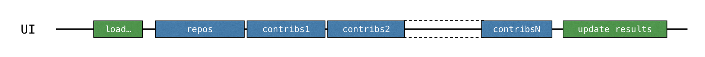
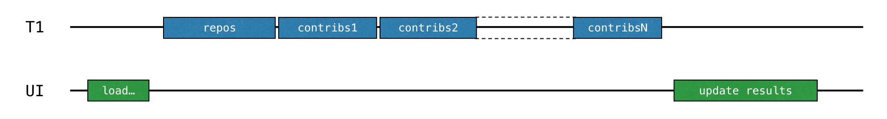
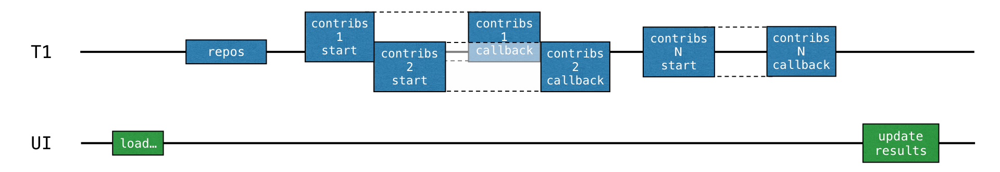
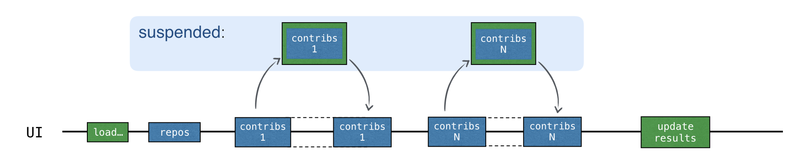
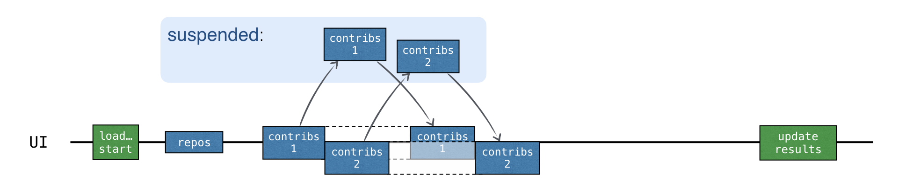
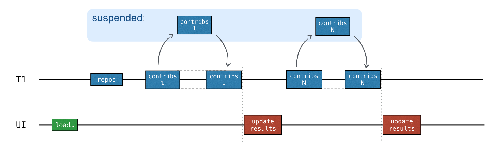
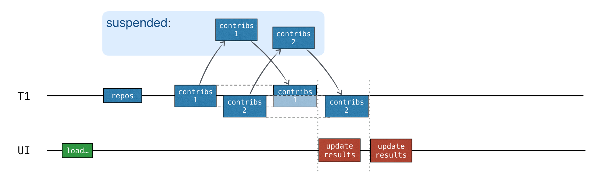
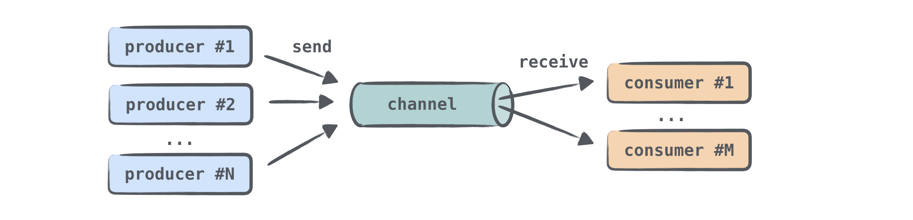
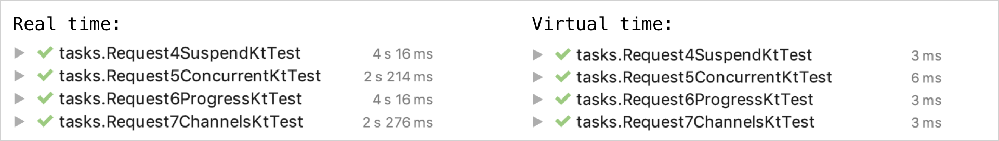
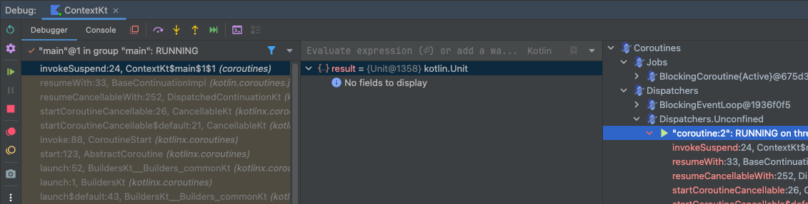

# Coroutines (kotlinx.coroutines)

- Coroutines basics
- Coroutines and channels-tutorial
- Cancellation and timeouts
- Composing suspending functions
- Coroutine context and dispatchers
- Asynchronous Flow
- Channels
- Coroutine exception handling
- Shared mutuable state and concurrency
- Select expression (experimental)
- Debug coroutines using IntelliJ IDEA - tutorial
- Debug Kotlin Flow using IntelliJ IDEA - tutorial

reference : https://kotlinlang.org/docs/coroutines-guide.html

---

### Coroutines

비동기, non-blocking은 개발에서 매우 중요한 부분이다.  
코틀린은 couroutine을 통해 비동기 프로그래밍을 쉽게 할 수 있도록 지원한다.

## Coroutines guide

- `async`, `await` 는 kotlin에서 keyword나 라이브러리가 아니다.
- **suspending function**은 더 안전하고 더 낮은 error-prone을 가진다. (futures, promises 보다)
- `kotlinx.coroutines` : 코루틴을 사용하기 위한 라이브러리 (by JetBrains)
    - `launch`, `async` 와 같은 고수준으로 코루틴을 사용할 수 있는 함수를 제공한다.
- `kotlinx-coroutines-core` : 코루틴을 사용하기 위한 라이브러리 (by JetBrains)

## Coroutines basics

### Your first coroutine

- **coroutine** : 중지가능한 연산을 하는 인스턴스
- 스레드와 비슷한 면 : 실행중인 코드 block 가능
- 코루틴은 스레드와 다름 : 스레드 안에서 중지 가능하고 다른 스레드에서 계속할 수 있다.

```kotlin
import kotlinx.coroutines.delay
import kotlinx.coroutines.launch
import kotlinx.coroutines.runBlocking

fun main() = runBlocking {
    launch {
        delay(1000L)
        println("World!")
    }

    println("Hello,")
}
```

```shell
Hello,
World!
```

- `launch` : 코루틴 빌더
    - 새로운 코루틴을 시작하고 실행한다.
- `delay` : 일시 중지 함수 (suspend function)
    - 코루틴을 특정 시간동안 중지
- `runBlocking` : 실행 중인 스레드 (`fun main()`)가 blocked
    - non coroutines world (`fun main()`)과 연결
    - 없이 `launch`를 사용하면 에러 발생 `Unresolved reference: launch`

#### Structured concurrency

- Structured concurrency : 새로운 코루틴은 CoroutineScope에서만 launch 가능
- CoroutineScope : 코루틴의 lifecycle, scope을 관리하는 인터페이스
- 위에서는 `runBlocking` 으로 새로운 CoroutineScope를 만들었다.
- CoroutineScope은 자식 코루틴들이 완료되기 전까지 실행을 끝내지 않는다.

### Extract function refactoring

- `launch` 를 별도의 함수로 추출
- `suspend` modifier : suspending function을 선언
    - suspending function : 코루틴 안에서 사용 가능한 함수이지만, 코루틴 중지 가능
- **suspending function** : 코루틴을 중지 가능한 함수 (코루틴 안에서 사용)

```kotlin
import kotlinx.coroutines.delay
import kotlinx.coroutines.launch
import kotlinx.coroutines.runBlocking

fun main() = runBlocking {
    launch { doWorld() }

    println("Hello,")
}

suspend fun doWorld() {
    delay(1000L)
    println("World!")
}
```

### Scope builder

- `coroutineScope` : 코루틴을 실행하는 블록을 만들어주는 함수

|     | `runBlocking`                      | `coroutineScope`                       |
|-----|------------------------------------|----------------------------------------|
| 공통점 | 코루틴을 실행하는 블록, children이 완료될떄까지 기다림 | 코루틴을 실행하는 블록, children이 완료될때까지 기다림     |
| 차이점 | 실행 중인 스레드를 block                   | 중지하고, thread 를 release하고, 다시 시작할 수 있다. |

```kotlin
fun main() = runBlocking {
    doWorld()
}

suspend fun doWorld() = coroutineScope {  // this: CoroutineScope
    launch {
        delay(1000L)
        println("World!")
    }
    println("Hello")
}
```

### Scope builder and concurrency

- `coroutineScope` builder는 suspending function 내부 어디에서든 사용 가능

```kotlin
// Sequentially executes doWorld followed by "Done"
fun main() = runBlocking {
        doWorld()
        println("Done")
    }

// Concurrently executes both sections
suspend fun doWorld() = coroutineScope { // this: CoroutineScope
    launch {
        delay(2000L)
        println("World 2")
    }
    launch {
        delay(1000L)
        println("World 1")
    }
    println("Hello")
}
```

### An explicit job

- `launch` builder는 Job 오브젝트를 반환
- 명시적으로 Job을 관리할 수 있음

```kotlin
import kotlinx.coroutines.*

suspend fun explicitJob() = coroutineScope {
    val job = launch {
        delay(1000L)
        println("World!")
    }

    println("Hello,")
    job.join() // wait until child coroutine completes
    println("Done")
}
```

### Coroutines are light-weight

- 코루틴은 JVM 스레드보다 resource를 적게 사용

```kotlin
import kotlinx.coroutines.*

fun main() = runBlocking {
    repeat(50_000) { // 50000 개의 개별적인 코루틴 생성, launch는 suspend function (=스레드에게 제어권을 양보)
        launch {
            delay(5000L)
            print(".")
        }
    }
}

// using java thread
fun main() {
    repeat(50_000) {
        thread {
            Thread.sleep(5000L)
            print(".")
        }
    }
}
```

## Coroutines and channels-tutorial

- network request를 suspend function으로 만들기
- 코루틴을 사용해서 request를 concurrently하게 실행
- 채널을 사용해 코루틴 간에 정보 전달

### Before you start

### Blocking requests



```kotlin
interface GitHubService {
    /**
     * Get a list of the repositories for the organization.
     */
    @GET("orgs/{org}/repos?per_page=100")
    fun getOrgReposCall(
        @Path("org") org: String
    ): Call<List<Repo>>

    /**
     * Get a list of the contributors to a repository.
     */
    @GET("repos/{owner}/{repo}/contributors?per_page=100")
    fun getRepoContributorsCall(
        @Path("owner") owner: String,
        @Path("repo") repo: String
    ): Call<List<User>>
}

fun loadContributorsBlocking(service: GitHubService, req: RequestData): List<User> {

    // repository 정보를 가져옴
    val repos = service
        .getOrgReposCall(req.org)
        .execute() // Executes request and blocks the current thread
        .also { logRepos(req, it) }
        .body() ?: emptyList()

    // 각 repository의 contributor 정보를 가져옴
    return repos.flatMap { repo ->
        service
            .getRepoContributorsCall(req.org, repo.name)
            .execute() // Executes request and blocks the current thread
            .also { logUsers(repo, it) }
            .bodyList()
    }.aggregate()
}

fun <T> Response<List<T>>.bodyList(): List<T> {
    return body() ?: emptyList()
}
```

### Task 1

- `aggregate()` : `List<User>`를 받아서
    - 같은 이름 (`login`)을 가진 `User`를 합침
    - 합친 후, `contributions`를 기준으로 내림차순 정렬

```kotlin
class AggregationKtTest {
    @Test
    fun testAggregation() {
        val actual = listOf(
            User("Alice", 1), User("Bob", 3),
            User("Alice", 2), User("Bob", 7),
            User("Charlie", 3), User("Alice", 5)
        ).aggregate()
        val expected = listOf(
            User("Bob", 10),
            User("Alice", 8),
            User("Charlie", 3)
        )
        Assert.assertEquals("Wrong result for 'aggregation'", expected, actual)
    }
}

fun List<User>.aggregate(): List<User> =
    groupBy { it.login }
        .map { (login, group) -> User(login, group.sumOf { it.contributions }) }
        .sortedByDescending { it.contributions }
```

### Callbacks

- callback : 비동기 작업이 완료되면 호출되는 함수
- callback 을 사용해서 스레드를 블룅하고, UI 멈춤 현상을 해결
- operation이 완료되고 코드를 즉시 호출하는 대신에, 콜백 (일반적으로 람다)으로 분리하여 호출자에게 전달

### Use a background thread

```kotlin
thread {
    loadContributorsBlocking(service, req)
}
```



````
fun loadContributorsBackground(
    service: GitHubService, req: RequestData,
    updateResults: (List<User>) -> Unit
)

...

fun loadContributorsBackground(service: GitHubService, req: RequestData, updateResults: (List<User>) -> Unit) {
    thread {
        updateResults(loadContributorsBlocking(service, req))
    }
}

...

loadContributorsBackground(service, req) { users ->
    SwingUtilities.invokeLater {
        updateResults(users, startTime)
    }
}
````

- `updateResults()` : 콜백 함수, 모두 완료되면 호출
- `SwingUtilities.invokeLater` : UI 업데이트를 위해 사용

### Use the Retrofit callback API

- 순차적으로 loading request가 이루어지는 문제점 해결하기
- loading 결과가 나올때까지 분리된 thread가 blocking 되는 문제 해결하기
- loading + processing 중 processing을 callback으로 분리하기



- Retrofit callback API 의 `Call.enqueue()` 로 HTPP reuqest에 대한 callback을 등록할 수 있다.

```kotlin
import retrofit2.Call
import retrofit2.Callback
import retrofit2.Response
import java.util.*
import java.util.concurrent.atomic.AtomicInteger

fun loadContributorsCallbacks(service: GitHubService, req: RequestData, updateResults: (List<User>) -> Unit) {
    service.getOrgReposCall(req.org).onResponse { responseRepos ->
        logRepos(req, responseRepos)
        val repos = responseRepos.bodyList()
        val allUsers = Collections.synchronizedList(mutableListOf<User>())
        val numberOfProcessed = AtomicInteger()
        for (repo in repos) {
            service.getRepoContributorsCall(req.org, repo.name)
                .onResponse { responseUsers ->
                    logUsers(repo, responseUsers)
                    val users = responseUsers.bodyList()
                    allUsers += users
                    if (numberOfProcessed.incrementAndGet() == repos.size) {
                        updateResults(allUsers.aggregate())
                    }
                }
        }
    }
}
```

- `onResponse` : `Call`에 대한 callback을 등록하는 extension function

### Suspending functions

- `Call<List<Repo>>` 을 리턴하는 대신 `suspend` function을 사용

```kotlin
interface GitHubService {
    @GET("orgs/{org}/repos?per_page=100")
    suspend fun getOrgRepos(
        @Path("org") org: String,
    ): List<Repo>
}
````

- `getOrgRepos()` 은 suspend funciton
    - reqeust 스레드는 block 되지 않음
- `getOrgRepos()` 은 `List<Repo>`를 리턴 (Call<List<Repo>> 대신)

```kotlin

import retrofit2.Response

interface GitHubService {
    // getOrgReposCall & getRepoContributorsCall declarations

    @GET("orgs/{org}/repos?per_page=100")
    suspend fun getOrgRepos(
        @Path("org") org: String,
    ): Response<List<Repo>>

    @GET("repos/{owner}/{repo}/contributors?per_page=100")
    suspend fun getRepoContributors(
        @Path("owner") owner: String,
        @Path("repo") repo: String,
    ): Response<List<User>>
}
```

- retrofit을 사용하여 `Response`를 리턴하는 suspend function을 작성, 대체 가능

```kotlin
suspend fun loadContributorsSuspend(service: GitHubService, req: RequestData): List<User> {
    val repos = service
        .getOrgRepos(req.org) // suspend function
        .also { logRepos(req, it) }
        .body() ?: emptyList()

    return repos.flatMap { repo ->
        service
            .getRepoContributors(req.org, repo.name) // suspend function
            .also { logUsers(repo, it) }
            .bodyList()
    }.aggregate()
}

```

### Coroutines

- threa가 blocking 되는 것은 coroutine이 suspend되는 것과 비슷한 개념
- 코루틴은 경량 스레드라고도 불림 (lightweight thread)

| thread | coroutine |
|--------|-----------|
| block  | supdend   |

#### Starting a new coroutine

```kotlin
// 아래는 하나의 코루틴 @coroutine#1에서 실행됨
// 모든 contributor를 load하고,
// 결과를 updateResults()로 전달
launch {
    val users = loadContributorsSuspend(req)
    updateResults(users, startTime)
}
```

- `launch` : 새로운 computation 시작 (새로운 코루틴 시작)
    - compuation은 suspendable
    - network rquest 시 suspend되어 thread를 release
    - network result가 오면 다시 resume
- **coroutine** : suspendable computation
- 코루틴은 스레드 위에서 실행되고, suspend됨
    - suspended : computation이 일시중지, thread에서 제어권을 양보, 메모리에 저장 => thread는 다른 태스크를 수행
- computation이 다시 실행가능해지면
    - 스레드에 다시할당 (다른 스레드일수도 있음)
    - 코루틴은 오직 응답이 왔을떄만 재개 가능



### Concurrency

- 코틀린 코루틴은 스레드보다 덜 리소를 소모함
- 코루틴 생성 = 새로운 비동기 연산 실행
- **coroutine builder** : 새로운 코루틴을 시작 e.g. `launch`, `async`, `runBlocking`
- `async` : 새로운 코루틴을 싲가하고, `Deferred`를 반환
    - `Deferred` : `Future`, `Promise`와 비슷한 개념
        - 연산을 저장하고, **future** 에 결과를 반환할거라는 **promise**를 가짐
- `async`와 `launch`의 차이점
    - `launch` : 결과를 반환하지 않음
        - `Job`을 반환 (`Job` : 코루틴을 나타냄)
        - `Job.join()` : 코루틴이 완료될때까지 기다림
- `Deferred` : `Job`을 확장한 제네릭 타입
    - `async` 는 `Deferred<Int>`를 반환 (or `Deferred<CustomeType>`)
    - `Deferred.await()` : 코루틴 결과 반환, `await()`을 호출한 코루틴은 suspended

```kotlin
import kotlinx.coroutines.*

fun main() = runBlocking {
    val deferred: Deferred<Int> = async {
        loadData()
    }
    println("waiting...")
    println(deferred.await())
}

suspend fun loadData(): Int {
    println("loading...")
    delay(1000L)
    println("loaded!")
    return 42
}
```

```
waiting...
loading...
loaded!
42

Process finished with exit code 0
```

- `runBlocking` : regular funciton과 suspending function의 브릿지
- https://youtu.be/zEZc5AmHQhk

```kotlin
import kotlinx.coroutines.*

fun main() = runBlocking {
    val deferreds: List<Deferred<Int>> = (1..3).map {
        async {
            delay(1000L * it)
            println("Loading $it")
            it
        }
    }
    val sum = deferreds.awaitAll().sum()
    println("$sum")
}
```



````kotlin
suspend fun loadContributorsConcurrent(service: GitHubService, req: RequestData): List<User> = coroutineScope {
    val repos = service
        .getOrgRepos(req.org)
        .also { logRepos(req, it) }
        .bodyList()

    val deferreds: List<Deferred<List<User>>> = repos.map { repo ->
        // 메인스레드에서 코루틴 생성
        async {
            service.getRepoContributors(req.org, repo.name)
                .also { logUsers(repo, it) }
                .bodyList()
        }
    }
    deferreds.awaitAll().flatten().aggregate()
}

````

````
...
    async(Dispatchers.Default) {
        log("starting loading for ${repo.name}")
        service.getRepoContributors(req.org, repo.name)
            .also { logUsers(repo, it) }
            .bodyList()
    }
...
````

- `async(Dispatchers.Default) { }` : `async` 를 사용하여 새로운 코루틴을 시작하고, `Dispatchers.Default`를 사용하여 코루틴을 실행할 스레드를 지정
    - `CoroutineDispatcher` : 코루틴을 실행할 스레드를 지정
    - `Dispatchers.Default` : JVM의 스레드 shared pool

````
// 메인 스레드에서 코루틴 실행
launch(Dispatchers.Main) {
    updateResults()
}
````

- 메인 스레드가 바쁘면, 코루틴은 suspended

````
launch(Dispatchers.Default) {
    val users = loadContributorsConcurrent(service, req)
    withContext(Dispatchers.Main) {
        updateResults(users, startTime)
    }
}
````

- `updateResults`는 메인 스레드에서 실행되어야 하므로, `withContext(Dispatchers.Main)`을 사용하여 메인 스레드에서 실행
- `withContext()` : 람다를 특정한 coroutine context에서 실행
    - 완료될 떄까지 suspended
    - `launch(context) { ... }.join()` 과 같은 의미

### Structured concurrency

- **coroutine scope** :  코루틴간의 parent-child 관계, 구조에 대한 관리를 함
    - 새로운 코루틴은 코루틴 스코프에서 시작되어야함
- **coroutine context** : 코루틴이 실행되는 환경에 대한 추가적인 정보들 e.g. 코루틴 커스텀 이름, 스레드 특정 가능한 디스패쳐 등
- scope은 일반적으로 childe coroutine에 대한 책임이 있다.
- scope은 child coroutine을 취소시킬 수 있다
- scope은 child corouitine의 완료를 기다린다.
    - 따라서 scope에 있는 모든 코루틴이 완료되지 않으면 parent 코루틴은 완료될 수 없다

```kotlin
launch { /* this: CoroutineScope */ }
```

- `launch` 람다의 암묵적 receiver는 `CoroutineScope` 인터페이스
- runBlocking, launch, or async 안의 새로운 코루틴은 자동을 해당 scope에서 실행됨
- `runBlocking` 은 top-level function으로서 현제 스레드를 block

```kotlin
import kotlinx.coroutines.*

fun main() = runBlocking { /* this: CoroutineScope */
    launch { /* ... */ }
    // the same as:
    this.launch { /* ... */ }
}
```

- nested coroutine은 outer coroutne의 child로 취급
    - scope을 통해 parent-child 관계를 유지
- `coroutineScope()` : 새로운 scope를 만들기만 함 (코루틴 생성, 실행 없음)
- `Global.async()`, `GlobalScope.launch()` : global scope에서 코루틴 생성
    - top-level "independent" coroutines
    - 코루틴의 라이프타임 한계는 application 라이프 타임

#### Canceling the loading of contributors

```kotlin
suspend fun loadContributorsConcurrent(
    service: GitHubService,
    req: RequestData,
): List<User> = coroutineScope {
    // ...
    async {
        log("starting loading for ${repo.name}")
        delay(3000)
        // load repo contributors
    }
    // ...
}
```

```kotlin
interface Contributors {

    fun loadContributors() {
        // ...
        when (getSelectedVariant()) {
            CONCURRENT -> {
                launch {
                    val users = loadContributorsConcurrent(service, req)
                    updateResults(users, startTime)
                }.setUpCancellation()      // #1
            }
        }
    }

    private fun Job.setUpCancellation() {
        val loadingJob = this              // #2

        // cancel the loading job if the 'cancel' button was clicked:
        val listener = ActionListener {
            loadingJob.cancel()            // #3
            updateLoadingStatus(CANCELED)
        }
        // add a listener to the 'cancel' button:
        addCancelListener(listener)

        // update the status and remove the listener
        // after the loading job is completed
    }
}
```

- `#1` : `launch` 의 리턴값인 `Job`에 `setUpCancellation()`을 호출
    - `Job` 에는 loading 코루틴에 대한 참조를 가짐

````kotlin
suspend fun loadContributorsNotCancellable(
    service: GitHubService,
    req: RequestData,
): List<User> {   // #1
    // ...
    GlobalScope.async {   // #2
        log("starting loading for ${repo.name}")
        // load repo contributors
    }
    // ...
    return deferreds.awaitAll().flatten().aggregate()  // #3
}
````

- `loadContributorsNotCancellable` : 코루틴이 취소되지 않는다.
    - `GlobalScope.async` : global scope에서 코루틴 생성
    - `GlobalScope` : application life time
    - `GlobalScope`에서 생성된 코루틴은 application이 종료될때까지 실행

#### Using the outer scope's context

- 모든 nested 코루틴은 자동으로 inherited context (부모 코루틴의 context)에서 시작

```kotlin
launch(Dispatchers.Default) {  // outer scope
    val users = loadContributorsConcurrent(service, req)
    // ...
}
````

```kotlin
suspend fun loadContributorsConcurrent(
    service: GitHubService, req: RequestData,
): List<User> = coroutineScope {
    // this scope inherits the context from the outer scope
    // ...
    async {   // nested coroutine started with the inherited context
        // ...
    }
    // ...
}
```

### Showing progress

- repo마다 데이터가 로딩되자마자 UI에 표시

```kotlin
suspend fun loadContributorsProgress(
    service: GitHubService,
    req: RequestData,
    updateResults: suspend (List<User>, completed: Boolean) -> Unit
) {
    val repos = service
        .getOrgRepos(req.org)
        .also { logRepos(req, it) }
        .bodyList()

    var allUsers = emptyList<User>()
    for ((index, repo) in repos.withIndex()) {
        val users = service.getRepoContributors(req.org, repo.name)
            .also { logUsers(repo, it) }
            .bodyList()

        allUsers = (allUsers + users).aggregate()
        updateResults(allUsers, index == repos.lastIndex)
    }
}

launch(Dispatchers.Default) {
    loadContributorsProgress(service, req) { users, completed ->
        withContext(Dispatchers.Main) {
            updateResults(users, startTime, completed)
        }
    }
}
```

- `updateResults()` : aggregate 중간마다 UI에 표시
    - `suspend` function으로 선언된 파라미터
    - `withContext` : lamda 블록을 다른 context (`loadContributorsProgress`) 에서 실행

#### Consecutive vs concurrent



- Consecutive (sequential) : repo를 순차적으로 접근해서 aggregate
- 동기화 필요 없음



- Concurrent : repo를 순차적으로 접근하지만, aggregate를 concurrent하게 실행
- 동기화 필요 (synchronization)
    - 동기화 작업 : `updateResults()` 내부에서 수행

### Channels


- 코루틴 간에 데이터를 통신(전달) 하는 방법
- 코루틴 하나가 채널로 정보를 보내면, 다른 하나가 받을 수 있음



- producer-consumer 패턴 가능
- N개의 코루틴이 같은 채널을 통해 데이터를 받을 때, 채널로부터 데이터가 처리된 (consume) 즉시 el은 채널에서 제거됨
- **suspend** `send()`, `receive()` 함수를 사용하여 채널을 통해 데이터를 보내고 받음
- 채널의 크기는 유한할때, 채널의 크기가 가득 차면 `send()` 함수는 suspended 됨

```kotlin
interface SendChannel<in E> {
    suspend fun send(element: E)
    fun close(): Boolean
}

interface ReceiveChannel<out E> {
    suspend fun receive(): E
}

interface Channel<E> : SendChannel<E>, ReceiveChannel<E>
```

- `Channel`의 세가지 인터페이스
    - `SendChannel` : 데이터를 보내는 채널
    - `ReceiveChannel` : 데이터를 받는 채널
    - `Channel` : 데이터를 보내고 받는 채널


- Unlimited channel : 큐와 가장 비슷
- 프로듀서가 무한정으로 채널에 데이터를 보낼 수 있음
- `send()` 는 suspended 되지 않음
- 빈 채널에 `receive()` 를 호출하면 suspended 됨


- Buffer channel : 크기가 유한한 채널
- 채널이 가득 차면 `send()` 는 suspended 됨


- Rendezvous channel : 크기가 0인 채널
- `send()`, `receive()` 는 항상 suspended 됨 (둘 다 준비될 때까지)

- Conflated channel : 가장 최근에 보낸 데이터만 유지
- `send()` 시 채널이 가득 차면, 가장 최근에 보낸 데이터로 채널을 덮어씀 (suspend 되지 않음)
- `receive()` 는 항상 가장 최근에 보낸 데이터를 받음

```kotlin
val rendezvousChannel = Channel<String>() // Rendezvous channel (default)
val bufferedChannel = Channel<String>(10) // Buffered channel with buffer size 10
val conflatedChannel = Channel<String>(CONFLATED) // Conflated channel
val unlimitedChannel = Channel<String>(UNLIMITED) // Unlimited channel
```

```kotlin
import kotlinx.coroutines.channels.Channel
import kotlinx.coroutines.launch
import kotlinx.coroutines.runBlocking

fun main() = runBlocking<Unit> {
    val channel = Channel<String>()
    launch {
        channel.send("A1")
        channel.send("A2")
        log("A done")
    }

    launch {
        channel.send("B1")
        log("B done")
    }

    launch {
        repeat(3) {
            log(channel.receive())
        }
    }
}


fun log(msg: String) = println("[${Thread.currentThread().name}] $msg")
```

````
[main] A1
[main] B1
[main] A done
[main] B done
[main] A2

Process finished with exit code 0
````

````kotlin
suspend fun loadContributorsChannels(
    service: GitHubService,
    req: RequestData,
    updateResults: suspend (List<User>, completed: Boolean) -> Unit,
) {
    coroutineScope {
        val repos = service
            .getOrgRepos(req.org)
            .also { logRepos(req, it) }
            .bodyList()

        val channel = Channel<List<User>>()
        for (repo in repos) {
            launch {
                val users = service.getRepoContributors(req.org, repo.name)
                    .also { logUsers(repo, it) }
                    .bodyList()
                channel.send(users) // send data to the channel
            }
        }
        var allUsers = emptyList<User>()
        repeat(repos.size) {
            val users = channel.receive()
            allUsers = (allUsers + users).aggregate()
            updateResults(allUsers, it == repos.lastIndex)
        }
    }
}
````

### Testing coroutines

- 실행시간을 직접 측정하면 machine 준비시간 등이 합쳐져 부정확함
- test dispatcher 사용해서 virtual time을 측정
- `runTest` : test dispatcher를 사용하여 코루틴을 실행 (`runBlocking`과 비슷)
- test dispatcher에서 `delay` 하면 즉시 리턴하고 virtual time을 증가시킴



````kotlin
import kotlinx.coroutines.delay
import kotlinx.coroutines.test.currentTime
import kotlinx.coroutines.test.runTest
import kotlin.test.Test

class TestingCoroutines {
    @Test
    fun testDelayInSuspend() = runTest {
        val realStartTime = System.currentTimeMillis()
        val virtualStartTime = currentTime

        foo()
        println("${System.currentTimeMillis() - realStartTime} ms") // ~ 6 ms
        println("${currentTime - virtualStartTime} ms")             // 1000 ms
    }

    suspend fun foo() {
        delay(1000)    // auto-advances without delay
        println("foo") // executes eagerly when foo() is called
    }

}

````

````
foo
0 ms
1000 ms

Process finished with exit code 0
````

```kotlin
@Test
fun testDelayInLaunch() = runTest {
        val realStartTime = System.currentTimeMillis()
        val virtualStartTime = currentTime

        bar()

        println("${System.currentTimeMillis() - realStartTime} ms") // ~ 11 ms
        println("${currentTime - virtualStartTime} ms")             // 1000 ms
    }

suspend fun bar() = coroutineScope {
    launch {
        delay(1000)    // auto-advances without delay
        println("bar") // executes eagerly when bar() is called
    }
}
```

````
bar
1 ms
1000 ms

Process finished with exit code 0
````

- `delay` 가 있음에도 불구하고, 실제 실행시간이 delay 되지 않음

```kotlin

@Test
fun test() = runTest {
    val startTime = currentTime
    // action
    val totalTime = currentTime - startTime
    // testing result
}


fun testConcurrent() = runTest {
    val startTime = currentTime
    val result = loadContributorsConcurrent(MockGithubService, testRequestData)
    Assert.assertEquals("Wrong result for 'loadContributorsConcurrent'", expectedConcurrentResults.users, result)
    val totalTime = currentTime - startTime

    Assert.assertEquals(
        "The calls run concurrently, so the total virtual time should be 2200 ms: " +
                "1000 for repos request plus max(1000, 1200, 800) = 1200 for concurrent contributors requests)",
        expectedConcurrentResults.timeFromStart, totalTime
    )
}

fun testChannels() = runTest {
    val startTime = currentTime
    var index = 0
    loadContributorsChannels(MockGithubService, testRequestData) { users, _ ->
        val expected = concurrentProgressResults[index++]
        val time = currentTime - startTime
        Assert.assertEquals(
            "Expected intermediate results after ${expected.timeFromStart} ms:",
            expected.timeFromStart, time
        )
        Assert.assertEquals("Wrong intermediate results after $time:", expected.users, users)
    }
}
```

## Cancellation and timeouts

### Cancelling coroutine execution

- 코루틴을 취소할 니즈가 있음 (유저가 UI를 닫았는데, 코루틴이 계속 실행되는 경우)

````kotlin
val job = launch {
    repeat(1000) { i ->
        println("job: I'm sleeping $i ...")
        delay(500L)
    }
}
delay(1300L) // delay a bit
println("main: I'm tired of waiting!")
job.cancel() // cancels the job
job.join() // waits for job's completion 
println("main: Now I can quit.")
````

````
job: I'm sleeping 0 ...
job: I'm sleeping 1 ...
job: I'm sleeping 2 ...
main: I'm tired of waiting!
main: Now I can quit.
````

- `launch` 가 반환하는 `Job`을 사용하여 코루틴을 취소

### Cancellation is cooperative

- 코루틴은 cooperative하게 취소됨
- `kotlinx.coroutines` 의 모든 suspeding function은 취소 가능
- 코루틴 취소를 체크하다 `CancellationException`을 던지고, 취소시킴
- 코루틴 연산을 하고있어서, 취소 체크를 안하고 있다면 취소 불가능

````kotlin
val startTime = System.currentTimeMillis()
val job = launch(Dispatchers.Default) {
    var nextPrintTime = startTime
    var i = 0
    while (i < 5) { // computation loop, just wastes CPU
        // print a message twice a second
        if (System.currentTimeMillis() >= nextPrintTime) {
            println("job: I'm sleeping ${i++} ...")
            nextPrintTime += 500L
        }
    }
}
delay(1300L) // delay a bit
println("main: I'm tired of waiting!")
job.cancelAndJoin() // cancels the job and waits for its completion
println("main: Now I can quit.")
````

````
job: I'm sleeping 0 ...
job: I'm sleeping 1 ...
job: I'm sleeping 2 ...
main: I'm tired of waiting!
job: I'm sleeping 3 ...
job: I'm sleeping 4 ...
main: Now I can quit.
````

- `job.cancelAndJoin()` : `cancel()`과 `join()`을 합친 함수
- "I'm sleeping" 일때 취소가 불가능함

```kotlin
val job = launch(Dispatchers.Default) {
    repeat(5) { i ->
        try {
            // print a message twice a second
            println("job: I'm sleeping $i ...")
            delay(500)
        } catch (e: Exception) {
            // log the exception
            println(e)
        }
    }
}
delay(1300L) // delay a bit
println("main: I'm tired of waiting!")
job.cancelAndJoin() // cancels the job and waits for its completion
println("main: Now I can quit.")
```

- `try-catch` 블록을 사용하여 `CancellationException`을 catch하면서 취소가 불가능해짐

### Making computation code cancellable

- 취소 가능한 코드를 작성하는 방법
- 방법 1. 주기적으로 cancellation check
    - `yield()` 를 활용
- 방법 2. 명시적으로 취소 상태를 확인

```kotlin
val startTime = System.currentTimeMillis()
val job = launch(Dispatchers.Default) {
    var nextPrintTime = startTime
    var i = 0
    while (isActive) { // cancellable computation loop
        // print a message twice a second
        if (System.currentTimeMillis() >= nextPrintTime) {
            println("job: I'm sleeping ${i++} ...")
            nextPrintTime += 500L
        }
    }
}
delay(1300L) // delay a bit
println("main: I'm tired of waiting!")
job.cancelAndJoin() // cancels the job and waits for its completion
println("main: Now I can quit.")
```

````
job: I'm sleeping 0 ...
job: I'm sleeping 1 ...
job: I'm sleeping 2 ...
main: I'm tired of waiting!
main: Now I can quit.
````

- `isActive` : `CoroutineScope`의 확장 프로퍼티

### Closing resources with finally

- suspending funciton은 취소되었을때 `CancellationException`을 던짐
- `finally` 블록을 사용하여 취소되었을때 리소스를 해제

```kotlin
val job = launch {
    try {
        repeat(1000) { i ->
            println("job: I'm sleeping $i ...")
            delay(500L)
        }
    } finally {
        println("job: I'm running finally")
    }
}
delay(1300L) // delay a bit
println("main: I'm tired of waiting!")
job.cancelAndJoin() // cancels the job and waits for its completion
println("main: Now I can quit.")
````

````
job: I'm sleeping 0 ...
job: I'm sleeping 1 ...
job: I'm sleeping 2 ...
main: I'm tired of waiting!
job: I'm running finally
main: Now I can quit.
````

### Run non-cancellable block

- `withContext(NonCancellable)` : 취소 불가능한 블록을 실행
- 아주 드문 케이스로 취소 불가능한 블록을 실행해야할때 사용

```kotlin
val job = launch {
    try {
        repeat(1000) { i ->
            println("job: I'm sleeping $i ...")
            delay(500L)
        }
    } finally {
        withContext(NonCancellable) {
            println("job: I'm running finally")
            delay(1000L)
            println("job: And I've just delayed for 1 sec because I'm non-cancellable")
        }
    }
}
delay(1300L) // delay a bit
println("main: I'm tired of waiting!")
job.cancelAndJoin() // cancels the job and waits for its completion
println("main: Now I can quit.")
```

```
job: I'm sleeping 0 ...
job: I'm sleeping 1 ...
job: I'm sleeping 2 ...
main: I'm tired of waiting!
job: I'm running finally
job: And I've just delayed for 1 sec because I'm non-cancellable
main: Now I can quit.
```

### Timeout

- 실무에서 코루틴을 취소해야하는 이유 중 가장 큰 부분
- 코루틴의 실행이 특정 시간을 초과하면 취소
- `withTimeout` : 특정 시간을 초과하면 `TimeoutCancellationException`을 던짐
    - `TimeoutCancellationException` 은 `CancellationException`의 하위 클래스
    - `CancellationException`은 보통 완료로 처리하지만, `withTimeout` 안에서는 예외로 처리
- `withTimeoutOrNull` : `TimeoutCancellationException`을 던지지 않고 `null`을 반환

```kotlin
withTimeout(1300L) {
    repeat(1000) { i ->
        println("I'm sleeping $i ...")
        delay(500L)
    }
}
```

````
'm sleeping 0 ...
I'm sleeping 1 ...
I'm sleeping 2 ...
Exception in thread "main" kotlinx.coroutines.TimeoutCancellationException: Timed out waiting for 1300 ms
 at _COROUTINE._BOUNDARY._ (CoroutineDebugging.kt:46) 
 at FileKt$main$1$1.invokeSuspend (File.kt:-1) 
 at FileKt$main$1.invokeSuspend (File.kt:-1) 
Caused by: kotlinx.coroutines.TimeoutCancellationException: Timed out waiting for 1300 ms
at kotlinx.coroutines.TimeoutKt .TimeoutCancellationException(Timeout.kt:191)
````

````kotlin
val result = withTimeoutOrNull(1300L) {
    repeat(1000) { i ->
        println("I'm sleeping $i ...")
        delay(500L)
    }
    "Done" // will get cancelled before it produces this result
}
println("Result is $result")
````

````
I'm sleeping 0 ...
I'm sleeping 1 ...
I'm sleeping 2 ...
Result is null
````

### Asynchronous timeout and resources

- `withTimeout` 을 사용했고, 블록 내에서 리소스를 사용하는 경우 블록 밖에서 리소스를 해제
- 아래 코드에서 리소스 누수는 없음

```kotlin
var acquired = 0

class Resource {
    init {
        acquired++
    } // Acquire the resource

    fun close() {
        acquired--
    } // Release the resource
}

fun main() {
    runBlocking {
        repeat(10_000) { // Launch 10K coroutines
            launch {
                val resource = withTimeout(60) { // Timeout of 60 ms
                    delay(50) // Delay for 50 ms
                    Resource() // Acquire a resource and return it from withTimeout block     
                }
                resource.close() // Release the resource
            }
        }
    }
    // Outside of runBlocking all coroutines have completed
    println(acquired) // Print the number of resources still acquired
}
```

```
0
```

````kotlin
runBlocking {
    repeat(10_000) { // Launch 10K coroutines
        launch {
            var resource: Resource? = null // Not acquired yet
            try {
                withTimeout(60) { // Timeout of 60 ms
                    delay(50) // Delay for 50 ms
                    resource = Resource() // Store a resource to the variable if acquired      
                }
                // We can do something else with the resource here
            } finally {
                resource?.close() // Release the resource if it was acquired
            }
        }
    }
}
// Outside of runBlocking all coroutines have completed
println(acquired) // Print the number of resources still acquired
````

```
0
```

## Composing suspending functions

suspending function을 조합하는 여러 방법

### Sequential by default

```kotlin
suspend fun doSomethingUsefulOne(): Int {
    delay(1000L) // pretend we are doing something useful here
    return 13
}

suspend fun doSomethingUsefulTwo(): Int {
    delay(1000L) // pretend we are doing something useful here, too
    return 29
}

fun main() {
    val time = measureTimeMillis {
        val one = doSomethingUsefulOne()
        val two = doSomethingUsefulTwo()
        println("The answer is ${one + two}")
    }
    println("Completed in $time ms")
}
```

````
The answer is 42
Completed in 2017 ms
````

- 코루틴의 코드는 기본적으로 regular code처럼 sequential하게 실행됨

### Concurrent using async

- 각 suspending function을 `async`로 감싸면 concurrent하게 실행됨
- `async` : `launch`와 비슷
    - `launch` : 결과를 반환하지 않음
    - `async` : 결과 `Deferred`를 반환
- `Deferred` : light-weight non-blocking future
    - `Deferred.await()` : 결과를 반환
    - `Job` 처럼 필요시 cancel 가능

```kotlin
val time = measureTimeMillis {
    val one = async { doSomethingUsefulOne() }
    val two = async { doSomethingUsefulTwo() }
    println("The answer is ${one.await() + two.await()}")
}
println("Completed in $time ms")
```

````
The answer is 42
Completed in 1017 ms
````

### Lazily started async

- `async`는 `start` 파라미터를 가짐
- `start` : `CoroutineStart` 타입
    - `DEFAULT` : 즉시 시작
    - `LAZY` : `Deferred`를 반환하고, `Deferred.await()` 호출 혹은 `Job.start()` 호출시 시작

```kotlin
val time = measureTimeMillis {
    val one = async(start = CoroutineStart.LAZY) { doSomethingUsefulOne() }
    val two = async(start = CoroutineStart.LAZY) { doSomethingUsefulTwo() }
    // some computation
    one.start() // start the first one
    two.start() // start the second one
    println("The answer is ${one.await() + two.await()}")
}
println("Completed in $time ms")
```

````
The answer is 42
Completed in 1017 ms
````

### Async-style functions

> 프로그래밍 언어에서 비동기 스타일 함수는 인기가 많으나, 코루틴에서는 비추

- `GlobalScope`을 사용하는 `async` 코투린 빌더로 비동기 스타일 함수를 만들 수 있음
- structured concurrency를 위반하고, 취소가 어려움

````kotlin
// The result type of somethingUsefulOneAsync is Deferred<Int>
@OptIn(DelicateCoroutinesApi::class)
fun somethingUsefulOneAsync() = GlobalScope.async {
        doSomethingUsefulOne()
    }

// The result type of somethingUsefulTwoAsync is Deferred<Int>
@OptIn(DelicateCoroutinesApi::class)
fun somethingUsefulTwoAsync() = GlobalScope.async {
    doSomethingUsefulTwo()
}
````

- `xxxAsync` 은 suspending function이 아님
- 어디서나 비동기로 호출 가능

````kotlin
// note that we don't have `runBlocking` to the right of `main` in this example
fun main() {
    val time = measureTimeMillis {
        // we can initiate async actions outside of a coroutine
        val one = somethingUsefulOneAsync()
        val two = somethingUsefulTwoAsync()
        // but waiting for a result must involve either suspending or blocking.
        // here we use `runBlocking { ... }` to block the main thread while waiting for the result
        runBlocking {
            println("The answer is ${one.await() + two.await()}")
        }
    }
    println("Completed in $time ms")
}
````

- `somethingUsefulOneAsync` 를 실행한 메인 스레드가 백그라운드로 `doSomethingUsefulOne`을 실행
- `runBlocking`을 사용하여 결과를 기다림
- 즉 메인스레드가 `runBlocking`을 사용하여 blocking 되어 백그라운드 작업이 완료될때까지 기다림 (Structured Concurrency에서는 발생하지 않음)

### Structured concurrency with async

- 비동기를 활용한 동시성 예시
- `doSomethingUsefulOne`, `doSomethingUsefulTwo` 를 동시에 실행하고, 결과를 합침

```kotlin
suspend fun concurrentSum(): Int = coroutineScope {
    val one = async { doSomethingUsefulOne() }
    val two = async { doSomethingUsefulTwo() }
    one.await() + two.await()
}

fun main() {
    val time = measureTimeMillis {
        println("The answer is ${concurrentSum()}")
    }
    println("Completed in $time ms")
}
```

````
The answer is 42
Completed in 1017 ms
````

#### cancelling 전파

```kotlin
import kotlinx.coroutines.*

fun main() = runBlocking<Unit> {
    try {
        failedConcurrentSum()
    } catch (e: ArithmeticException) {
        println("Computation failed with ArithmeticException")
    }
}

suspend fun failedConcurrentSum(): Int = coroutineScope {
    val one = async<Int> {
        try {
            delay(Long.MAX_VALUE) // Emulates very long computation
            42
        } finally {
            println("First child was cancelled")
        }
    }
    val two = async<Int> {
        println("Second child throws an exception")
        throw ArithmeticException()
    }
    one.await() + two.await()
}
```

````
Second child throws an exception
First child was cancelled
Computation failed with ArithmeticException
````

## Coroutine context and dispatchers

- 코루틴은 항상 실행되는 context (`CoroutineContext`)를 가짐
- `CoroutineContext` : 여러 요소를 가짐
    - `Job` : 코루틴의 lifecycle을 관리
    - `CoroutineDispatcher` : 코루틴을 실행할 스레드를 지정
    - `CoroutineName` : 코루틴의 이름
    - `CoroutineExceptionHandler` : 코루틴에서 발생한 예외를 처리

### Dispatchers and threads

- **coroutine dispatcher** (`CoroutineDispatcher`) : 코루틴을 실행할 스레드를 지정
    - 스레드 풀에 디스패치
- 모든 코루틴 빌더 (`launch`, `asynce`, ..)는 `CoroutineContext`를 받음 (optional)

```kotlin
launch { // context of the parent, main runBlocking coroutine
    println("main runBlocking      : I'm working in thread ${Thread.currentThread().name}")
}
launch(Dispatchers.Unconfined) { // not confined -- will work with main thread
    println("Unconfined            : I'm working in thread ${Thread.currentThread().name}")
}
launch(Dispatchers.Default) { // will get dispatched to DefaultDispatcher 
    println("Default               : I'm working in thread ${Thread.currentThread().name}")
}
launch(newSingleThreadContext("MyOwnThread")) { // will get its own new thread
    println("newSingleThreadContext: I'm working in thread ${Thread.currentThread().name}")
}
```

````
main runBlocking      : I'm working in thread main
Unconfined            : I'm working in thread main
Default               : I'm working in thread DefaultDispatcher-worker-1
newSingleThreadContext: I'm working in thread MyOwnThread
````

- 파라미터 없는 `launch` : 부모 코루틴의 context를 상속
    - main runBlocking coroutine의 context를 상속
- `Dispatchers.Unconfined` : 부모 코루틴의 context를 상속하지 않음
    - main thread에서 실행
- `Dispatchers.Default` : 공유 백그라운드 스레드 풀에서 실행
- `newSingleThreadContext` : 새로운 스레드를 생성

### Unconfined vs confined dispatcher

- `Dispathcers.Unconfined` : 코루틴이 시작되는 스레드에서 실행
    - 첫번쨰 suspension point에서 다른 스레드로 전환됨
    - 중지되면, suspending function을 호출한 스레드에서 재개
    - 적합 : CPU 시간을 많이 소모하지 않고, 공유 데이터를 변경하지 않는 경우
    - 자주 사용되지 않음
- `Dispatchers.Default` : 바깥 `CoroutineScope`의 context를 상속
    - `runBlocking` 하면 호출한 thread에서만 실행됨
    - FIFO 스케줄링

````kotlin
launch(Dispatchers.Unconfined) { // not confined -- will work with main thread
    println("Unconfined      : I'm working in thread ${Thread.currentThread().name}")
    delay(500)
    println("Unconfined      : After delay in thread ${Thread.currentThread().name}")
}
launch { // context of the parent, main runBlocking coroutine
    println("main runBlocking: I'm working in thread ${Thread.currentThread().name}")
    delay(1000)
    println("main runBlocking: After delay in thread ${Thread.currentThread().name}")
}
````

````
Unconfined      : I'm working in thread main
main runBlocking: I'm working in thread main
Unconfined      : After delay in thread kotlinx.coroutines.DefaultExecutor
main runBlocking: After delay in thread main
````

### Debugging coroutines and threads

- 코루틴은 스레드 에서 중지되어 다른 스레드에서 재개 가능
- 싱글스레드 디스패처여도, 어떤 코루틴이 뭘하고 있는지 파악하기 힘듦

#### Debugging with IDEA



- Debug 툴의 Coroutines 탭 사용
- 코루틴 state 확인
- 각 코루틴의 로컬 변수, 변수 값 확인
- 코루틴 stack trace 확인
- Coroutines Dump : 코루틴의 상태를 파일로 저장

#### Debugging using logging

- logging framework을 사용하여 코루틴의 상태를 로깅

````kotlin
// run with JVM option -Dkotlinx.coroutines.debug
val a = async {
    log("I'm computing a piece of the answer")
    6
}
val b = async {
    log("I'm computing another piece of the answer")
    7
}
log("The answer is ${a.await() * b.await()}")

fun log(msg: String) = println("[${Thread.currentThread().name}] $msg")
````

````
[main @coroutine#2] I'm computing a piece of the answer
[main @coroutine#3] I'm computing another piece of the answer
[main @coroutine#1] The answer is 42
````

### Jumping between threads

````kotlin
import kotlinx.coroutines.newSingleThreadContext
import kotlinx.coroutines.runBlocking
import kotlinx.coroutines.withContext


fun main() {
    newSingleThreadContext("Ctx1").use { ctx1 ->
        newSingleThreadContext("Ctx2").use { ctx2 ->
            runBlocking(ctx1) { // context 명시
                log("Started in ctx1")
                withContext(ctx2) { // context 변경
                    log("Working in ctx2")
                }
                log("Back to ctx1")
            }
        }
    }
}
````

````
[Ctx1 @coroutine#1] Started in ctx1
[Ctx2 @coroutine#1] Working in ctx2
[Ctx1 @coroutine#1] Back to ctx1
````

- `newSingleThreadContext` : 새로운 스레드를 생성하고 `use` 블록이 끝나면 스레드를 release

### Job in the context

- `Job`은 context의 일부
- `coroutineCOntext[Job]` 표현식으로 `Job`을 얻을 수 있음

````kotlin
import kotlinx.coroutines.Job
import kotlinx.coroutines.newSingleThreadContext
import kotlinx.coroutines.runBlocking
import kotlinx.coroutines.withContext


fun main() {
    newSingleThreadContext("Ctx1").use { ctx1 ->
        newSingleThreadContext("Ctx2").use { ctx2 ->
            runBlocking(ctx1) {
                log("Started in ctx1")
                println("My job is ${coroutineContext[Job]}") // My job is "coroutine#1":BlockingCoroutine{Active}@7103734e
                withContext(ctx2) {
                    log("Working in ctx2")
                }
                log("Back to ctx1")
            }
        }
    }
}
````

### Children of a coroutine

- `CoroutineScope`으로 코루틴을 시작할때, `CoroutineScope.coroutineContext`에 `Job`이 포함됨
- 부모 코루틴의 `Job`은 자식 코루틴의 `Job`을 포함
- 코루틴이 취소되면 자식 코루틴도 취소됨
- 명시적으로 부모-자식 관계를 무시(취소)하는 방법
    - 방법 1. 서로 다른 scope을 코루틴 런치 시 사용 (e.g. `GlobalScope.launch`)
    - 방법 2. 코루틴 런치시 context 파라미터로 다른 `Job` 오브젝트 사용
        - 해당 `Job` 의 부모를 상속받음

```kotlin
// launch a coroutine to process some kind of incoming request
val request = launch {
    // it spawns two other jobs
    launch(Job()) {
        println("job1: I run in my own Job and execute independently!")
        delay(1000)
        println("job1: I am not affected by cancellation of the request")
    }
    // and the other inherits the parent context
    launch {
        delay(100)
        println("job2: I am a child of the request coroutine")
        delay(1000)
        println("job2: I will not execute this line if my parent request is cancelled")
    }
}
delay(500)
request.cancel() // cancel processing of the request
println("main: Who has survived request cancellation?")
delay(1000) // delay the main thread for a second to see what happens
```

````
job1: I run in my own Job and execute independently!
job2: I am a child of the request coroutine
main: Who has survived request cancellation?
job1: I am not affected by cancellation of the request
````

### Parental responsibilities

- 부모 코루틴은 자식 코루틴이 완료되기를 언제나 기다림
- 명시적으로 `Job.join` 해서 기다리지 않아도 됨

````kotlin
// launch a coroutine to process some kind of incoming request
val request = launch {
    repeat(3) { i -> // launch a few children jobs
        launch {
            delay((i + 1) * 200L) // variable delay 200ms, 400ms, 600ms
            println("Coroutine $i is done")
        }
    }
    println("request: I'm done and I don't explicitly join my children that are still active")
}
request.join() // wait for completion of the request, including all its children
println("Now processing of the request is complete")
````

````
request: I'm done and I don't explicitly join my children that are still active
Coroutine 0 is done
Coroutine 1 is done
Coroutine 2 is done
Now processing of the request is complete
````

### Naming coroutines for debugging

- `CoroutineName` : 코루틴의 이름을 지정
- debugging mode에서 코루틴의 이름을 확인 가능

````kotlin
log("Started main coroutine")
// run two background value computations
val v1 = async(CoroutineName("v1coroutine")) {
    delay(500)
    log("Computing v1")
    6
}
val v2 = async(CoroutineName("v2coroutine")) {
    delay(1000)
    log("Computing v2")
    7
}
log("The answer for v1 * v2 = ${v1.await() * v2.await()}")
````

````
[main @coroutine#7] Started main coroutine
[main @v1coroutine#8] Computing v1
[main @v2coroutine#9] Computing v2
[main @coroutine#7] The answer for v1 * v2 = 42
````

### Combining context elements

- `+` 연산자로 `CoroutineContext`를 합칠 수 있음

````kotlin
launch(Dispatchers.Default + CoroutineName("test")) {
    println("I'm working in thread ${Thread.currentThread().name}")
}
````

````
I'm working in thread DefaultDispatcher-worker-1 @test#11
````

### Coroutine scope

- `CoroutineScope` : 코루틴을 시작하고, 취소할 수 있는 scope
- `CoroutineScope` 인스턴스는 `CoroutineScope()`, `MainScope()` 등으로 생성

```kotlin
class Activity {
    private val mainScope = CoroutineScope(Dispatchers.Default)
    fun destroy() {
        mainScope.cancel()
    }

    fun doSomething() {
        // launch ten coroutines for a demo, each working for a different time
        repeat(10) { i ->
            mainScope.launch {
                delay((i + 1) * 200L) // variable delay 200ms, 400ms, ... etc
                println("Coroutine $i is done")
            }
        }
    }
}


fun main() = runBlocking {
    val activity = Activity()
    activity.doSomething() // run test function
    println("Launched coroutines")
    delay(500L) // delay for half a second
    println("Destroying activity!")
    activity.destroy() // cancels all coroutines
    delay(1000) // visually confirm that they don't work
}
```

#### Thread-local data

- 코루틴 간에 스레드-로컬 데이터를 전달하는 방법
- `ThreadLocal` : `asContextElement` 확장 함수를 사용하여 `CoroutineContext`에 추가
    - 주어진 `ThreadLocal` 을 저장하고 코루틴이 실행될때 값을 복원
- `ensuerPresent` : `ThreadLocal` 값이 존재하는지 확인
- `ThreadLocal` 값이 변해도 새로운 값이 코루틴 호출자에게 전파되지 않음
    - context element가 모든 ThreadLocal Object를 추적할 수 없기 때문
    - 수정된 값은 다음 suspension point에서 유실됨
    - `withContext`를 사용해 코루틴 변수 내에서 스레드 로컬 변수 값을 업데이트 할것

```kotlin

val threadLocal = ThreadLocal<String?>() // declare thread-local variable

fun main() = runBlocking {
    threadLocal.set("main")
    println("Pre-main, current thread: ${Thread.currentThread()}, thread local value: '${threadLocal.get()}'")
    val job = launch(Dispatchers.Default + threadLocal.asContextElement(value = "launch")) {
        println("Launch start, current thread: ${Thread.currentThread()}, thread local value: '${threadLocal.get()}'")
        yield()
        println("After yield, current thread: ${Thread.currentThread()}, thread local value: '${threadLocal.get()}'")
    }
    job.join()
    println("Post-main, current thread: ${Thread.currentThread()}, thread local value: '${threadLocal.get()}'")
}
```

````
Pre-main, current thread: Thread[main,5,main], thread local value: 'main'
Launch start, current thread: Thread[DefaultDispatcher-worker-1,5,main], thread local value: 'launch'
After yield, current thread: Thread[DefaultDispatcher-worker-1,5,main], thread local value: 'launch'
Post-main, current thread: Thread[main,5,main], thread local value: 'main'
````

- 별도의 `Dispatchers.Default` 풀에서 코루틴 런치
    - `threadLocal.asContextElement(value = "launch")` 로 `ThreadLocal` 값을 설정
    - 해당 풀에서 어떤 코루틴이 실행되건 `ThreadLocal` 값이 유지됨

## Asynchronous Flow

### Representing multiple values

- Kotlin에서는 `Collection`을 사용하여 여러 값을 표현

```kotlin
fun simple(): List<Int> = listOf(1, 2, 3)

fun main() {
    simple().forEach { value -> println(value) }
}
```

#### Sequences

- CPU 집중 작업 (blocking 유발)을 연속으로 한다면, `Sequence`를 사용
- 아래는 sequence 항목 마다 blocking됨

```kotlin
fun simple(): Sequence<Int> = sequence { // sequence builder
    for (i in 1..3) {
        Thread.sleep(100) // pretend we are computing it
        yield(i) // yield next value
    }
}

fun main() {
    simple().forEach { value -> println(value) }
}
```

#### Suspending functions

```kotlin
suspend fun simple(): List<Int> {
    delay(1000) // pretend we are doing something asynchronous here
    return listOf(1, 2, 3)
}

fun main() = runBlocking<Unit> {
    simple().forEach { value -> println(value) }
}
```

#### Flows

- stream의 value들이 비동기적으로 연산될 수 있다면 `Flow<Int>`를 사용
- `flow { ...}` 빌더를 사용하여 flow를 생성
- 람다 안의 코드는 suspending function

```kotlin
fun simple() = flow { // flow builder
    for (i in 1..3) {
        delay(100) // pretend we are doing something useful here
        emit(i) // emit next value
    }
}

fun main() = runBlocking {
    // Launch a concurrent coroutine to check if the main thread is blocked
    launch {
        for (k in 1..3) {
            println("I'm not blocked $k")
            delay(100)
        }
    }
    // Collect the flow
    simple().collect { value -> println(value) }
}
```

````
I'm not blocked 1
1
I'm not blocked 2
2
I'm not blocked 3
3
````

### Flows are cold

- `Flow`는 cold stream (sequence 처럼)
- cold stream : `collect` 함수가 호출되기 전까지 아무것도 하지 않음
- `flow` 빌더 안의 코드들이 `collect` 함수가 호출될때 실행됨

```kotlin
fun simple(): Flow<Int> = flow {
    println("Flow started")
    for (i in 1..3) {
        delay(100)
        emit(i)
    }
}

fun main() = runBlocking<Unit> {
    println("Calling simple function...")
    val flow = simple()
    println("Calling collect...")
    flow.collect { value -> println(value) }
    println("Calling collect again...")
    flow.collect { value -> println(value) }
}
```

````
Calling simple function...
Calling collect...
Flow started
1
2
3
Calling collect again...
Flow started
1
2
3
````

### Flow cancellation basics

- Flow는 기본 cooperative cancellation을 지원
- suspending funciton에서 `cancel`되면 flow는 취소된다. e.g. `delay`

```kotlin
import kotlinx.coroutines.withTimeoutOrNull

fun simple(): Flow<Int> = flow {
    for (i in 1..3) {
        delay(100)
        println("Emitting $i")
        emit(i)
    }
}

fun main() = runBlocking<Unit> {
    withTimeoutOrNull(250) { // Timeout after 250ms 
        simple().collect { value -> println(value) }
    }
    println("Done")
}
````

````
Emitting 1
1
Emitting 2
2
Done
````

### Flow builders

- `flow{...}` 빌더는 가장 간단한 flow builder
- `flowOf` : 고정된 수의 값을 flow로 변환
- `.asFlow()` : 다양한 컬렉션이나 시퀀스를 flow로 변환

```kotlin
(1..3).asFlow().collect { value -> println(value) }
```

### Intermediate flow operators

- intermediate operator : flow를 변환하거나, 다른 flow를 반환
- `map`, `filter`, ...
- 시퀀스와 다른점 : operator 안의 코드가 suspending function일 수 있음

```kotlin
import kotlinx.coroutines.delay
import kotlinx.coroutines.flow.asFlow
import kotlinx.coroutines.flow.map
import kotlinx.coroutines.runBlocking

suspend fun performRequest(request: Int): String {
    delay(1000) // imitate long-running asynchronous work
    return "response $request"
}

fun main() = runBlocking {
    (1..3).asFlow() // a flow of requests
        .map { request -> performRequest(request) }
        .collect { response -> println(response) }
}
```

````
response 1
response 2
response 3
````

#### Transform operator

- `transform` : 각 요소를 변환하고, 새로운 flow를 반환

````kotlin
(1..3).asFlow() // a flow of requests
    .transform { request ->
        emit("Making request $request")
        emit(performRequest(request))
    }
    .collect { response -> println(response) }
````

````
Making request 1
response 1
Making request 2
response 2
Making request 3
response 3
````

#### Size-limiting operator

- `take` 처럼 limit에 도달하면 flow 실행 취소
- 코루틴의 취소는 항상 예외로부터 가능

```kotlin
fun numbers(): Flow<Int> = flow {
    try {
        emit(1)
        emit(2)
        println("This line will not execute")
        emit(3) // throw exception
    } finally {
        println("Finally in numbers")
    }
}

fun main() = runBlocking {
    numbers()
        .take(2) // take only the first two
        .collect { value -> println(value) }
}
```

````
1
2
Finally in numbers
````

### Terminal flow operators

- flow의 terminal operation은 **suspending function**
- `collect` : flow를 실행하고, 각 요소를 처리
- `toList`, `toSet` : flow를 리스트나 셋으로 변환
- `first`, `single` : 첫번째 요소나 유일한 요소를 반환
- `reduce`, `fold` : flow의 요소를 하나의 값으로 축소

```kotlin
val sum = (1..5).asFlow()
    .map { it * it } // squares of numbers from 1 to 5                           
    .reduce { a, b -> a + b } // sum them (terminal operator)
println(sum)
```

### Flows are sequential

- flow는 sequential하게 실행됨
- terminal operator를 실행한 코루틴에서 flow의 모든 연산이 실행됨
    - 새로운 코루틴이 생성되지 않음

```kotlin
import kotlinx.coroutines.flow.asFlow
import kotlinx.coroutines.flow.filter
import kotlinx.coroutines.flow.map
import kotlinx.coroutines.runBlocking

fun main() = runBlocking {
    (1..5).asFlow()
        .filter {
            println("Filter $it")
            it % 2 == 0
        }
        .map {
            println("Map $it")
            "string $it"
        }.collect {
            println("Collect $it")
        }
}
```

````
Filter 1
Filter 2
Map 2
Collect string 2
Filter 3
Filter 4
Map 4
Collect string 4
Filter 5

Process finished with exit code 0
````

### Flow context

- flow 컬렉션은 항상 코루틴 컨텍스트에서 실행됨
- **context preservation** : flow의 연산은 flow의 context에서 실행되는 성격

```kotlin
withContext(context) {
    simple().collect { value ->
        println(value) // run in the specified context
    }
}
```

```kotlin
fun simple(): Flow<Int> = flow {
    log("Started simple flow")
    for (i in 1..3) {
        emit(i)
    }
}

fun main() = runBlocking<Unit> {
    simple().collect { value -> log("Collected $value") }
}
```

````
[main @coroutine#1] Started simple flow
[main @coroutine#1] Collected 1
[main @coroutine#1] Collected 2
[main @coroutine#1] Collected 3
````

- `simple().collect` 는 `runBlocking`의 context에서 실행됨
- flow 빌더 안의 코드는 `flow` 빌더가 호출되는 context에서 실행됨

#### A common pitfall when using withContext

- `withContext`를 사용하여 컨텍스트 변경 가능
- 하지만 flow 빌더는 context preservation의 주인이어야함, `emit()` 을 다른 컨텍스트에서 호출하면 안됨

```kotlin
fun simpleDifferentContext(): Flow<Int> = flow {
    // The WRONG way to change context for CPU-consuming code in flow builder
    kotlinx.coroutines.withContext(Dispatchers.Default) {
        for (i in 1..3) {
            Thread.sleep(100) // pretend we are computing it in CPU-consuming way
            emit(i) // emit next value
        }
    }
}

fun main() = runBlocking {
    simpleDifferentContext().collect { value -> log("Collected $value") }
}
````

````
Exception in thread "main" java.lang.IllegalStateException: Flow invariant is violated:
		Flow was collected in [BlockingCoroutine{Active}@72dd3e6e, BlockingEventLoop@74f3eb40],
		but emission happened in [DispatchedCoroutine{Active}@72412f39, Dispatchers.Default].
		Please refer to 'flow' documentation or use 'flowOn' instead
		...
````

#### flowOn operator

- `flowOn` : flow의 context를 변경
- 다른 코루틴을 생성해서 flow의 연산을 다른 context에서 실행

```kotlin
fun simple(): Flow<Int> = flow {
    for (i in 1..3) {
        Thread.sleep(100) // pretend we are computing it in CPU-consuming way
        log("Emitting $i")
        emit(i) // emit next value
    }
}.flowOn(Dispatchers.Default) // RIGHT way to change context for CPU-consuming code in flow builder

fun main() = runBlocking<Unit> {
    simple().collect { value ->
        log("Collected $value")
    }
}  
````

````
[DefaultDispatcher-worker-1] Emitting 1
[main] Collected 1
[DefaultDispatcher-worker-1] Emitting 2
[main] Collected 2
[DefaultDispatcher-worker-1] Emitting 3
[main] Collected 3
````

### Buffering

- flow의 일부를 서로 다른 코루틴에서 실행

```kotlin
fun simple3(): Flow<Int> = flow {
    for (i in 1..3) {
        delay(100) // pretend we are asynchronously waiting 100 ms
        emit(i) // emit next value
    }
}

fun main() = runBlocking {
    val time = measureTimeMillis {
        simple3().collect { value ->
            delay(300) // pretend we are processing it for 300 ms
            println(value)
        }
    }
    println("Collected in $time ms")
}
```

````
1
2
3
Collected in 1232 ms
````

- 프로그램 완료까지 1,200ms가 소요됨

```kotlin
val timeBuffer = measureTimeMillis {
    simple()
        .buffer() // buffer emissions, don't wait
        .collect { value ->
            delay(300) // pretend we are processing it for 300 ms
            println(value)
        }
}
println("Collected in $timeBuffer ms")
```

````
1
2
3
Collected in 1039 ms
````

- `buffer` operator를 사용하여 flow를 concurrent하게 실행

### Conflaction

- `conflate` operator : flow 요소를 처리하던 중 다음 요소가 이미 emit되었을때, 이전 요소를 무시

```kotlin
val timeConflate = measureTimeMillis {
    simple()
        .conflate() // conflate emissions, don't process each one
        .collect { value ->
            delay(300) // pretend we are processing it for 300 ms
            println(value)
        }
}
println("Collected in $timeConflate ms")
```

````
1
3
Collected in 713 ms
````

- flow 2번쨰가 실행되는 순간에 3번쨰가 끝나니 2번쨰는 무시됨

#### Processing the latest value

- 새로운 값이 emit 될때마다 이전 값을 무시하고 최신 값을 처리
- `xxxLatest` operator : 최신 값을 처리하고, 이전 값을 무시

```kotlin
val timeCollectLatest = measureTimeMillis {
    simple()
        .collectLatest { value -> // cancel & restart on the latest value
            println("Collecting $value")
            delay(300) // pretend we are processing it for 300 ms
            println("Done $value")
        }
}
println("Collected in $timeCollectLatest ms")
```

````
Collecting 1
Collecting 2
Collecting 3
Done 3
Collected in 638 ms
````

### Composing multiple flows

- flow를 합치는 방법

#### Zip

- `Sequence.zip` 처럼 flow에도 `zip` operator가 있음

```kotlin
import kotlinx.coroutines.flow.asFlow
import kotlinx.coroutines.flow.flowOf
import kotlinx.coroutines.flow.zip

suspend fun main() {
    val nums = (1..3).asFlow()
    val strs = flowOf("one", "two", "three")
    nums.zip(strs) { a, b -> "$a -> $b" }.collect { println(it) }
}
```

````
1 -> one
2 -> two
3 -> three

Process finished with exit code 0
````

#### Combine

- `combine` operator : 두 flow의 최신 값을 결합
- e.g. flow의 각 숫자가 300ms마다 수정되고, 문자열이 400ms마다 수정되면,
    - `zip` 은 400ms마다 값을 출력
    - `combine` 은 300ms마다 값을 출력

```kotlin
val nums = (1..3).asFlow().onEach { delay(300) } // numbers 1..3 every 300 ms
val strs = flowOf("one", "two", "three").onEach { delay(400) } // strings every 400 ms
val startTime = System.currentTimeMillis() // remember the start time
nums.zip(strs) { a, b -> "$a -> $b" } // compose a single string with "zip"
    .collect { value -> // collect and print
        println("$value at ${System.currentTimeMillis() - startTime} ms from start")
    }
```

````
1 -> one at 440 ms from start
2 -> two at 852 ms from start
3 -> three at 1257 ms from start

Process finished with exit code 0
````

```kotlin
val nums2 = (1..3).asFlow().onEach { delay(300) } // numbers 1..3 every 300 ms
val strs2 = flowOf("one", "two", "three").onEach { delay(400) } // strings every 400 ms
val startTime2 = System.currentTimeMillis() // remember the start time
nums2.combine(strs2) { a, b -> "$a -> $b" } // compose a single string with "combine"
    .collect { value -> // collect and print
        println("$value at ${System.currentTimeMillis() - startTime2} ms from start")
    }
```

````
1 -> one at 414 ms from start
2 -> one at 622 ms from start
2 -> two at 821 ms from start
3 -> two at 926 ms from start
3 -> three at 1222 ms from start

Process finished with exit code 0
````

### Flattening flows

- flow의 flow를 합치는 방법 **flattened**
- Collection의 `flatten()`, `flatMap()`과 유사

````kotlin
import kotlinx.coroutines.delay
import kotlinx.coroutines.flow.Flow
import kotlinx.coroutines.flow.asFlow
import kotlinx.coroutines.flow.flow
import kotlinx.coroutines.flow.map

fun requestFlow(i: Int): Flow<String> = flow {
    emit("$i: First")
    delay(500) // wait 500 ms
    emit("$i: Second")
}

fun main() {
    requestFlow(1) // return Flow<String>
    (1..3).asFlow().map { requestFlow(it) } // return Flow<Flow<String>>
}

````

#### flatMapConcat

- `flatMapConcat`, `flattenConcat` : flow의 flow를 순차적으로 합침
- flow 안에서 이전 collection이 완료되어야 다음 collection이 시작됨

````kotlin
val startTime = System.currentTimeMillis() // remember the start time
(1..3).asFlow().onEach { delay(100) } // emit a number every 100 ms
    .flatMapConcat { requestFlow(it) }
    .collect { value -> // collect and print
        println("$value at ${System.currentTimeMillis() - startTime} ms from start")
    }
````

````
1: First at 128 ms from start
1: Second at 634 ms from start
2: First at 734 ms from start
2: Second at 1240 ms from start
3: First at 1345 ms from start
3: Second at 1850 ms from start

Process finished with exit code 0
````

#### flatMapMerge

- `flatMapMerge`, `flattenMerge` : flow의 flow를 병렬로 합침
- concurrent하게 합쳐서져서 value가 합쳐지는대로 출력
- optional parameter로 `concurrency`를 지정하여 병렬로 합칠 수 있음

````kotlin
val startTime = System.currentTimeMillis() // remember the start time
(1..3).asFlow().onEach { delay(100) } // a number every 100 ms
    .flatMapMerge { requestFlow(it) }
    .collect { value -> // collect and print
        println("$value at ${System.currentTimeMillis() - startTime} ms from start")
    }
````

````
1: First at 137 ms from start
2: First at 240 ms from start
3: First at 341 ms from start
1: Second at 642 ms from start
2: Second at 744 ms from start
3: Second at 843 ms from start

Process finished with exit code 0
````

#### flatMapLatest

- `collectLatest` operator와 유사
- 다음 flow에서 emit되면 이전 flow를 취소

````kotlin
val startTime = System.currentTimeMillis() // remember the start time
(1..3).asFlow().onEach { delay(100) } // a number every 100 ms
    .flatMapLatest { requestFlow(it) }
    .collect { value -> // collect and print
        println("$value at ${System.currentTimeMillis() - startTime} ms from start")
    }
````

````
1: First at 106 ms from start
2: First at 213 ms from start
3: First at 316 ms from start
3: Second at 820 ms from start

Process finished with exit code 0
````

### Flow exceptions

- flow에서 예외가 발생해도 완료 시킬 수 있음

#### Collector try and catch

- kotlin `try/catch` block을 사용함

```kotlin
fun simple(): Flow<Int> = flow {
    for (i in 1..3) {
        println("Emitting $i")
        emit(i) // emit next value
    }
}

fun main() = runBlocking {
    try {
        simple().collect { value ->
            println(value)
            check(value <= 1) { "Collected $value" }
        }
    } catch (e: Throwable) {
        println("Caught $e")
    }
}
```

````
Emitting 1
1
Emitting 2
2
Caught java.lang.IllegalStateException: Collected 2

Process finished with exit code 0
````

#### Everything is caught

- `map` operator 안에서 발생한 예외도 `collect`에서 잡힘

````kotlin
fun simple(): Flow<String> =
    flow {
        for (i in 1..3) {
            println("Emitting $i")
            emit(i) // emit next value
        }
    }.map { value ->
        check(value <= 1) { "Crashed on $value" }
        "string $value"
    }

fun main() = runBlocking {
    try {
        simple().collect { value ->
            println(value)
        }
    } catch (e: Throwable) {
        println("Caught $e")
    }
}
````

````
Emitting 1
string 1
Emitting 2
Caught java.lang.IllegalStateException: Crashed on 2

Process finished with exit code 0
````

### Exception transparency

````kotlin
simple()
    .catch { e -> emit("Caught $e") } // emit on exception
    .collect { value -> println(value) }
````

- flow emitter 는 예외를 투명하게 관리 (transparent)
- `try/catch` 블럭 안에서 `flow` 빌더를 사용하여 emmit 하는것은 투명성 위반
- collector가 던진 예외는 항상 flow의 `catch` 블럭에서 잡히는 것을 보장
- emitter 가 `catch` operator 를 사용해 예외를 캡슐화할 수 있음
    - `catch` operator가 잡는 예외
        - `throw` 로 발생한 예외
        - `catch` 바디에서 `emit` 하다 발생한 예외
        - 무시되거나, 로깅되거나, 다른 방법으로 처리되는 예외

#### Transparent catch

- `catch` operator를 exception transparency를 위해 사용
- 반드시 upstream 에서 발생한 예외를 잡아야함 (downstream에서 발생한 예외는 잡히지 않음)

````kotlin
fun simple(): Flow<Int> = flow {
    for (i in 1..3) {
        println("Emitting $i")
        emit(i)
    }
}

fun main() = runBlocking<Unit> {
    simple()
        .catch { e -> println("Caught $e") } // does not catch downstream exceptions
        .collect { value ->
            check(value <= 1) { "Collected $value" }
            println(value)
        }
}        
````

````
Emitting 1
1
Emitting 2
Exception in thread "main" java.lang.IllegalStateException: Collected 2
 at FileKt$main$1$2.emit (File.kt:15) 
 at FileKt$main$1$2.emit (File.kt:14) 
 at kotlinx.coroutines.flow.FlowKt__ErrorsKt$catchImpl$2.emit (Errors.kt:158) 
````

#### Catching declaratively

- `collect` 를 `onEach`로 변경하여 `catch` operator 이전에 배치

````kotlin
simple()
    .onEach { value ->
        check(value <= 1) { "Collected $value" }
        println(value)
    }
    .catch { e -> println("Caught $e") }
    .collect()
````

````
Emitting 1
1
Emitting 2
Caught java.lang.IllegalStateException: Collected 2
````

### Flow completion

- flow는 imperative, declarative 방식으로 완료될 수 있음

#### Imperative finally block

- `finally` block을 사용하여 flow 완료시 실행

````kotlin
fun simple(): Flow<Int> = (1..3).asFlow()

fun main() = runBlocking<Unit> {
    try {
        simple().collect { value -> println(value) }
    } finally {
        println("Done")
    }
}            
````

#### Declarative handling

- `onCompletion` operator를 사용하여 flow 완료시 실행
- 장점 : nullable `Throwable`을 받을 수 있음
    - `catch`와 달리 예외 처리는 할 수 없음
    - 자동으로 downstream으로 전파됨

````kotlin
simple()
    .onCompletion { println("Done") }
    .collect { value -> println(value) }
````

````kotlin
fun simple(): Flow<Int> = flow {
    emit(1)
    throw RuntimeException()
}

fun main() = runBlocking<Unit> {
    simple()
        .onCompletion { cause -> if (cause != null) println("Flow completed exceptionally") }
        .catch { cause -> println("Caught exception") }
        .collect { value -> println(value) }
}            
````

````
1
Flow completed exceptionally
Caught exception
````

#### Successful completion

- `onCompletion` operator는 성공적인 완료에 대해서도 실행됨
    - `null` cause를 받음

````kotlin
fun simple(): Flow<Int> = (1..3).asFlow()

fun main() = runBlocking<Unit> {
    simple()
        .onCompletion { cause -> println("Flow completed with $cause") }
        .collect { value ->
            check(value <= 1) { "Collected $value" }
            println(value)
        }
}
````

````
1
Flow completed with java.lang.IllegalStateException: Collected 2
Exception in thread "main" java.lang.IllegalStateException: Collected 2
````

### Imperative versus declarative

- flow의 Completion, exception은 imperative, declarative 방식으로 처리 가능
- 각자 장단점이 있음
- imperative
    - `try/catch/finally` 블럭을 사용하여 flow의 완료를 처리
    - 예외 처리가 가능
- declarative
    - `onCompletion` operator를 사용하여 flow의 완료를 처리
    - 성공적인 완료와 예외 완료를 구분할 수 있음

### Launching flow

- 어딘가에서 발생한 이벤트를 flow를 사용해 비동기로 처리
- `addEventListener()` : 이벤트에 대한 리스너를 등록
- `onEach` operator : 이벤트를 flow로 변환
- `onEach` 는 intermediate operator이므로 terminal operator를 추가로 호출해야함 (e.g. `collect`)
- `launchIn` : flow를 시작하고, 취소할 수 있는 `Job`을 반환 (별도의 코루틴에서 실행)
    - 파라미터로 `CoroutineScope`를 전달
    - `Job` 을 반환하기 때문에 `cancel`을 사용하여 flow를 취소할 수 있음
- `onEach { ... }.launchIn(scope)` : 마치 이벤트 리스너처럼 작동함
    - 해당 scope이 취소되면 flow도 취소됨

````kotlin
// Imitate a flow of events
fun events(): Flow<Int> = (1..3).asFlow().onEach { delay(100) }

fun main() = runBlocking<Unit> {
    events()
        .onEach { event -> println("Event: $event") }
        .collect() // <--- Collecting the flow waits
    println("Done")
}   
````

````
Event: 1
Event: 2
Event: 3
Done

Process finished with exit code 0
````

```kotlin
events()
    .onEach { event -> println("Event: $event") }
    .launchIn(this) // <--- Launching the flow in a separate coroutine
println("Done")

```

````
Done
Event: 1
Event: 2
Event: 3
````

#### Flow cancellation checks

- `ensureActive()` : flow가 취소되었는지 확인
- 대부분의 flow operator들은 성능의 이유로 cacecllation check를 하지 않음
    - e.g. `IntRage.asFlow`

```kotlin
fun foo(): Flow<Int> = flow {
    for (i in 1..5) {
        println("Emitting $i")
        emit(i)
    }
}

fun main() = runBlocking<Unit> {
    foo().collect { value ->
        if (value == 3) cancel()
        println(value)
    }
}
```

````
Emitting 1
1
Emitting 2
2
Emitting 3
3
Emitting 4
Exception in thread "main" kotlinx.coroutines.JobCancellationException: BlockingCoroutine was cancelled; job=BlockingCoroutine{Cancelled}@27f674d
````

````kotlin
fun main() = runBlocking<Unit> {
    (1..5).asFlow().collect { value ->
        if (value == 3) cancel() // cancel이 발생하지만 runBlocking thread가 종료되어야 알 수 있음
        println(value)
    }
}
````

````
1
2
3
4
5
Exception in thread "main" kotlinx.coroutines.JobCancellationException: BlockingCoroutine was cancelled; job="coroutine#1":BlockingCoroutine{Cancelled}@3327bd23
````

##### Making busy flow cancellable

- `.onEach { currentCoroutineContext().ensureActive() }` : flow가 취소되었는지 확인을 명시
- `cancellable()` : flow를 취소 가능하게 만듬

````kotlin
fun main() = runBlocking<Unit> {
    (1..5).asFlow().cancellable().collect { value ->
        if (value == 3) cancel()
        println(value)
    }
}
````

````
1
2
3
Exception in thread "main" kotlinx.coroutines.JobCancellationException: BlockingCoroutine was cancelled; job="coroutine#1":BlockingCoroutine{Cancelled}@5ec0a365
````

### Flow and Reactive Streams

- Flow는 reactive stream의 publisher와 유사
- Flow는 `Reactive Streams`나 reactive framework (e.g. RxJava)와 유사
- Reactive Sterams에서 영감을 받아 구현되었음
- Flow의 목표 : 심플 디자인, 코틀린의 structured concurrency와 잘 어울림
- Flow를 reactive stream pulisher로 변환하거나, 그 반대로 변환 가능
    - `kotlinx,coroutines` 에서 제공 중
    - `kotlinx-coroutines-reactive` : Reactive Streams 전용
    - `kotlinx-coroutines-rx2` : RxJava2 전용
    - `kotlinx-coroutines-rx3` : RxJava3 전용
    - `kotlinx-coroutines-reactor` : Project Reactor 전용

## Channels

- deferred value를 사용해서 코루틴 간에 값을 전달할 수 있음

### Channel basics

- `Channel` : `BlockingQueue`와 유사한 특수한 coroutine
- `BlockingQueue` 와 다른점
    - `put` blocking 대신 suspending function `send`
    - `take` blocking 대신 suspending function `receive`

```kotlin

import kotlinx.coroutines.channels.Channel
import kotlinx.coroutines.launch
import kotlinx.coroutines.runBlocking

fun main() = runBlocking {
    val channel = Channel<Int>()
    launch {
        // this might be heavy CPU-consuming computation or async logic,
        // we'll just send five squares
        for (x in 1..5) channel.send(x * x)
    }
    // here we print five received integers:
    repeat(5) { println(channel.receive()) }
    println("Done!")
}
```

### Closing and iteration over channels

- queue와 다릴, Channel은 다음 el이 없으면 닫을 수 있음
- `for` loop를 사용하여 channel을 iterate 가능
- `close` : channel에 close token을 전송

```kotlin
import kotlinx.coroutines.channels.Channel
import kotlinx.coroutines.launch
import kotlinx.coroutines.runBlocking

fun main() = runBlocking {
    val channel = Channel<Int>()
    launch {
        for (x in 1..5) channel.send(x * x)
        channel.close() // we're done sending
    }
// here we print received values using `for` loop (until the channel is closed)
    for (y in channel) println(y)
    println("Done!")
}
```

````
1
4
9
16
25
Done!

Process finished with exit code 0
````

### Building channel producers

- producer-consumer 패턴
- `produce()` : 프로듀서 입장에서 사용하는 코루틴 빌더
- `consumeEach` : 컨슈머 입장에서 사용하는 확장 함수

```kotlin
import kotlinx.coroutines.CoroutineScope
import kotlinx.coroutines.channels.ReceiveChannel
import kotlinx.coroutines.channels.consumeEach
import kotlinx.coroutines.channels.produce
import kotlinx.coroutines.runBlocking

fun CoroutineScope.produceSquares(): ReceiveChannel<Int> = produce {
    for (x in 1..5) send(x * x)
}

fun main() = runBlocking {
    val squares = produceSquares()
    squares.consumeEach { println(it) }
    println("Done!")
}
```

### Pipelines

- pipeline 패턴 : 코루틴이 무한하게 값을 생성하게 함
- 다른 코루틴은 해당 stream으로부터 소비하여 값을 가공

```kotlin
import kotlinx.coroutines.CoroutineScope
import kotlinx.coroutines.channels.ReceiveChannel
import kotlinx.coroutines.channels.produce
import kotlinx.coroutines.runBlocking

fun CoroutineScope.produceNumbers() = produce<Int> {
    var x = 1
    while (true) send(x++) // infinite stream of integers starting from 1
}

fun CoroutineScope.square(numbers: ReceiveChannel<Int>): ReceiveChannel<Int> = produce {
    for (x in numbers) send(x * x)
}

fun main() = runBlocking {
    val numbers = produceNumbers()
    val squares = square(numbers)
    repeat(5) { println(squares.receive()) }
    println("Done!")
}

```

### Prime numbers with pipeline

```kotlin
import kotlinx.coroutines.CoroutineScope
import kotlinx.coroutines.cancelChildren
import kotlinx.coroutines.channels.ReceiveChannel
import kotlinx.coroutines.channels.produce
import kotlinx.coroutines.runBlocking


// producer : produces a sequence of numbers starting from start
fun CoroutineScope.numbersFrom(start: Int) = produce {
    var x = start
    while (true) send(x++) // infinite stream of integers from start
}

// filter : filters out numbers not divisible by prime
fun CoroutineScope.filter(numbers: ReceiveChannel<Int>, prime: Int) = produce {
    for (x in numbers) if (x % prime != 0) send(x)
}


fun main() = runBlocking {
    var cur = numbersFrom(2)
    repeat(10) {
        val prime = cur.receive()
        println(prime)
        cur = filter(cur, prime)
    }
    coroutineContext.cancelChildren() // cancel all children to let main finish
}

```

- `iterator` 코루틴 빌더로 pipeline을 구현할 수 있음
    - `produce` -> `iterator`
    - `send` -> `yield`
    - `receive` -> `next`
    - `ReceiveChannel` -> `Iterator`
- 다른점 : channel을 사용하면 코루틴이 동시에 실행되지만, iterator는 순차적으로 실행됨
    - parallel processing을 위해서는 `produce`를 사용해야함

```kotlin

fun CoroutineScope.numbersFrom(start: Int) = iterator {
    var x = start
    while (true) yield(x++) // infinite stream of integers from start
}

fun CoroutineScope.filter(numbers: Iterator<Int>, prime: Int) = iterator {
    for (x in numbers) if (x % prime != 0) yield(x)
}

fun main() = runBlocking {
    var cur = numbersFrom(2)
    repeat(10) {
        val prime = cur.next()
        println(prime)
        cur = filter(cur, prime)
    }
}
```

### Fan-out

- 여러 코루틴이 하나의 channel로부터 receive
- `consumeEach` 와 달리 `for` loop로 여러 코루틴이 동시에 값을 받을 수 있음
    - 한 코루틴이 실패해도 다른 코루틴은 계속 실행됨
    - `consumeEach` 는 한 코루틴이 실패하면 채널이 취소됨

```kotlin
import kotlinx.coroutines.CoroutineScope
import kotlinx.coroutines.channels.ReceiveChannel
import kotlinx.coroutines.channels.produce
import kotlinx.coroutines.delay
import kotlinx.coroutines.launch
import kotlinx.coroutines.runBlocking


fun main() = runBlocking {
    val producer = produceNumber()
    repeat(5) { launchProcessor(it, producer) }
    delay(950)
    producer.cancel() // cancel producer coroutine and thus kill them all
}

fun CoroutineScope.produceNumber() = produce {
    var x = 1
    while (true) {
        send(x++)
        delay(100)
    }
}

fun CoroutineScope.launchProcessor(id: Int, channel: ReceiveChannel<Int>) = launch {
    for (msg in channel) {
        println("Processor #$id received $msg")
    }
}
```

### Fan-in

- 여러 코루틴이 하나의 channel로 send

```kotlin

import kotlinx.coroutines.cancelChildren
import kotlinx.coroutines.channels.Channel
import kotlinx.coroutines.channels.SendChannel
import kotlinx.coroutines.delay
import kotlinx.coroutines.launch
import kotlinx.coroutines.runBlocking

fun main() = runBlocking {
    val channel = Channel<String>()
    launch {
        sendString(channel, "foo", 200L)
    }
    launch {
        sendString(channel, "BAR!", 500L)
    }
    repeat(6) { // receive first six
        println(channel.receive())
    }
    coroutineContext.cancelChildren() // cancel all children to let main finish
}

suspend fun sendString(channel: SendChannel<String>, s: String, time: Long) {
    while (true) {
        delay(time)
        channel.send(s)
    }
}
```

### Buffered channels

- Unbefferd channel은 랑데부 : sender와 receiver가 만나면 그 즉시 element를 전달
    - sender가 보내면 receiver가 받을 때까지 기다림
    - receiver가 받으면 sender가 보낼 때까지 기다림
- `Channel` 과 `produce` 는 파라미터로 `capacity`를 받음
    - `capacity` : buffer size

```kotlin
import kotlinx.coroutines.channels.Channel
import kotlinx.coroutines.delay
import kotlinx.coroutines.launch
import kotlinx.coroutines.runBlocking

fun main() = runBlocking {
    val channel = Channel<Int>(4) // create buffered channel
    val sender = launch { // launch sender coroutine
        repeat(10) {
            println("Sending $it") // print before sending each element
            channel.send(it) // will suspend when buffer is full
        }
    }
    // don't receive anything... just wait....
    delay(1000)
    sender.cancel() // cancel sender coroutine
}
```

````
Sending 0
Sending 1
Sending 2
Sending 3
Sending 4

Process finished with exit code 0
````

### Channels are fair

- channel은 fair : 먼저 요청한 코루틴이 먼저 처리됨 (FIFO)
- 먼저 `recive`를 요청한 코루틴이 먼저 처리됨

```kotlin

import kotlinx.coroutines.cancelChildren
import kotlinx.coroutines.channels.Channel
import kotlinx.coroutines.delay
import kotlinx.coroutines.launch
import kotlinx.coroutines.runBlocking

data class Ball(var hits: Int)

fun main() = runBlocking {
    val table = Channel<Ball>() // a shared table
    launch { player("ping", table) }
    launch { player("pong", table) }
    table.send(Ball(0)) // serve the ball
    delay(1000) // delay 1 second
    coroutineContext.cancelChildren() // game over, cancel them
}

suspend fun player(name: String, table: Channel<Ball>) {
    for (ball in table) { // receive the ball in a loop
        ball.hits++
        println("$name $ball")
        delay(300) // wait a bit
        table.send(ball) // send the ball back
    }
}
```

````
ping Ball(hits=1)
pong Ball(hits=2)
ping Ball(hits=3)
pong Ball(hits=4)

Process finished with exit code 0
````

### Ticker channels

- 일정한 시간을 간격으로 `Unit` 을 보내는 특별한 랑데부 채널
- 복잡한 time-based `produce()` 파이프라인에 유용
- `ticker()` : 채널 생성
- `ReceiveChannel.cancel()` : 채널 취소

```kotlin
package coroutines.channels

import kotlinx.coroutines.channels.ticker
import kotlinx.coroutines.delay
import kotlinx.coroutines.runBlocking
import kotlinx.coroutines.withTimeoutOrNull

fun main() = runBlocking {
    val tickerChannel = ticker(delayMillis = 200, initialDelayMillis = 0) // create a ticker channel
    var nextElement = withTimeoutOrNull(1) { tickerChannel.receive() }
    println("Initial element is available immediately: $nextElement") // no initial delay

    nextElement = withTimeoutOrNull(100) { tickerChannel.receive() } // all subsequent elements have 200ms delay
    println("Next element is not ready in 100 ms: $nextElement")

    nextElement = withTimeoutOrNull(120) { tickerChannel.receive() }
    println("Next element is ready in 200 ms: $nextElement")

    // Emulate large consumption delays
    println("Consumer pauses for 300ms")
    delay(300)
    // Next element is available immediately
    nextElement = withTimeoutOrNull(1) { tickerChannel.receive() }
    println("Next element is available immediately after large consumer delay: $nextElement")
    // Note that the pause between `receive` calls is taken into account and next element arrives faster
    nextElement = withTimeoutOrNull(120) { tickerChannel.receive() }
    println("Next element is ready in 100ms after consumer pause in 300ms: $nextElement")

    tickerChannel.cancel() // indicate that no more elements are needed
}
```

````
Initial element is available immediately: kotlin.Unit
Next element is not ready in 100 ms: null
Next element is ready in 200 ms: kotlin.Unit
Consumer pauses for 300ms
Next element is available immediately after large consumer delay: kotlin.Unit
Next element is ready in 100ms after consumer pause in 300ms: kotlin.Unit

Process finished with exit code 0
````

## Coroutine exception handling

## Shared mutable state and concurrency

## Select expression (experimental)

## Debug coroutines using IntelliJ IDEA - tutorial

## Debug Kotlin Flow using IntelliJ IDEA - tutorial
