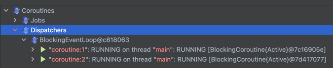

# 코루틴 톺아보기

- 코루틴?

---

## 코루틴?

비동기, non-blocking 컨셉 개발은 너무 중요한 부분이다. 코틀린은 coroutine (코루틴) 라이브러리로 비동기 프로그래밍을 API 수준으로 쉽게 구현할 수 있게 했다.

### 기본 가이드


- `kotlinx.coroutines` 패키지가 코루틴을 사용하기위한 라이브러리로 JetBrains에서 개발했다.
    - `launch`, `asynce` 와 같은 고수준라이브러리를 제공해 편리하게 사용할 수 있다.
- `kotlinx-coroutines-core` 라이브러리를 임포트하면 코루틴을 사용할 수 있다.
    - https://github.com/Kotlin/kotlinx.coroutines/blob/master/README.md#maven

### 코루틴 시작해보기

- 코루틴은 중지가능한 (suspendable) 연산을 진행하는 인스턴스이다.
- 스레드와 비슷하게 실행중인 코드를 blocking할 수 있지만,
- 특정 스레드에서 중지된 코루틴이 다른 스레드에서 계속할 수 있다.
    - 즉 코루틴은 특정 스레드에 바인딩되지 않는다.

```kotlin
import kotlinx.coroutines.delay
import kotlinx.coroutines.launch
import kotlinx.coroutines.runBlocking

fun main() = runBlocking { // runBlocking : 코루틴을 실행하고 완료될 때까지 현재 스레드를 blocking
    launch { // 코루틴 빌더 : 새로운 코루틴을 시작하고 실행
        delay(1000L) // 코루틴 suspend function : 코루틴을 일정 시간동안 중지
        println("World!")
    }

    println("Hello,")
}
```

````
Hello,
World!
````

1. `runBlocking{}` 으로 코루틴 스코프 생성, 코루틴 A 생성
2. `launch{}`로 새로운 코루틴 B 생성
3. `delay(1000L)`로 코루틴 B 1초동안 중지
4. 코루틴 B가 중지된 동안 코루틴 A가 실행되어 `Hello,` 출력 후 코루틴 B 기다림
5. 코루틴 B가 1초 후에 실행되어 `World!` 출력
6. 코루틴 B 종료
7. 코루틴 A 종료, `runBlocking{}` 종료, `main()` 종료


- `runBlocking`은 코루틴 빌더 (새로운 코루틴을 생성하는 함수)로서 빌더 중에서도 코루틴이 아닌 세상과 코루틴을 연결하는 빌더다.
- 위에서 main()을 실행한 스레드는 runBlocking 빌더로 코루틴을 생성하여 main을 실행하고 `main()`이 종료될때까지 blocking한다.

### Structured Concurrency (구조적 동시성)

- 코루틴은 Structured Concurrency를 따른다.
- Structured Concurrency 이란 새로운 코루틴은 반드시 `CoroutineScope` 안에서만 생성될 수 있다는 것으로 코루틴의 범위를 제한하는 메커니즘이다.
- 위에서 `runBlocking` 을 통해 코루틴 생성과 동시에 새로운 코루틴 범위 (스코프)를 생성했고, 그 스코프 안에서 `launch`를 통해 새로운 코루틴을 생성했다.

## Scope builder

- `CoroutineScope` 는 코루틴 범위 (스코프)를 나타내는 인터페이스로, 코루틴 범위를 생성하고 취소할 수 있는 메소드를 제공한다.
- `coroutineScope{}` 빌더는 코루틴 스코프를 생성하고 해당 스코프 안에서 생성 (런치)된 모든 코루틴이 완료될 때까지 기다린다.

### `runBlocking{}` vs `coroutineScope{}`

- 두 빌더 모두 body의 모든 코루틴과 코드가 종료될때까지 blocking된다는 공통점이 있다.
- 차이점은 `runBlocking{}` 은 현재 실행중인 스레드를 blocking하고 코루틴을 실행하는 것이고,
- `coroutineScope{}` 는 suspending function이다.
    - `coroutineScope{}`을 실행한 코루틴은 중지되고, 현재 스레드는 release한다.

```kotlin
// runBlocking
fun main() = runBlocking {
        launch {
            delay(1000L)
            println("World!")
        }

        println("Hello,")
    }

// coroutineScope
fun main() = runBlocking {
    coroutineScope {
        launch {
            delay(1000L)
            println("World!")
        }
    }
    println("Hello,")
}
```

- 아래 coroutineScope 예제는 `World!` 출력 후 `Hello,`가 출력된다.
- 아래처럼 실행된다.

1. main() 실행, runBlocking 빌더로 코루틴 A 생성 (main 스레드 blocking)
2. coroutineScope 빌더로 코루틴 스코프 생성 (여기서 코루틴 A는 중지되어 해당 스코프가 종료될때까지 기다림)
3. 해당 스코프에서 코루틴 B 생성
4. 코루틴 B 1초동안 중지 후 `World!` 출력
5. 코루틴 B 종료, 코루틴 스코프 종료
6. 코루틴 A `Hello,` 출력 후 종료, main() 종료

똑같이 출력되게 하려면 아래처럼 수정하면 된다.

```kotlin
fun main() = runBlocking {
    coroutineScope {
        launch {
            delay(1000L)
            println("World!")
        }
        println("Hello,")
    }
}
```

```kotlin

fun main() = runBlocking {
    makeCoroutine()
    notMakeCoroutine()
}
fun makeCoroutine() = runBlocking {
    println("made coroutine")
    delay(1000L)
}

suspend fun notMakeCoroutine() = coroutineScope {
    println("not made coroutine")
    delay(1000L)
}
```




```kotlin
private val context = Executors.newFixedThreadPool(2).asCoroutineDispatcher()

fun demoWithCoroutineScope() = runBlocking {
    (1..10).forEach {
        launch(context) {
            coroutineScope {
                println("Start No.$it in coroutineScope on ${Thread.currentThread().name}")
                delay(500)
                println("End No.$it in coroutineScope on ${Thread.currentThread().name}")
            }
        }
    }
}

fun demoWithRunBlocking() = runBlocking {
    (1..10).forEach {
        launch(context) {
            runBlocking {
                println("Start No.$it in runBlocking on ${Thread.currentThread().name}")
                delay(500)
                println("End No.$it in runBlocking on ${Thread.currentThread().name}")
            }
        }
    }
}

```


1. demoWithCoroutineScope을 스레드 A, 코루틴 a로 실행 blocking. A-a binding
2. 스레드 A, 코루틴 a에서 자식 코루틴 a-1 생성 후 coroutineScope 진입
    1. coroutineScope에서 a가 delay (suspend), 스레드 A를 release
3. 스레드 B, 코루틴 a의 자식 코루틴 a-2 생성 후 coroutineScope 진입
    1. coroutineScope에서 a-2가 delay (suspend), 스레드 B를 release
4. 스레드 B, 코루틴 a의 자식 코루틴 a-3 생성 후 coroutineScope 진입
    1. coroutineScope에서 a-3이 delay (suspend), 스레드 B를 release
       .... (반복)
11. 2 에서 중지된 코루틴 a-1, 스레드 B에서 재개
    ... (반복)


1. demoWithCoroutineScope을 스레드 A, 코루틴 a로 실행 blocking. A-a binding
2. 스레드 A, 코루틴 a에서 자식 코루틴 a-1 생성 후 runBlocking에 진입 (이 때, 코루틴 a-1이 스레드 a에 바인딩되어 blocking)
   => 즉 자식 코루틴 a-1이 완료될 떄까지 스레드 A를 release하지 않는다.
3. 스레드 B, 코루틴 a의 자식 코루틴 a-2 생성 후 runBlocking에 진입 (이 때, 코루틴 a-2가 스레드 B에 바인딩되어 blocking)
   => 즉 자식 코루틴 a-2가 완료될 떄까지 스레드 B를 release하지 않는다.
4. 스레드가 총 2개라 다음 코루틴을 런칭할 수 없음
5. 2에서 중지된 코루틴 a-1, 스레드 A에서 재개, 완료 후 스레드 A release
6. 3에서 중지된 코루틴 a-2, 스레드 B에서 재개, 완료 후 스레드 B release
7. ... (반복)
